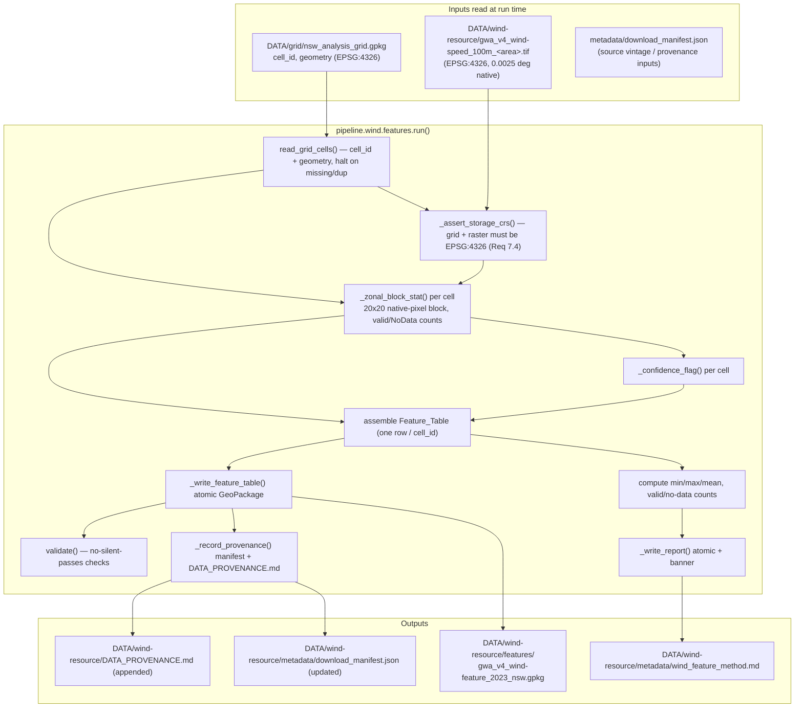

# Design Document

## Overview

This feature adds a **wind feature-builder** pipeline stage (Sprint 1 task S1-03) that converts the
Sprint 0 Global Wind Atlas (GWA) investigation — the clipped wind-speed, power-density, and
capacity-factor rasters under `DATA/wind-resource/` — into a **per-cell wind feature table** keyed
to the common analysis grid (`DATA/grid/nsw_analysis_grid.gpkg`, 47,311 cells at 0.05°). It emits
exactly one row per grid `cell_id` (Req 2.3, 2.4) carrying one representative wind value, its units,
its data source, and a per-cell confidence flag, plus an atomically-written method report. The table
feeds the integrated NSW feature table (S1-08) and, through it, the multi-criteria suitability
scoring model (S1-07).

The S1-02 decision selected **Option A** (0.05° GWA-aligned geographic cells, EPSG:4326), so each
analysis cell is exactly **20×20 native GWA pixels** — a clean block extraction with **no
reprojection or interpolation of the GWA rasters**. Both the grid and the GWA rasters are stored in
EPSG:4326, so the per-cell aggregation is a windowed block read, not a warp. This is the same
alignment guaranteed by `grid/generate._snap_origin` and proven in `integration/analyse` §5.

The stage is a **consumer of the grid**, so unlike the existing `wind.*` stages (which run in
Sprint-0 order *before* the grid exists) it must be scheduled *after* the `grid` stage (Req 6.3).
Section 5 resolves that ordering.

Two project-constitution rules constrain the design. First, **"never invent, extrapolate or
hard-code data values"**: cells with no valid GWA coverage are flagged, never back-filled (Req 5.4).
Second, **"never build a circular model"**: the wind value is derived exclusively from GWA rasters,
never from any suitability score or prediction target (Req 1.4).

The design follows the pipeline's established contracts, verified against the current code:

- **Uniform stage contract** — `run(verbose: bool = False, ...) -> dict` returning a summary dict of
  output paths and run statistics, matching `grid/generate.run`, `wind/analyse.run`, `wind/download.run`
  (Req 6.1).
- **Strict grid keying** — read `cell_id` + geometry from the gpkg via `geopandas.read_file`; reuse
  `cell_id` byte-for-byte (Req 2.4).
- **Explicit, logged CRS** — reuse `grid/config.STORAGE_CRS` (`EPSG:4326`) and
  `grid/config.COMPUTATION_CRS` (`EPSG:3577`); every reprojection logged; mismatches reported, never
  silently reprojected (Req 7).
- **Atomic writes + do-not-edit banner** — `common/geo.atomic_write_text` and `common/geo.banner`
  for the report; a tmp-file + `os.replace` write for the table, mirroring `grid/generate.run` and
  `wind/download._clip_gwa_sample` (Req 4.6, 9.4).
- **File naming** — `{source}_{dataset}_{year/vintage}_{region}.{ext}` with region slug `nsw`
  (Req 4.4).
- **Provenance** — `DATA_PROVENANCE.md` entry, `download_manifest.json` SHA-256 record, derived-layer
  labelling, mirroring `wind/download.run` (Req 8).
- **No silent passes** — validation as a list of `{"name","expected","observed","passed"}` dicts,
  the exact shape used in `validate.py` and `wind/validate.py` (Req 10).

### How the feature satisfies the requirements (map)

| Requirement | Where addressed in this design |
|---|---|
| R1 Variable selection & documentation | §7 variable choice; §Data Models method report |
| R2 Per-cell derivation | §7 zonal-statistics method; §3 `_zonal_block_stat` |
| R3 Documented aggregation method | §7 inclusion basis / boundary rule / NoData rule; report |
| R4 Output schema, naming, format | §Data Models Feature_Table; §3 writer; §10 output dir |
| R5 Confidence flag | §7 confidence rule; §3 `_confidence_flag` |
| R6 Pipeline integration | §3 config/orchestrator additions; §5 ordering; §8 error handling |
| R7 Explicit CRS handling | §6 CRS boundaries |
| R8 Provenance | §10 provenance conventions; §3 manifest/provenance writers |
| R9 Output statistics logging | §Data Models method report; §3 stats |
| R10 Validation, no silent passes | §Testing Strategy validation checks |
| R11 Unit tests | §Testing Strategy unit tests |
| R12 Documentation | §10 cross-component impact |

## Architecture

The stage sits after `grid` in the domain-sequential `STAGES` list. It reads the grid plus the
Sprint-0 GWA raster(s) and writes one Feature_Table (GeoPackage) and one method report.



### Position in STAGES

```
... → demand → grid → wind.features → validate
```

The stage runs immediately after `grid` and before the cross-domain `validate` stage, so the grid
producer always precedes this consumer (Req 6.3) and the cross-domain checks can see the new
Feature_Table. See §5 for the naming/positioning decision and its interaction with `--only wind`.

## Components and Interfaces

### New module: `pipeline/wind/features.py`

The stage lives in the wind subpackage for domain cohesion (its inputs are the GWA rasters produced
by `wind.download`). The naming caveat this creates — a `wind.*` stage that must run *after* `grid`,
not inline with the other `wind.*` stages — is resolved in §5.

#### Public entry point

```python
def run(verbose: bool = False) -> dict:
    """
    Build the per-cell wind feature table on the common analysis grid.

    Reads the grid (cell_id + geometry) and the source GWA raster, derives one
    Wind_Variable per cell by block-aggregating the 20x20 native GWA pixels that
    fall in each cell, writes the Feature_Table atomically as a GeoPackage, writes
    a do-not-edit method report, and records provenance.

    Returns
    -------
    dict with keys:
        "feature_table" : Path   # output GeoPackage (exists on disk after return)
        "report"        : Path   # method report (exists on disk after return)
        "manifest"      : Path   # updated download manifest
        "n_cells"       : int    # rows written == grid cell_id count (Req 2.3)
        "n_valid"       : int    # cells with valid wind data (Req 9.2)
        "n_nodata"      : int    # cells flagged no-data (Req 9.2)
        "stats"         : dict    # {"min","max","mean"} over valid cells (Req 9.1)

    Raises
    ------
    FileNotFoundError / ValueError / RuntimeError on any halting condition
        (missing grid, missing cell_id column, duplicate cell_id, missing GWA
        raster, undeclared/non-EPSG:4326 CRS on grid or raster) — see §8. On any
        raise the run returns no summary dict so the orchestrator halts non-zero
        (Req 6.6).
    """
```

The signature matches the other stages: `verbose` first with default `False`, returns a dict
(Req 6.1). No `bbox`/`area_name` kwargs are needed — the stage always operates over the full NSW
grid and reads whichever GWA raster is named in config, so `_build_kwargs` supplies only `verbose`.

#### Internal functions

```python
# --- grid input (Req 2.3, 2.4, 6.6) ---
def read_grid_cells(grid_path: Path) -> "gpd.GeoDataFrame":
    """Read cell_id + geometry from the grid GeoPackage (EPSG:4326).
    Raises FileNotFoundError if the grid file is missing (Req 6.6), ValueError if
    there is no cell_id column or duplicate cell_ids. Does not modify, renumber,
    or reorder cell_id (Req 2.4)."""

# --- CRS boundary (Req 7.1, 7.4) ---
def _assert_storage_crs(grid: "gpd.GeoDataFrame", src: "rasterio.DatasetReader") -> None:
    """Assert the grid CRS and raster CRS both resolve to EPSG:4326. If either is
    None or not 4326, raise ValueError reporting the mismatch rather than silently
    reprojecting (Req 7.4). Under Option A no reprojection of the GWA raster ever
    occurs (Req 7.1)."""

# --- zonal block statistic (Req 2.1, 2.5, 3.1-3.4, 5) ---
def _zonal_block_stat(
    src: "rasterio.DatasetReader",
    cell_geom,                      # shapely polygon in EPSG:4326
    stat: str = "mean",             # documented Aggregation_Statistic (§7)
) -> "CellStat":
    """Read the raster window over the cell bounds, select the native pixels whose
    centre lies inside the cell polygon (cell-centre inclusion rule), apply
    src.scales, exclude nodata, and aggregate with `stat`. Under Option A the
    selection is a clean 20x20 block. Returns CellStat(value, n_valid, n_nodata,
    in_coverage). value is None when n_valid == 0 (Req 2.5). Deterministic: the
    same raster+cell yields the same pixel set on repeated runs (Req 3.1)."""

def _cell_in_coverage(src, cell_geom) -> bool:
    """Cell-centroid-in-raster-bounds test used to short-circuit the ~majority of
    NSW cells that fall outside the current GWA clip extent (Req 5.3, performance)."""

# --- confidence (Req 5) ---
def _confidence_flag(stat: "CellStat") -> str:
    """Return CONF_VALID ('valid') when stat.n_valid >= 1, else CONF_NODATA
    ('no_data'). Exactly one of the enumerated values (Req 5.1, 5.2, 5.3)."""

# --- output (Req 4) ---
def _write_feature_table(gdf: "gpd.GeoDataFrame", path: Path) -> None:
    """Atomic GeoPackage write: to_file(tmp) + os.replace, mirroring
    grid/generate.run(). EPSG:4326 (Req 4.5). Leaves any prior output intact on
    failure (Req 4.6)."""

def _write_report(report_text: str, path: Path) -> None:
    """atomic_write_text with a banner('wind.features') stamp (Req 9.4)."""

# --- provenance (Req 8) ---
def _record_provenance(table_path: Path, source_raster: Path, manifest_path: Path) -> None:
    """Append a derived-layer row to DATA/wind-resource/DATA_PROVENANCE.md (Req 8.1,
    8.3) and add an entry to download_manifest.json with sha256, byte count, and UTC
    timestamp for the written table (Req 8.2)."""

# --- validation (Req 10) ---
def validate(feature_table_path: Path, grid_path: Path) -> dict:
    """No-silent-passes checks over the written table; returns
    {"checks": [ {name, expected, observed, passed}, ... ], "passed": int,
    "total": int}. See §Testing Strategy."""
```

`CellStat` is a small dataclass (see Data Models). `_zonal_block_stat` takes an open
`rasterio.DatasetReader` so the raster is opened once and windowed per cell, never read in full.

### Config additions: `pipeline/config.py`

Add the stage key to `STAGES` **after `grid` and before `validate`**. `DOMAINS` already contains
`wind`, so it is unchanged.

```python
STAGES = [
    "wind.probe",
    "wind.download",
    "wind.inspect",
    "wind.validate",
    "wind.analyse",
    "geographic.probe",
    "geographic.download",
    "geographic.inspect",
    "geographic.derive",
    "geographic.validate",
    "infrastructure.download",
    "infrastructure.inspect",
    "demand",
    "grid",           # common analysis cell (S1-02) — must run before feature layers
    "wind.features",  # S1-03 feature-builder — CONSUMES grid, so scheduled after it
    "validate",       # cross-domain integration checks
]
```

See §5 for why `wind.features` appears out of contiguous order with the other `wind.*` stages and
how `resolve_stages` handles it.

### Orchestrator additions: `pipeline/__main__.py`

Add a dispatch branch in `_get_runner` placed after the `grid` branch to mirror execution order:

```python
    elif stage == "grid":
        from .grid.generate import run
        return run
    elif stage == "wind.features":
        from .wind.features import run
        return run
    elif stage == "validate":
        from .validate import run
        return run
```

`_build_kwargs` needs no special-casing: the stage takes only `verbose`, which the base
`kwargs = {"verbose": args.verbose}` already supplies. The existing `if stage in ("wind.download", ...)`
branches do not match `"wind.features"`, so no `bbox`/`heights` kwargs are wrongly injected.

### Wind config additions: `pipeline/wind/config.py`

Add the feature-builder constants beside the existing wind paths and aggregation constants:

```python
# --- Wind feature-builder (S1-03) ---
WIND_FEATURES_DIR = WIND_DIR / "features"

# Source raster for the per-cell wind feature. Frozen decisions Q1 (statistic =
# mean) and Q2 (primary hub height = 100 m) select mean wind speed at 100 m.
WIND_FEATURE_SOURCE = "gwa_v4_wind-speed_100m_new-england-rez.tif"
WIND_VARIABLE = "wind_speed_100m"          # output value column name
WIND_VARIABLE_UNITS = "m/s"                # Req 4.2
WIND_DATA_SOURCE = "GWA v4"                # Req 4.3
WIND_AGG_STATISTIC = "mean"                # Req 2.2 (frozen decision Q1)

# Plausible range for validation (Req 10.2). Mean wind speed at 100 m over land.
WIND_PLAUSIBLE_MIN = 0.0
WIND_PLAUSIBLE_MAX = 25.0                  # m/s; generous upper bound for a cell mean

# Enumerated confidence values (Req 5.1)
CONF_VALID = "valid"
CONF_NODATA = "no_data"
```

The source-raster filename mirrors `wind/analyse.RASTER_NAME` (also `gwa_v4_wind-speed_100m_*`), so
both wind consumers read the same layer.

### Subpackage docstring: `pipeline/wind/__init__.py`

Add the feature-builder to the stage list, noting its true execution position (Req 12.1):

```
Stages:
    1. probe     — GWA layer availability
    2. download  — Clip GWA rasters via /vsicurl/
    3. inspect   — Raster statistics and reports
    4. validate  — Wind farm sampling, crosscheck
    5. analyse   — Aggregation sensitivity
    6. features  — Per-cell wind feature table on the common analysis grid (S1-03).
                   NOTE: this stage CONSUMES the grid, so it is registered in
                   config.STAGES AFTER the `grid` stage, not inline with 1-5.
```

## Data Models

### Feature_Table schema (Req 4.1)

Exactly these five attribute columns, plus geometry (Req 4.5). Written as a GeoPackage layer in
EPSG:4326.

| Column | dtype | Units / domain | Null semantics |
|---|---|---|---|
| `cell_id` | str | grid identifier `S{lat}_E{lon}` | never null; byte-for-byte from grid (Req 2.4) |
| `wind_speed_100m` | float64 | m/s (the Wind_Variable value; column name = `config.WIND_VARIABLE`) | null (NaN) when the cell has zero valid GWA pixels / is out of coverage (Req 2.5, 5.3) |
| `units` | str | `"m/s"` | never null (Req 4.2) |
| `data_source` | str | `"GWA v4"` | never null (Req 4.3) |
| `confidence_flag` | str | exactly `"valid"` or `"no_data"` | never null (Req 5.1) |
| `geometry` | polygon | EPSG:4326 | copied from grid (Req 4.5) |

The Wind_Variable value column is named from `config.WIND_VARIABLE` (`wind_speed_100m`), so the
column name self-documents the variable and hub height. Null values are stored as float `NaN` so
`geopandas.read_file` round-trips them as missing. Exactly one wind-value column exists per run
(Req 1.1, 2.2). The `units` and `data_source` values are constant per run (populated from config).

### `CellStat` (zonal block result, in-memory)

```python
@dataclass
class CellStat:
    value: float | None     # aggregated statistic (mean), None when n_valid == 0 (Req 2.5)
    n_valid: int            # non-NoData native pixels in the cell's block (Req 3.2)
    n_nodata: int           # NoData native pixels in the cell's block (Req 3.2)
    in_coverage: bool       # False -> cell centroid outside raster extent (Req 5.3)
    # invariant: n_valid + n_nodata == total pixels in the cell's block (Req 3.2)
```

Under Option A the block is exactly 20×20 = 400 native pixels for a fully-covered cell, so
`n_valid + n_nodata == 400`; edge cells overlapping the raster extent have a smaller total, still
partitioned exactly (Req 3.2).

### Check-result dict (Req 10) — reused shape

```python
{"name": str, "expected": str, "observed": str, "passed": bool}
```

Identical to `validate.py` / `wind/validate.py`, so the report table renders the same way
(`PASS` / `**FAIL**`).

### Method report structure (Req 1.2, 1.3, 3.5, 5.5, 9.3, 9.4)

Markdown, atomic-written with `banner("wind.features")` (Req 9.4), containing:

1. **Header + banner** (do-not-edit stamp).
2. **Variable selection** — the selected Wind_Variable, its hub height, its units, and the source
   GWA raster filename (Req 1.2); a written justification for the hub height and variable choice
   (Req 1.3): 100 m per frozen decision Q2 (consistent with the capacity-factor layers), mean wind
   speed per frozen decision Q1.
3. **Aggregation method** — the Aggregation_Statistic (`mean`), the pixel-inclusion basis
   (cell-centre rule), the partial-cell boundary rule (verbatim), and the NoData handling rule
   (Req 2.2, 3.5). Notes that under Option A each cell is a clean 20×20 native-pixel block.
4. **NoData / zero-valid occurrences** — count of cells with zero valid pixels (Req 2.5) and, per
   grid, valid vs no-data cell counts with `valid + no_data == total` (Req 9.2).
5. **Confidence** — the enumerated confidence values (`valid`, `no_data`) and the assignment rule
   (Req 5.5).
6. **CRS handling** — storage CRS EPSG:4326 for grid, raster, and output; statement that no
   reprojection of the GWA raster occurs under Option A; any reprojection event (source → target)
   logged here (Req 7.3).
7. **Output statistics** — min, max, mean of the Wind_Variable across valid cells (Req 9.1, 9.3).

## Stage-ordering resolution (Req 6.3)

**Decision: name the stage `wind.features` (keeping it in the wind namespace for cohesion) but
register it in `STAGES` immediately after `grid`, i.e. out of contiguous order with the other
`wind.*` stages.**

Rationale:

- **Cohesion vs. correctness.** The stage's input is the GWA raster produced by `wind.download`, so
  its logic belongs in the wind subpackage beside `analyse` (which reads the same raster). But it is
  fundamentally a *grid consumer*: it cannot run until `grid` has produced `nsw_analysis_grid.gpkg`.
  The `STAGES` list is the single source of execution order, so placing the key after `grid` is what
  guarantees producer-before-consumer (Req 6.3). The other `wind.*` stages run in Sprint-0 order
  before the grid ever exists; `features` is the exception and is annotated as such in `config.py`
  and the `__init__` docstring.

- **Interaction with `--only wind`.** `resolve_stages()` matches a domain filter with
  `s.startswith(only + ".")`, so `--only wind` selects **all six** `wind.*` stages *in their `STAGES`
  order*. Because `wind.features` sits after `grid` in `STAGES`, the resolved list for `--only wind`
  is `wind.probe, wind.download, wind.inspect, wind.validate, wind.analyse, wind.features` — the
  feature builder last, which is correct relative ordering *among wind stages*. The subtlety is that
  `--only wind` runs `wind.features` **without** first running `grid`, so it depends on a
  previously-generated grid file on disk. This is acceptable and consistent with how the pipeline
  already treats cross-stage inputs (e.g. `--only validate` assumes upstream outputs exist), and
  `read_grid_cells` fails loudly with a clear error if the grid is absent (Req 6.6). This behaviour
  is documented in the README CLI notes (§10).

- **Alternative considered and rejected: a new top-level `features` domain.** This would make the
  "after grid" position visually obvious and avoid the `--only wind` subtlety, but it fragments the
  wind logic across two namespaces, requires a new `DOMAINS` entry and a new subpackage, and adds
  ceremony for a single stage. The chosen approach keeps the change minimal and cohesive while
  `STAGES` still enforces the ordering contract. If more grid-consuming feature builders are added
  (S1-04 demand, S1-06 geographic — the sibling S1-06 design makes the same call), revisiting a
  dedicated `features` domain is reasonable — noted for future work.

The README stage-order table and diagram (§10) must be updated to show `wind.features` between
`grid` and `validate`, matching the resolved runtime order (Req 12.1).

## CRS handling (Req 7)

Reuse the authoritative constants from `pipeline/grid/config.py` — do **not** re-hardcode:

```python
from ..grid.config import STORAGE_CRS       # "EPSG:4326"
from ..grid.config import COMPUTATION_CRS    # "EPSG:3577"
```

Explicit boundaries:

- **Storage (Req 7.1).** The grid is read in `STORAGE_CRS`, the GWA raster is read in its own
  declared CRS (which, per the download stage and Option A, is EPSG:4326), and the Feature_Table is
  written in `STORAGE_CRS`. Geometry is copied straight from the grid without reprojection.
- **No warp of the GWA raster.** Because grid and raster share EPSG:4326 and the cell edges are
  GWA-lattice-aligned (each cell = 20×20 native pixels), the per-cell aggregation is a windowed
  block read with **no reprojection or interpolation** of the raster (Overview; Req 7.1). This is
  the central benefit of the Option A decision and is contrasted with the reproject-heavy path in
  `integration/analyse` §3 (NLUM etc.).
- **Distance/area (Req 7.2).** This stage performs **no distance or area computation** — it is a
  pure raster block aggregation keyed to pre-computed cells. `area_km2` already exists on the grid
  (computed by `grid/generate` in EPSG:3577). The method report records that no EPSG:3577
  computation is performed by this stage; **were** any added later, it would use `COMPUTATION_CRS`.
- **Mismatch detection (Req 7.4).** `_assert_storage_crs` checks the grid CRS and raster CRS both
  resolve to EPSG:4326. If either is `None` or a different EPSG, the run **halts with a reported
  mismatch** rather than silently reprojecting. This mirrors the Constitution's "make CRS explicit
  at every boundary — never convert silently" rule and the explicit `outSR` discipline in
  `common/geo.query_layer_geojson`.
- **Logging (Req 7.3).** If any reprojection ever occurs (none expected under Option A), the source
  and target CRS are logged and appended to the method report's CRS section. When `verbose`, the
  storage-CRS assertions are printed.

## Zonal-statistics method (Req 2, 3, 5)

### Pixel-inclusion basis and partial-cell rule (Req 3.1, 3.4, 2.1)

**Rule: cell-centre inclusion — a native GWA pixel belongs to a cell iff the pixel centre lies
within the cell polygon.** This is the same deterministic rule the codebase already uses for
rasterisation (`rasterio.features.rasterize(..., all_touched=False)` in `validate._point_in_polygons`
and `_mask_from_polygons`). It is deterministic (same pixel set on repeated runs, Req 3.1) and is
recorded verbatim in the method report (Req 3.4).

Under **Option A** the grid origin is snapped to the GWA lattice (`grid/generate._snap_origin`) and
`CELL_DEG = 20 × GWA_STEP_DEG`, so every fully-covered cell selects an exact **20×20 = 400 native
pixel block** with no boundary-pixel ambiguity — the cell-centre rule and a raw block-slice agree
exactly. The only partial cells are those at the edge of the current GWA clip extent (the raster
covers New England REZ, not all of NSW); for those, pixel positions outside the raster's data
extent are counted as NoData (below) and the cell-centre rule still yields a deterministic
selection (Req 3.4).

Implementation: for each in-coverage cell, compute the window from the cell bounds
(`rasterio.windows.from_bounds(...).round_offsets().round_lengths()`), read that window, and build a
boolean mask of pixel centres inside the cell polygon via `rasterio.features.geometry_mask` /
`rasterize` on the window transform with `all_touched=False`. The statistic is computed over
`window_data[mask & valid]`.

### NoData rule (Req 3.2, 3.3, 2.5)

Valid pixels are those inside the cell mask that are **not** equal to the raster's declared
`src.nodata` (and not masked on masked reads). `n_valid` counts valid pixels; `n_nodata` counts
NoData/masked pixels **and** in-cell pixel positions that fall outside the raster's data extent
(counted as NoData, Req 5.3). Invariant: `n_valid + n_nodata == total pixels in the cell's block`
(Req 3.2). NoData pixels are excluded from the statistic (Req 3.3). If `n_valid == 0`, the value is
`None`/NaN and the occurrence is recorded (Req 2.5).

### Scaled rasters (Req 1.2)

The reader multiplies by `src.scales[0]` (defaulting to `1.0` when absent), exactly as
`validate._sample_raster_at` does, so any scale factor on the GWA clip is honoured. Wind speed is a
float measurement in m/s; the units string is recorded from `config.WIND_VARIABLE_UNITS`.

### Statistic (Req 2.2, 1.4)

| Variable | Statistic | Justification |
|---|---|---|
| `wind_speed_100m` | **mean** of valid pixels | **Frozen decision Q1** (data-spec §2, README): *"Wind aggregation statistic: Mean — single stable statistic; report P90 as a feature and max as a best micro-site indicator in explanation."* This design implements the scoring statistic (mean). The Q1 evidence lives in `wind/analyse.py` (aggregation-sensitivity report). Using anything other than mean here would contradict a frozen decision and require the §8 change-control process. |

The hub height (100 m) is **frozen decision Q2** (*"Primary hub height for scoring: 100 m —
consistent with the capacity-factor layers"*), which is why the source raster is
`gwa_v4_wind-speed_100m_*`. The chosen statistic, hub height, and source filename are recorded in
the method report (Req 1.2, 2.2). The value is derived **exclusively from the GWA raster** — the
module imports no scoring/ranking code (Req 1.4).

**Frozen-decision note (Req 12.2):** this design *implements* Q1 and Q2 as already frozen; it does
not change them. No §8 change-control action is triggered. If S1-07 later needs the P90/max
"explanation" layers, those are additive columns and a separate decision.

### Coverage test (Req 5.3, performance)

The GWA clip currently covers the New England REZ window, while the grid spans all of NSW (47,311
cells). Coverage is decided per cell:

- **Centroid test (fast path).** If the cell centroid lies outside the raster bounds, the cell is
  out of coverage → value null, `in_coverage=False`, confidence `no_data` (Req 5.3). This
  short-circuits the majority of NSW cells without a windowed read.
- **Edge test.** If the centroid is inside the bounds but the block overlaps the raster edge such
  that pixel positions fall outside valid data, those positions count as NoData; when this makes
  `n_valid == 0`, the value is null and the cell is `no_data`.

Out-of-coverage always implies a null value and the no-data confidence flag (Req 5.3, 5.4).

### Confidence rule (Req 5)

`confidence_flag` is exactly one of the enumerated values `config.CONF_VALID` (`"valid"`) or
`config.CONF_NODATA` (`"no_data"`) (Req 5.1):

- **valid** iff the cell has ≥ 1 valid GWA pixel (`n_valid >= 1`) (Req 5.2).
- **no_data** iff the cell has zero valid pixels or lies outside GWA coverage; the Wind_Variable
  value is left **null** (Req 5.3).

The builder **never** substitutes a default, interpolated, extrapolated, or hard-coded number for a
zero-valid cell (Req 5.4) — the constitution's "never invent data" rule. The enumerated values and
the assignment rule are recorded in the method report (Req 5.5).

## Error Handling

All halting conditions raise before any Feature_Table is written (or leave a prior output intact),
so the orchestrator's `try/except` in `__main__.main()` catches the exception and exits non-zero
(Req 6.6). No partial or silently-degraded output is ever produced.

| Condition | Requirement | Behaviour |
|---|---|---|
| Grid file missing / unopenable | 6.6 | `read_grid_cells` raises `FileNotFoundError` naming the grid path; nothing written; no partial Feature_Table. |
| Grid has no `cell_id` column | 2.4 | Raise `ValueError` naming the absent column; nothing written. |
| Grid has duplicate `cell_id` | 2.3, 2.4 | Raise `ValueError` listing duplicated `cell_id`s; nothing written. |
| Source GWA raster missing | 2.1 | Raise `FileNotFoundError` naming the expected raster path (`config.WIND_FEATURE_SOURCE`); nothing written. |
| Grid or raster CRS undeclared or not EPSG:4326 | 7.4 | `_assert_storage_crs` raises `ValueError` reporting the mismatch; do **not** silently reproject; nothing written. |
| Feature_Table write fails | 4.6 | Atomic write (tmp + `os.replace`) discards the tmp file; any existing table is unmodified; the exception propagates. |
| Provenance/manifest write fails | 8 | Raise after the table write; because provenance is recorded after the atomic table write, a failure here is reported rather than leaving a silently unrecorded output. |

Because writes are atomic, a crash mid-write cannot leave a truncated GeoPackage: the destination
path only ever appears via `os.replace` of a fully-written tmp file, matching `grid/generate.run`
and `wind/download._clip_gwa_sample`.

## Testing Strategy

The feature builder's core is a set of **pure functions** over raster/grid inputs with clear
input/output behaviour (zonal block statistic, NoData exclusion, confidence assignment, coverage
bookkeeping, one-row-per-cell assembly, CLI stage ordering). These have genuine universal
properties, so **property-based testing applies** to the logic layer, complemented by example/edge
unit tests and no-silent-passes validation checks. The GeoPackage *I/O*, provenance/report
*rendering*, and the full-pipeline *integration* are verified with example-based and
integration-style tests, not PBT.

### Property-based testing

- **Library:** `hypothesis` for Python (add to `requirements.txt`; do not hand-roll generators). It
  is the standard PBT library for the Python/pytest stack already used here (`pytest.ini`,
  `tests/test_*.py`). This is a test-only dependency, flagged in §10.
- **Configuration:** minimum 100 iterations per property (`@settings(max_examples=100)`).
- **Tagging:** each property test carries a comment
  `# Feature: s1-03-build-wind-feature-layer, Property {n}: {property text}`.
- **Implementation:** each correctness property below is implemented by a single property-based test.
  Generators build small synthetic numpy rasters (with a chosen `nodata`), synthetic
  GWA-lattice-aligned cell polygons, and small synthetic grids — no network, no real files, fast
  enough for 100+ iterations.

### Unit tests (Req 11)

Location: `tests/test_wind_features.py` (repo-root `tests/`, matching `pytest.ini`
`testpaths = tests` and the existing `tests/test_grid.py`, `tests/test_wind_unit.py`). Grouped in
`Test*` classes to match the existing style.

| Test | Requirement | What it asserts |
|---|---|---|
| Aggregation mean on a synthetic raster + cell | 11.1 | Computed mean equals a hand-computed value within a documented tolerance (`1e-9`). |
| All-NoData cell → null + no-data flag | 11.2 | A cell whose block is all-NoData yields a null Wind_Variable and `confidence_flag == "no_data"`. |
| NoData excluded from the statistic | 11.3 | Mixed valid/NoData block: statistic equals the mean of the valid pixels only. |
| One row per input `cell_id` | 11.4 | Output Feature_Table has exactly one row per grid `cell_id`. |
| Units and data_source populated | 4.2, 4.3 | `units == "m/s"`, `data_source == "GWA v4"` on every row. |
| Output filename convention | 4.4 | Written filename matches `gwa_v4_wind-feature_{vintage}_nsw.gpkg`. |
| Output CRS round-trip | 4.5 | Re-read table has CRS EPSG:4326. |
| Missing grid raises | 6.6 | `run()` (or `read_grid_cells`) raises identifying the missing grid; no output written. |
| Non-4326 CRS reported | 7.4 | A grid/raster with a non-4326 CRS triggers a reported mismatch, no silent reprojection. |

### Validation checks (Req 10) — no silent passes

`validate()` (in `features.py`, invoked after the write) produces `{"name","expected","observed","passed"}`
dicts and reports expected vs observed vs pass/fail for each:

| Check | Requirement | Expected vs observed |
|---|---|---|
| Row count == grid cell count | 10.1 | expected = grid `cell_id` count (47,311); observed = Feature_Table row count; pass iff equal. |
| Non-null values within plausible range | 10.2 | expected = `[WIND_PLAUSIBLE_MIN, WIND_PLAUSIBLE_MAX]`; observed = min/max of non-null values; pass iff all in range. |
| No-data cells have null value | 10.3 | expected = every `confidence_flag=="no_data"` row has null value; observed = count of no-data rows with a non-null value (0 to pass). |
| `confidence_flag` ∈ enum | 5.1 | observed = count of rows whose flag is not in `{valid, no_data}` (0 to pass). |

Any failing check is reported with its expected value, observed value, and `passed=False` — never a
silent pass (Req 10.4).

### Full-pipeline integration (Req 6.5)

A (slower, opt-in) integration test runs `run()` over the real grid + GWA raster if present and
asserts: the returned `n_cells` equals the grid cell count (Req 10.1), the summary dict contains
`stats`/`n_valid`/`n_nodata` (Req 9.1, 9.2), and the method report exists with the do-not-edit
banner. This test `pytest.skip`s when the grid GeoPackage or source raster is absent, mirroring
`TestGeoPackageRoundtrip` in `tests/test_grid.py`.

## Cross-component impact & documentation (Req 12, holistic-project-awareness)

This stage adds a new pipeline stage **and** a new derived output dataset, so the following files
must change together for the feature to be complete. Leaving any of these inconsistent is a partial
implementation.

### Code

| File | Change | Why |
|---|---|---|
| `pipeline/wind/features.py` | **new module** | The stage itself (Req 6.1). |
| `pipeline/wind/config.py` | add feature-builder constants (source raster, variable, units, data source, statistic, plausible range, confidence enum, `WIND_FEATURES_DIR`) | Central config for the stage. |
| `pipeline/config.py` | add `"wind.features"` to `STAGES` after `grid` | Stage registration + ordering (Req 6.2, 6.3). |
| `pipeline/__main__.py` | add `_get_runner` branch for `wind.features` | Orchestrator dispatch (Req 6.4). `_build_kwargs` needs no change (verbose-only). |
| `pipeline/wind/__init__.py` | add stage 6 to docstring with the "after grid" note | Req 12.1. |

### Documentation

| File | Change | Why |
|---|---|---|
| `pipeline/README.md` | add `wind.features` to the **Stage Execution Order** block and ASCII flow, between `grid` and `validate`; add the Feature_Table row to the Wind Resource expected-outputs table; add a CLI note that `--only wind` runs `features` against a pre-existing grid | Req 12.1 (README order must match resolved runtime order). |
| `DATA/data-specification/sprint1_data_specification.md` §4 (dataset detail) | add a dataset-detail entry for the wind Feature_Table naming its per-cell columns incl. `confidence_flag`, the selected variable/hub height, and the New-England-REZ coverage gap vs the full NSW grid | Req 12.2. |
| `DATA/data-specification/sprint1_data_specification.md` §7 (source → stage → criterion mapping) | add a row mapping GWA v4 → `wind.features` stage → the wind-resource suitability criterion | Req 12.2. |
| `DATA/data-specification/sprint1_data_specification.md` §8 | the new output is added via the §8 change-control "Adding a New Dataset" process (spec entry, provenance, source register, README) | Req 12.2 / holistic rule. |

**Frozen decisions (Q1–Q7):** this design *implements* Q1 (wind statistic = mean) and Q2 (primary
hub height = 100 m) as already frozen; it does **not** change any frozen parameter, so no §8
frozen-parameter change is triggered and no dual spec-§2/README edit is required (Req 12.2). If
review decides to change the wind statistic or hub height, that must go through §8 and be recorded
identically in data-spec §2 and README.

### New output dataset — provenance conventions (Req 8)

The Feature_Table is a new **derived** output under a new directory `DATA/wind-resource/features/`
(kept in the wind domain tree alongside its source GWA rasters). As a fully regenerable derived
product (Req 8.3) it follows the same provenance discipline as other generated layers:

- **Format: GeoPackage** (`.gpkg`), not CSV, because the table carries geometry in EPSG:4326
  (Req 4.5) and downstream S1-07/S1-08 join spatially; GeoPackage is already the grid's format and
  is round-tripped by `geopandas`/`pyogrio` in the test suite.
- **Filename:** `gwa_v4_wind-feature_2023_nsw.gpkg` following `{source}_{dataset}_{vintage}_{region}`
  with region slug `nsw` (Req 4.4). (`source` = `gwa`, `dataset` = `wind-feature`; the `2023` vintage
  token tracks the GWA v4 release — confirm the vintage token against the download manifest in the
  spec entry.)
- **Provenance (Req 8.1, 8.2, 8.3):**
  - Append a **derived-layer row** to `DATA/wind-resource/DATA_PROVENANCE.md` naming the source GWA
    dataset (`GWA v4`), the derivation method (mean of 20×20 native pixels per cell), and the fact
    that the output is a **derived layer regenerable** from the GWA raster + the grid (Req 8.1, 8.3).
  - Add an entry to `DATA/wind-resource/metadata/download_manifest.json` for the written table with
    a **SHA-256 hash, byte count, and UTC timestamp** (Req 8.2), mirroring the manifest records
    written by `wind/download.run`. Because `download.run` overwrites the manifest wholesale, the
    feature builder must **read-merge-write** (load the existing manifest, add/replace its own
    `features` record, write back atomically) so it does not clobber the download records. This
    read-merge-write is called out as an integration detail with `wind/download.run`.

### Duplicated-constant hazard

The stage reuses `grid/config.STORAGE_CRS` / `COMPUTATION_CRS` and reads `cell_id`/geometry from the
grid file itself — it does **not** re-declare grid constants (`GWA_ORIGIN`, `CELL_DEG`, `CELL_FACTOR`).
This deliberately avoids the known duplication hazard where `integration/analyse.py` and `validate.py`
re-hardcode those values. The design keeps `grid/config.py` authoritative. The GWA source-raster
filename is defined once in `wind/config.py` and shared with `wind/analyse.py`'s reading of the same
100 m layer.

### Test dependency

`hypothesis` is added to `requirements.txt` for the property-based tests (test-only, pinned to a
current release). No runtime dependency change. Zonal statistics are implemented with the
already-pinned `rasterio` + `numpy` + `geopandas`/`shapely` primitives (windowed reads,
`geometry_mask`/`rasterize` with `all_touched=False`, `src.scales`) — **`rasterstats` is not added**,
matching the sibling S1-06 design's decision and keeping the partial-cell rule identical to the rest
of the pipeline.

## Correctness Properties

*A property is a characteristic or behavior that should hold true across all valid executions of a
system — essentially, a formal statement about what the system should do. Properties serve as the
bridge between human-readable specifications and machine-verifiable correctness guarantees.*

Each property below is universally quantified and is implemented by a single property-based test
(`hypothesis`, ≥100 iterations) tagged
`# Feature: s1-03-build-wind-feature-layer, Property {n}: {text}`. The prework consolidated the 12
requirements' testable criteria into the following non-redundant set (the zonal-statistic /
NoData-exclusion, bijection/identity, and confidence/no-fabrication families were each collapsed to
one property).

### Property 1: Zonal statistic equals the mean of valid pixels, NoData excluded

*For any* synthetic GWA raster (with a declared NoData value) and *any* GWA-lattice-aligned cell
polygon, the derived Wind_Variable value equals the arithmetic mean of exactly the native pixels
whose centre lies inside the cell and whose value is not NoData; adding further NoData pixels within
the cell does not change the derived value.

**Validates: Requirements 2.1, 3.3**

### Property 2: Valid and NoData counts partition the cell's block

*For any* raster and cell, `n_valid + n_nodata` equals the total number of native pixels in the
cell's selection, and both counts are non-negative integers.

**Validates: Requirements 3.2**

### Property 3: Deterministic pixel selection

*For any* raster and cell, computing the cell's pixel selection twice yields identical pixel index
sets (the same result on repeated runs for the same raster and cell).

**Validates: Requirements 3.1, 3.4**

### Property 4: Zero valid pixels yield a null value and the no-data flag (no fabrication)

*For any* cell whose selection contains zero valid (non-NoData) GWA pixels, or whose centroid lies
outside GWA coverage, the derived Wind_Variable value is null (never a default, interpolated,
extrapolated, or hard-coded number) and the cell's `confidence_flag` is the no-data value.

**Validates: Requirements 2.5, 5.3, 5.4**

### Property 5: Confidence flag is the valid/no-data biconditional over the enumerated set

*For any* cell, `confidence_flag` is the valid value if and only if the cell has at least one valid
GWA pixel, and is the no-data value otherwise; in all cases `confidence_flag` is exactly one of the
enumerated values `{valid, no_data}`.

**Validates: Requirements 5.1, 5.2**

### Property 6: Output cell_id set is a bijection with the grid, values preserved

*For any* Analysis_Grid, the multiset of `cell_id` values in the Feature_Table equals the multiset
of `cell_id` values in the grid — every grid `cell_id` appears exactly once, none is missing, none
is duplicated, and each value is reused byte-for-byte without re-derivation, renumbering, or
reordering.

**Validates: Requirements 2.3, 2.4**

### Property 7: Non-null wind values fall within the plausible range

*For any* GWA raster whose valid pixel values lie within the plausible wind-speed range, every
non-null per-cell Wind_Variable value also lies within that range (the mean of in-range values stays
in range).

**Validates: Requirements 10.2**

### Property 8: Resolved stage order places the feature builder after the grid

*For any* CLI invocation whose resolved stage list contains both `grid` and `wind.features`,
`wind.features` appears after `grid`.

**Validates: Requirements 6.3**

## Review

The design covers all 12 requirements (see the map in §Overview) and is grounded in the current
codebase (`grid/config.py` CRS constants, `grid/generate` GWA-lattice snapping and atomic GeoPackage
write, `wind/analyse.py` reading the same 100 m layer, `wind/download.run` manifest/provenance idiom,
`validate.py` cell-centre rasterisation + check-dict shape, `config.STAGES` / `__main__` dispatch).
Key decisions flagged for your review:

1. **Stage naming/position** — `wind.features` registered after `grid` in `STAGES` (§5), with the
   `--only wind` implication documented. Alternative (new `features` domain) considered and rejected.
2. **Variable & statistic** — mean wind speed at 100 m, honouring frozen decisions Q1 (mean) and Q2
   (100 m hub); not a change to either. Please confirm 100 m mean wind speed is the intended MVP
   Wind_Variable (vs. capacity factor or power density).
3. **Output location/format/vintage** — new
   `DATA/wind-resource/features/gwa_v4_wind-feature_2023_nsw.gpkg` (GeoPackage, EPSG:4326). Please
   confirm the `2023` GWA vintage token against the download manifest.
4. **Manifest read-merge-write** — the feature builder must merge into `download_manifest.json`
   rather than overwrite it (since `wind/download.run` owns that file). Flagged as an integration
   detail.
5. **Plausible range** — validation uses `[0, 25] m/s` for a cell mean wind speed at 100 m; confirm
   the upper bound.
6. **Dependencies** — pure rasterio/numpy/geopandas (no `rasterstats`); `hypothesis` added test-only.

If any of these gaps or assumptions are wrong — particularly the Wind_Variable choice or the
requirements themselves — I can return to requirements clarification before we proceed to tasks.
