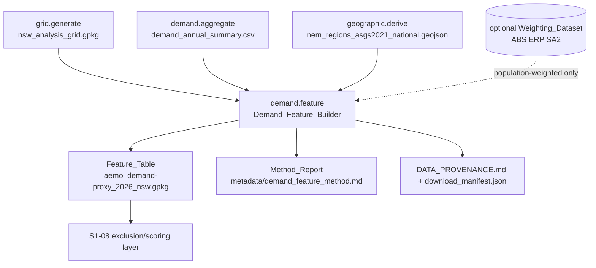
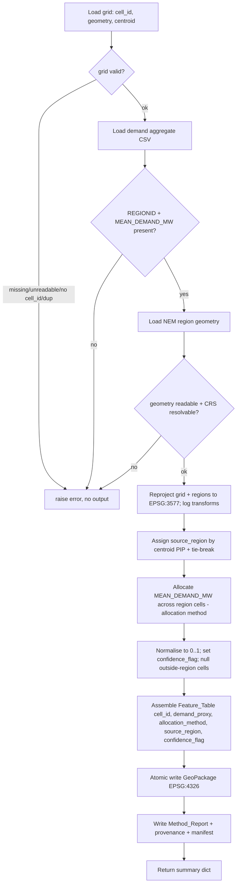

# Design Document

## Overview

This design specifies the **demand feature-builder** stage (`Demand_Feature_Builder`) that converts the Sprint 0 regional demand aggregate into a per-cell electricity-demand **proxy** on the common analysis grid. It is Sprint 1 task S1-04.

The stage sits inside the existing `pipeline/demand/` subpackage as a new module `feature.py`, exposing the uniform `run(verbose=False, ...) -> dict` contract. It reads three existing pipeline outputs — the analysis grid (`DATA/grid/nsw_analysis_grid.gpkg`, ~47,311 cells), the AEMO regional demand aggregate (`DATA/electricity-demand/demand_annual_summary.csv`), and the derived NEM region geometry (`DATA/geographic/derived/nem_regions_asgs2021_national.geojson`) — and produces one row of demand-proxy features per `cell_id`.

The core problem is **spatial disaggregation**: AEMO publishes exactly five regional demand figures (one per NEM region), but the scoring layer (S1-08) needs a value per grid cell. There is no measured per-cell demand. Any per-cell value is therefore a **proxy**, produced by a documented allocation method that spreads one regional `MEAN_DEMAND_MW` across the cells of that region. The design commits to this honesty everywhere: the output column is named `demand_proxy`, every value is traceable to a real AEMO regional figure, and the method, assumptions, and limitations are recorded in a `Method_Report` stamped with the do-not-edit banner.

### Key design decisions

| Decision | Choice | Rationale |
|----------|--------|-----------|
| Module location | `pipeline/demand/feature.py` | Keeps the feature builder with its domain; reuses `demand/config.py` paths and `common/geo` helpers. |
| Stage registration | New `demand.feature` stage in `config.STAGES` after `grid` | Grid is the producer; this stage is the consumer. Must be scheduled after both `grid` and the `demand` aggregate stage. |
| Allocation method (primary) | **Uniform allocation** as the defensible MVP default, with the module structured so `population-weighted` can be added without changing the contract | Uniform requires no new dataset, is fully reproducible from existing inputs, and honestly reflects that we have no sub-regional demand signal yet. Population weighting (frozen decision Q4: ABS Census 2021 ERP at SA2) is the intended upgrade but introduces a new `Weighting_Dataset` requiring provenance registration. **Flagged for user confirmation in the Review section.** |
| Proxy scale | Normalised to the closed range `[0, 1]` per region-max, with the raw interpretable `MW`-per-cell allocation retained internally for the conservation check | Downstream scoring (S1-08) needs a comparable 0–1 signal; conservation is verifiable against the raw MW before normalisation. |
| Source-region assignment | Cell centroid point-in-polygon against NEM region geometry (EPSG:3577) | Deterministic, unambiguous per cell, and matches the "one source region per cell" requirement. |
| Boundary tie-break | Region containing the cell **centroid**; if the centroid falls outside all regions, greatest-area-overlap, then lexicographically smallest `REGIONID` | Deterministic and repeatable (Requirement 4.2). |

### Requirements coverage summary

All 14 requirements are addressed: per-cell proxy derivation (R1), documented method + report (R2), source-region assignment (R3), edge cases (R4), confidence flag (R5), output schema/naming (R6), strict `cell_id` keying (R7), input consumption + fail-fast (R8), explicit CRS handling (R9), the `run()` stage contract + registration (R10), provenance (R11), no-silent-passes validation (R12), unit tests (R13), and documentation updates (R14).

## Architecture

### Position in the pipeline

The stage is registered as `demand.feature` and resolves to run after `grid` and after the `demand` aggregate stage:

```
... → demand (download → validate → inspect → aggregate) → grid → demand.feature → validate
```

Because `config.STAGES` currently lists `demand` (which internally runs `aggregate`) before `grid`, placing `demand.feature` immediately after `grid` guarantees both producers (the aggregate CSV and the grid GeoPackage) exist before the consumer runs (Requirements 10.4, 10.7).



### Processing flow



### CRS boundaries (explicit)

| Boundary | CRS | Reason |
|----------|-----|--------|
| Grid load / storage of Feature_Table | EPSG:4326 | Pipeline storage CRS (Requirements 6.3, 9.1). |
| Cell-to-region spatial relation | EPSG:3577 | Point-in-polygon and any area overlap use equal-area CRS; logged (Requirements 3.4, 9.2). |
| Load-centre distance / area weighting (if used) | EPSG:3577 | Distance and area are meaningless in degrees (Requirement 9.2). |
| Region geometry load | declared CRS → EPSG:3577 | Explicit reprojection at the read boundary, recorded per transform (Requirements 9.3, 9.5). |

If any source has no declared/resolvable CRS, the stage halts before writing and reports the affected source (Requirement 9.4) — it never assumes a default.

## Components and Interfaces

New module: `pipeline/demand/feature.py`. Config additions go in `pipeline/demand/config.py`. Registration touches `pipeline/config.py` and `pipeline/__main__.py`. Validation additions go in `pipeline/demand/validate.py`.

### `run()` — stage entry point

```python
def run(
    verbose: bool = False,
    allocation_method: str = "uniform",
    grid_path: Path | None = None,
    aggregate_path: Path | None = None,
    nem_regions_path: Path | None = None,
    weighting_path: Path | None = None,
) -> dict:
    """
    Build the per-cell demand proxy feature layer.

    Returns
    -------
    dict with keys:
        'feature_table_path' : Path   # existing on disk after return
        'method_report_path' : Path   # existing on disk after return
        'allocation_method'  : str
        'n_cells'            : int
        'n_outside_region'   : int
        'per_region_counts'  : dict[str, int]
        'confidence_counts'  : dict[str, int]

    Raises
    ------
    FileNotFoundError / ValueError on any missing or malformed input,
    so the orchestrator halts with a non-zero exit (Requirements 8, 10.3).
    """
```

Signature matches the registered-stage convention: first parameter `verbose` defaulting to `False`, returns a dict (Requirements 10.1, 10.2).

### Internal functions (pure where possible)

| Function | Signature | Responsibility | Requirements |
|----------|-----------|----------------|--------------|
| `load_grid` | `(path) -> GeoDataFrame` | Read grid; validate `cell_id` present, unique; fail fast otherwise | 7.1, 7.4, 7.5, 7.6 |
| `load_aggregate` | `(path) -> DataFrame` | Read CSV; validate `REGIONID` + `MEAN_DEMAND_MW`; fail fast | 8.1, 8.3 |
| `load_nem_regions` | `(path) -> GeoDataFrame` | Read region polygons; validate CRS resolvable; fail fast | 8.2, 8.4, 9.4 |
| `assign_source_region` | `(grid_3577, regions_3577) -> Series[cell_id -> region]` | Centroid PIP + deterministic tie-break; null when outside all regions | 3.1, 4.1, 4.2 |
| `allocate_demand` | `(source_region, region_demand, method, weights=None) -> Series[cell_id -> mw]` | Distribute `MEAN_DEMAND_MW` across region cells (pure) | 1.1, 1.2, 2.1, 2.5 |
| `normalise_proxy` | `(mw_series) -> Series[cell_id -> 0..1]` | Normalise; null cells stay null | 1.4 |
| `assign_confidence` | `(source_region, has_weight, proxy) -> Series[cell_id -> flag]` | Enum flag from documented rules | 5.1, 5.3 |
| `build_feature_table` | `(...) -> GeoDataFrame` | Assemble exact schema, one row per cell | 6.1, 6.2, 7.3 |
| `write_feature_table` | `(gdf, path)` | Atomic write via `os.replace`; leave prior output intact on failure | 6.5, 6.6 |
| `write_method_report` | `(stats, path)` | Banner-stamped Markdown report (atomic) | 2.2–2.6, 4.4, 4.5, 5.2, 5.5, 9.5 |
| `record_provenance` | `(...)` | Append `DATA_PROVENANCE.md` row + `download_manifest.json` entry | 11.1, 11.2, 11.4 |

`allocate_demand`, `normalise_proxy`, and `assign_confidence` are pure functions over in-memory structures — the property-tested core.

### Allocation methods

The `Allocation_Method` is selected via the `allocation_method` argument; exactly one is applied per run and recorded in the `allocation_method` column of every assigned cell (Requirement 2.1).

**Uniform (default MVP):** each of the `N_r` cells assigned to region `r` receives `MEAN_DEMAND_MW_r / N_r` MW. This trivially conserves demand (sum over region cells = regional total) and requires no external dataset.

**Population-weighted (planned upgrade, requires confirmation):** cell `c` in region `r` receives `MEAN_DEMAND_MW_r * (pop_c / sum(pop over region r cells))`. Uses an ABS Census 2021 ERP dataset (frozen decision Q4). Cells with no weighting coverage fall back to the region's uniform share and are flagged low confidence (Requirement 4.3). This method requires the `Weighting_Dataset` to be registered in the source register with custodian, access method, native CRS, licence, and vintage before use (Requirement 11.3), and a data-specification §4 + §8 change-control entry (Requirements 14.2, 14.5).

Both methods are deterministic: repeated runs over unchanged inputs produce identical outputs (Requirement 2.5).

### Config additions (`pipeline/demand/config.py`)

```python
# Feature-builder inputs
GRID_PATH = PROJECT_ROOT / "DATA" / "grid" / "nsw_analysis_grid.gpkg"
NEM_REGIONS_PATH = (
    PROJECT_ROOT / "DATA" / "geographic" / "derived"
    / "nem_regions_asgs2021_national.geojson"
)
# Feature-builder outputs (naming: {source}_{dataset}_{vintage}_{region}.{ext})
FEATURE_TABLE_NAME = "aemo_demand-proxy_2026_nsw.gpkg"
FEATURE_TABLE_LAYER = "demand_proxy"
METHOD_REPORT_NAME = "demand_feature_method.md"
FEATURE_MANIFEST_NAME = "download_manifest.json"

STORAGE_CRS = "EPSG:4326"
COMPUTATION_CRS = "EPSG:3577"

DEFAULT_ALLOCATION_METHOD = "uniform"
CONFIDENCE_LEVELS = ("high", "medium", "low")
DEMAND_INPUT_COLUMN = "MEAN_DEMAND_MW"
CONSERVATION_TOLERANCE_MW = 1e-6   # relative-scaled; see validate.py

# Register the new stage
STAGES = ["download", "validate", "inspect", "aggregate", "feature"]
```

### Orchestrator registration

- `pipeline/config.py`: add `"demand.feature"` to `STAGES` immediately after `"grid"`; `DOMAINS` unchanged (demand already present) but the `demand.feature` key is dispatchable as a stage (Requirement 10.4).
- `pipeline/__main__.py` `_get_runner`: add `elif stage == "demand.feature": from .demand.feature import run; return run` (Requirement 10.5).
- `pipeline/__main__.py` `_build_kwargs`: for `"demand.feature"`, pass `verbose` (already default) plus `allocation_method` if a new `--allocation-method` CLI flag is added (Requirement 10.5).
- `pipeline/demand/__init__.py`: extend the stage docstring to list `5. feature — per-cell demand proxy on the common grid` (Requirement 10.6).

## Data Models

### Feature_Table (output)

GeoPackage `aemo_demand-proxy_2026_nsw.gpkg`, layer `demand_proxy`, CRS EPSG:4326, one row per `cell_id` (Requirements 6.1–6.4, 7.3):

| Column | Type | Description | Null? |
|--------|------|-------------|-------|
| `cell_id` | str | Grid cell identifier, reused byte-for-byte from the grid | never |
| `demand_proxy` | float | Normalised demand proxy in `[0, 1]`; `MW`-derived, then region-max normalised | null when outside all NEM regions or unmatched region |
| `allocation_method` | str | The single method applied (`uniform` \| `population-weighted`) | never for assigned cells |
| `source_region` | str | Assigned NEM region `REGIONID` | null when outside all regions / unmatched |
| `confidence_flag` | str | One of `high` \| `medium` \| `low` | never |
| `geometry` | Polygon | Cell polygon (EPSG:4326), carried from grid | never |

`cell_id` values are the grid's exact values — never re-derived, renumbered, reordered (Requirement 7.2). The set of `cell_id` in the Feature_Table equals the grid's set exactly (Requirement 7.3).

### Confidence flag semantics

| Value | Assigned when |
|-------|---------------|
| `high` | Cell centroid lies cleanly inside one NEM region and (for weighted methods) has weighting coverage |
| `medium` | Cell assigned to a region via boundary tie-break, or a weighted cell using the uniform fallback |
| `low` | Cell outside all NEM regions, or `source_region` has no matching `REGIONID`, or `demand_proxy` is null |

Every null-proxy / outside-region cell is `low` (Requirements 5.3, 1.5, 3.5, 4.1).

### Method_Report (output)

`DATA/electricity-demand/metadata/demand_feature_method.md`, atomic write, banner-stamped (Requirements 2.2, 2.6). Sections: method name + formula; assumptions; limitations (explicit "proxy, not measured; regional aggregate not per-cell", Requirement 2.3); data inputs incl. any weighting dataset (2.4); demand-aggregate column used (`MEAN_DEMAND_MW`, 1.3); proxy scale + unit (1.4); NSW1=NSW+ACT convention (3.2); edge-case rules (4.4); per-region assigned counts, outside-region count, boundary-cell count, no-weighting count with the balance identity (4.5); confidence-value definitions + per-value counts summing to total (5.2, 5.5); one entry per CRS transform (9.5).

### Aggregate input (existing, read-only)

`demand_annual_summary.csv` — columns `REGIONID`, `MEAN_DEMAND_MW`, `MAX_DEMAND_MW`, `MIN_DEMAND_MW`, `STD_DEMAND_MW`, `SUMMER_MEAN_MW`, `WINTER_MEAN_MW`, `START_DATE`, `END_DATE`. Only `REGIONID` and `MEAN_DEMAND_MW` are consumed (Requirements 8.1, 8.3, 1.3).

### NEM region geometry (existing, read-only)

`nem_regions_asgs2021_national.geojson` — polygons per `REGIONID` (NSW1 = NSW+ACT), derived by dissolving ABS state boundaries per `pipeline/geographic/config.py` `NEM_REGIONS` (Requirements 8.2, 3.2).

## Correctness Properties

*A property is a characteristic or behavior that should hold true across all valid executions of a system — essentially, a formal statement about what the system should do. Properties serve as the bridge between human-readable specifications and machine-verifiable correctness guarantees.*

The allocation core (`assign_source_region`, `allocate_demand`, `normalise_proxy`, `assign_confidence`, `build_feature_table`) is pure over in-memory grid/region/demand structures, so these properties are exercised with generated synthetic grids, region polygons, and regional demand figures — no file I/O or network. Overlapping and report-content criteria were consolidated during prework; each property below provides unique validation value.

### Property 1: Strict cell_id keying

*For any* analysis grid and valid inputs, the set of `cell_id` values in the Feature_Table equals the set of `cell_id` values in the grid exactly (no missing, no extra), every `cell_id` appears exactly once, and each value is identical to the grid's value (no re-derivation, renumbering, or reordering of the underlying values).

**Validates: Requirements 6.2, 7.2, 7.3**

### Property 2: One proxy row per cell with exact schema

*For any* valid inputs, the Feature_Table contains exactly one row per grid `cell_id` and exactly the columns `cell_id`, `demand_proxy`, `allocation_method`, `source_region`, `confidence_flag` (plus geometry), with no additional or missing feature columns.

**Validates: Requirements 1.1, 6.1**

### Property 3: Demand conservation

*For any* region with demand figure `D` and a non-empty set of assigned cells, the sum of the raw (pre-normalisation, interpretable-MW) allocated demand across that region's cells equals `D` within the documented numeric tolerance. No proxy value is fabricated: the regional total is exactly preserved.

**Validates: Requirements 1.2, 12.7**

### Property 4: Proxy range

*For any* valid inputs, every non-null `demand_proxy` value lies within the closed range `[0, 1]`.

**Validates: Requirements 1.4**

### Property 5: Source-region correctness

*For any* cell whose centroid lies inside exactly one NEM region, the cell's `source_region` equals that region's `REGIONID`, and that `REGIONID` is present in the demand aggregate; the allocation input for the cell is that region's `MEAN_DEMAND_MW`.

**Validates: Requirements 3.1, 3.3**

### Property 6: Outside-region and unmatched cells

*For any* cell that intersects no NEM region, or whose assigned region has no matching `REGIONID` in the aggregate, the cell receives a null `demand_proxy`, a null `source_region`, and the lowest confidence value (`low`).

**Validates: Requirements 1.5, 3.5, 4.1, 5.3**

### Property 7: Determinism and boundary tie-break

*For any* fixed set of inputs, two runs produce identical `demand_proxy`, `allocation_method`, `source_region`, and `confidence_flag` values for every cell; and *for any* cell intersecting two or more regions, exactly one `source_region` is assigned by the documented tie-break, stable across runs.

**Validates: Requirements 2.5, 4.2, 6.7**

### Property 8: Confidence enumeration

*For any* valid inputs, every cell's `confidence_flag` is exactly one value from the documented set `{high, medium, low}`, and no cell has a value outside that set or a missing value.

**Validates: Requirements 5.1, 5.4**

### Property 9: Counting conservation

*For any* valid inputs, the sum of per-region assigned cell counts plus the outside-region cell count equals the total grid `cell_id` count; and the sum of the per-value confidence-flag counts also equals the total grid `cell_id` count.

**Validates: Requirements 4.5, 5.5**

### Property 10: Storage CRS invariant

*For any* valid inputs, the Feature_Table geometry is stored in EPSG:4326.

**Validates: Requirements 6.3, 9.1**

### Property 11: Constant allocation-method label

*For any* valid inputs and a selected allocation method `m`, every assigned cell's `allocation_method` value equals `m`.

**Validates: Requirements 2.1**

## Error Handling

The stage fails loud and fails early — it never writes a partial or fabricated Feature_Table. All input validation happens before any output write.

| Condition | Handling | Requirements |
|-----------|----------|--------------|
| Grid file missing / unreadable | Raise `FileNotFoundError`/`OSError` with the grid path; no output written | 7.4, 10.3 |
| Grid lacks `cell_id` column | Raise `ValueError` naming the absent column; no output | 7.5 |
| Grid has duplicate `cell_id` | Raise `ValueError` listing duplicated values; no output | 7.6 |
| Aggregate missing / unreadable / lacks `REGIONID` or `MEAN_DEMAND_MW` | Raise `ValueError`/`FileNotFoundError` identifying the malformed input | 8.3 |
| NEM geometry missing / unreadable | Raise `FileNotFoundError`/`OSError` identifying the input | 8.4 |
| Weighting dataset selected but missing / unreadable | Raise error identifying the weighting dataset | 8.5 |
| Source dataset with no resolvable EPSG CRS | Raise `ValueError` naming the affected source; never assume a default | 9.4 |
| Feature_Table write failure | Temp file discarded via `finally`; any prior Feature_Table left unmodified; error propagated | 6.5, 6.6 |
| Any failure to produce Feature_Table or Method_Report | `run()` raises rather than returning a dict, so the orchestrator halts with a non-zero exit | 10.3 |

**Atomic-write discipline:** the Feature_Table is written to a sibling `*.tmp` path then `os.replace`d onto the target; the Method_Report and manifest use `common.geo.atomic_write_text` / `atomic_write_json`. On any exception the temp file is removed and the previous good output remains intact (Requirements 6.5, 6.6, 2.6).

**Cells vs errors:** an outside-region or unmatched cell is *not* an error — it is a valid low-confidence, null-proxy row (Property 6). Errors are reserved for missing/malformed inputs and write failures, keeping honest gaps distinct from failures.

## Testing Strategy

### Dual approach

- **Property-based tests** verify the 11 universal properties across generated synthetic grids, region polygons, and regional demand figures. The allocation core is pure, so 100+ iterations are cheap and reveal edge cases (empty regions, single-cell regions, cells straddling boundaries, all-outside grids, zero demand).
- **Unit tests** verify specific hand-computed examples, report content, wiring, and error conditions — the criteria classified EXAMPLE/EDGE_CASE/SMOKE in prework.

### Property-based testing

PBT **is** appropriate here: the allocation logic is a pure data transformation with universal invariants (conservation, keying, range, determinism). Library: **Hypothesis** (Python), consistent with the pipeline's stack.

- Each property test runs a **minimum of 100 iterations**.
- Each test is tagged with a comment referencing its design property, format:
  `# Feature: s1-04-build-demand-feature-layer, Property {number}: {property_text}`
- Each correctness property is implemented by a **single** property-based test (P1–P11).
- Generators produce: grids of varying cell counts with unique `cell_id`s and polygon geometries; 1–5 region polygons (including overlapping polygons for boundary cases and gaps for outside-region cases); per-region `MEAN_DEMAND_MW` including zero and large values; optional synthetic weighting rasters/tables for the weighted-method path.

### Unit and integration tests

| Test | Covers | Requirements |
|------|--------|--------------|
| Hand-computed uniform allocation on a 4-cell synthetic region | exact per-cell MW values within tolerance | 13.1 |
| Conservation on synthetic region (raw MW) | sum == regional input | 13.2 |
| Outside-region cell → null/null/low | edge case | 13.3, 4.1 |
| Boundary cell → single region via tie-break | edge case | 13.4, 4.2 |
| No-weighting-coverage fallback (weighted method) | edge case | 13.5, 4.3 |
| `run()` signature introspection | `verbose=False` first, returns dict | 10.1 |
| `run()` on synthetic inputs returns dict with existing paths | success contract | 10.2 |
| Forced input/write failures raise, produce no dict/output | fail-fast | 6.6, 7.4–7.6, 8.3–8.5, 9.4, 10.3 |
| `config.STAGES` places `demand.feature` after `grid`; `_get_runner('demand.feature')` returns callable; `demand/__init__` docstring lists stage | registration | 10.4, 10.5, 10.6, 10.7 |
| Method_Report content assertions (banner, proxy disclaimer, method/formula/assumptions/limitations, NSW1=NSW+ACT, edge-case rules, counts + balance identity, confidence definitions + counts, CRS transform entries, `MEAN_DEMAND_MW` recorded) | report completeness | 1.3, 2.2–2.4, 2.6, 3.2, 3.4, 4.4, 5.2, 5.5, 9.3, 9.5 |
| Output filename matches `{source}_{dataset}_{vintage}_nsw.{ext}` | naming | 6.4 |
| Provenance: `DATA_PROVENANCE.md` row, manifest entry (sha256/bytes/utc), derived-proxy label; weighted run registers weighting in source register | provenance | 11.1–11.4 |
| `demand.validate` no-silent-pass checks report expected/observed/pass-fail for row count, cell-id set, schema, proxy range, source-region values, confidence enum, conservation | validation coverage | 12.1–12.7 |

### Validation stage integration

The no-silent-passes checks (Requirement 12) extend `pipeline/demand/validate.py` (domain-tier), each reporting expected value, observed value, and explicit pass/fail. Because these consume the Feature_Table, they are the runtime enforcement of Properties 1–4, 8, and the conservation identity — the property tests guard the logic, the validation stage guards each real run.

### Documentation (Requirement 14)

Not code-testable, verified by review with optional string-presence checks: data specification §4 (dataset detail) and §7 (dataset→stage→criterion) name the Feature_Table and its columns; README stage-order table and CLI docs list `demand.feature` at the resolved runtime position; any `Weighting_Dataset` addition and any frozen-decision (Q4/Q5) touch follows spec §8 change-control and is recorded identically in both spec §2 and the README.

## Review: Open Decision for Confirmation

**Allocation method for V1.** This design defaults to **uniform allocation** (each cell in a region gets `MEAN_DEMAND_MW / N_cells`). It is fully reproducible from existing inputs, needs no new dataset, conserves demand exactly, and honestly reflects that we have no sub-regional demand signal. The module is structured so **population-weighted** allocation (frozen decision Q4: ABS Census 2021 ERP at SA2) can be added without changing the `run()` contract or output schema.

Choosing population-weighted for V1 would additionally require: registering the ABS ERP `Weighting_Dataset` in the source register (custodian, access, CRS, licence, vintage), a data-specification §4 + §8 change-control entry, and a no-weighting-coverage fallback path. 

Please confirm whether V1 should ship with **uniform** (recommended MVP) or **population-weighted** allocation before task breakdown. The rest of the design is method-agnostic.
