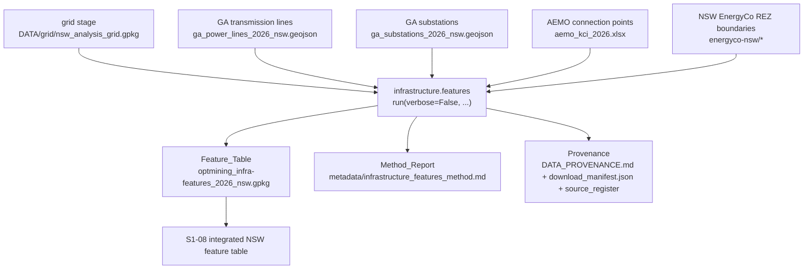

# Design Document

## Overview

This design specifies the **infrastructure feature-builder** stage (`s1-05-build-infrastructure-features`) for the Opt-Mining geospatial pipeline. It adds a new stage under `pipeline/infrastructure/` that converts the Sprint 0 electricity-infrastructure investigation (Geoscience Australia transmission lines and substations, AEMO connection points, and NSW EnergyCo Renewable Energy Zone boundaries) into **per-cell features** on the common analysis grid.

For every valid analysis cell (`DATA/grid/nsw_analysis_grid.gpkg`, 47,311 NSW cells), the stage derives:

- `dist_transmission_km` — distance from the cell centroid to the nearest transmission line
- `dist_substation_km` — distance from the cell centroid to the nearest substation
- `dist_connection_km` — distance from the cell centroid to the nearest AEMO connection point
- `inside_rez` — whether the cell intersects a Renewable Energy Zone boundary
- `rez_name` — the name(s) of the overlapping REZ(s), or null
- `confidence_flag` — `high` when every feature was computed from real source data, `low` when any required source was missing, unreadable, or empty

The resulting per-cell Feature_Table feeds the integrated NSW feature table (S1-08), which supports the multi-criteria suitability score. Proximity to grid infrastructure is a key driver of wind-farm connection cost, so these features materially affect siting suitability.

The design satisfies the pipeline's established contracts: the uniform `run(verbose=False, ...) -> dict` stage contract, strict keying to the grid's `cell_id`, explicit and logged CRS handling (EPSG:4326 storage / EPSG:3577 computation for all distances), the consistent GA-layer filtering pattern in `pipeline/infrastructure/helpers.py`, atomic writes with a do-not-edit banner on generated reports, the project file-naming convention, provenance capture, and the "no silent passes" validation rule.

### Design Grounding — Research and Existing Conventions

The design reuses existing pipeline infrastructure rather than introducing new patterns:

- **Grid contract** — `pipeline/grid/config.py` is authoritative for `STORAGE_CRS = "EPSG:4326"`, `COMPUTATION_CRS = "EPSG:3577"`, and `CELL_DEG = 0.05`. The grid file carries columns `cell_id`, `geometry`, `centroid_lat`, `centroid_lon`, `area_km2`. This stage **reads** those columns and never re-derives them (Requirement 8).
- **GA-layer helpers** — `pipeline/infrastructure/helpers.py` already provides `load_geojson`, `filter_by_state`, and `filter_by_fuel_type`, applied identically to all three GA layers (transmission lines, substations, generators). This stage routes all GA loads through those helpers (Requirement 7).
- **Atomic writes and banners** — `pipeline/common/geo.py` provides `atomic_write_text`, `atomic_write_json`, `banner(module_name)`, and `utc_now()`. This stage uses them for the Feature_Table, method report, and provenance updates (Requirements 5, 11).
- **Stage dispatch** — `pipeline/__main__.py` resolves the stage list from `config.STAGES`, dispatches each stage's `run()` via `_get_runner`, and builds kwargs via `_build_kwargs`. This stage registers there (Requirement 10).
- **Nearest-distance computation** — GeoPandas `GeoDataFrame.sjoin_nearest` (introduced with the spatial stack at S1-02) computes nearest-neighbour joins efficiently using an STR-tree spatial index. Run in EPSG:3577, `sjoin_nearest` returns the metre distance to the **nearest point on the nearest geometry** (for a `LineString`, that is the nearest point along the line, not an endpoint), which is exactly the Nearest_Feature_Distance defined in the requirements. This avoids an O(cells x features) brute-force scan and keeps the full-NSW-grid run tractable (Requirements 1, 2, 3, 14).

The distance-computation projection is **EPSG:3577 (GDA94 Australian Albers Equal Area)** and all distances are measured **from the cell centroid**, consistent with the frozen storage/computation CRS split.

## Architecture

### Placement in the pipeline

The stage is a new module `pipeline/infrastructure/features.py` exposing `run(verbose=False, ...) -> dict`. It is registered in `pipeline/config.py` `STAGES` **after** `grid` (the producer of its primary input) and dispatched by `pipeline/__main__.py`.



### Updated stage execution order

```
... → infrastructure.download → infrastructure.inspect → demand
→ grid → infrastructure.features → validate
```

`infrastructure.features` is placed after `grid` because it consumes the grid, and before `validate` so cross-domain checks see the output. The orchestrator's resolved order MUST place it after `grid` for every invocation that includes both (Requirement 10.4, 10.7).

> **Naming note.** The stage key uses the `infrastructure.` prefix to keep it in the infrastructure subpackage, but it is scheduled at the grid-consumer position rather than adjacent to the other infrastructure stages. `config.STAGES` is the single source of truth for order; the README stage-order table and `__main__.py` dispatch are kept in sync with it (Requirements 10, 15).

### Internal data flow

```mermaid
flowchart LR
    A["1. Load grid<br/>validate cell_id"] --> B["2. Load + filter GA layers<br/>via helpers.py"]
    B --> C["3. Resolve connection points<br/>xlsx → points w/ explicit CRS"]
    C --> D["4. Load REZ boundaries"]
    D --> E["5. Reproject all → EPSG:3577<br/>log every transform"]
    E --> F["6. sjoin_nearest per layer<br/>centroid → nearest feature (m)"]
    F --> G["7. REZ intersection<br/>inside_rez, rez_name"]
    G --> H["8. Assign confidence_flag"]
    H --> I["9. Assemble Feature_Table<br/>store geometry EPSG:4326"]
    I --> J["10. Atomic write + method report + provenance"]
    J --> K["11. Validate (no silent passes)"]
```



### CRS boundary discipline

Every CRS boundary is explicit and logged (Requirement 9). A `CrsLog` accumulator records one entry per reprojection with `{source_id, source_crs, target_crs, operation}`. The rules:

- The grid, GA layers, REZ boundaries, and connection points are each read in their declared CRS.
- If any source vector has no declared CRS or one that cannot be resolved to an EPSG code, the stage **halts** and raises an error naming the source — it never assumes or defaults a CRS (Requirement 9.4).
- Before any distance computation, geometries are reprojected to EPSG:3577; the reprojection is logged (Requirement 9.3).
- Before REZ intersection, all geometries are brought into one explicit CRS (EPSG:3577) and the CRS is logged (Requirement 4.7).
- The Feature_Table geometry (grid cell polygons, carried for join convenience) is stored in EPSG:4326 (Requirements 5.4, 9.1).
- The method report lists one entry per transformation, reconcilable against the reprojection events (Requirement 9.5).

## Components and Interfaces

### 1. Stage entry point — `pipeline/infrastructure/features.py`

```python
def run(
    verbose: bool = False,
    state: str = config.DEFAULT_STATE,        # "NSW"
    grid_path: Path | None = None,            # defaults to DATA/grid/nsw_analysis_grid.gpkg
    computation_crs: str = grid_config.COMPUTATION_CRS,  # "EPSG:3577" override
) -> dict:
    """
    Build per-cell infrastructure features on the common analysis grid.

    Returns a summary dict with at least:
        {
          "feature_table_path": str,   # existing path on disk
          "method_report_path": str,   # existing path on disk
          "n_cells": int,
          "n_high_confidence": int,
          "n_low_confidence": int,
          "runtime_seconds": float,
        }

    Raises on: missing/unreadable grid, missing cell_id column, duplicate
    cell_ids, unresolvable source CRS, or write failure — so the orchestrator
    halts with a non-zero exit status.
    """
```

The signature matches the registered-stage contract (first parameter `verbose`, defaults to `False`, returns a dict — Requirement 10.1).

### 2. Grid loader (Requirement 8)

`_load_grid(grid_path) -> GeoDataFrame`:

- Reads the grid GeoPackage with `geopandas.read_file`.
- Halts (raises `FileNotFoundError` / `RuntimeError`) if the file is missing or unreadable (8.4), if there is no `cell_id` column (8.5), or if `cell_id` contains duplicates (8.6) — all **before** writing any output.
- Reuses `cell_id` values byte-for-byte; never renumbers, reformats, or reorders (8.2).
- Derives the cell centroid from the cell polygon in EPSG:3577 for distance computation. (Centroids in a projected CRS are used; the stored `centroid_lat`/`centroid_lon` are geographic and are not used for metric distance.)

### 3. GA-layer loading via shared helpers (Requirement 7)

A single helper `_load_ga_layer(path, state)` routes **all three GA layers** (transmission lines, substations, generators) through `pipeline/infrastructure/helpers.py`:

```python
def _load_ga_layer(path: Path, state: str) -> list[dict]:
    collection = helpers.load_geojson(path)
    features = collection["features"]
    return helpers.filter_by_state(features, state)   # identical rule for all GA layers
```

- The same `filter_by_state` rule (default `NSW`) is applied to every GA layer (7.2). Generators are loaded for context/optional indicators only.
- All source paths and the default state come from `pipeline/infrastructure/config.py` (7.3).
- Any new configurable input is exposed as a CLI flag in `__main__.py` and threaded through `_build_kwargs` (7.4).
- Any required input not already in `EXPECTED_FILES` is added to that set in `config.py` (7.5).

### 4. Connection-point resolver (Requirement 3)

The AEMO KCI file is an `.xlsx`, not a spatial format, so its points need explicit CRS resolution:

`_resolve_connection_points(xlsx_path) -> tuple[GeoDataFrame, int]`:

- Reads the workbook with `pandas.read_excel`.
- Identifies latitude/longitude columns (documented in the method report). Each connection point is resolved to a geographic location with an **explicit source CRS of EPSG:4326** before reprojection to EPSG:3577 (3.3).
- A record whose coordinates cannot be resolved to a valid geographic location (missing/non-numeric/out-of-range lat-lon) is **excluded** from the distance computation, never given a default location; the excluded count is returned and reported in the method report (3.4).
- Returns an empty result (triggering the missing-source path) if the file is missing, unreadable, or yields zero locatable points (3.5).

### 5. REZ boundary loader and membership (Requirement 4)

`_load_rez(rez_dir) -> GeoDataFrame`:

- Loads the NSW EnergyCo REZ boundary polygons under `DATA/infrastructure/renewable-energy-zones/energyco-nsw/` (New England, Central-West Orana, Hunter-Central Coast) with `geopandas.read_file`.
- Each polygon carries a zone-name attribute; the name field is documented in config and the method report.

`_compute_rez_membership(grid, rez)`:

- Performs the intersection in **one explicit CRS** (EPSG:3577), logging the CRS (4.7).
- Uses `geopandas.sjoin(grid, rez, predicate="intersects")` so shared interior area **or** shared boundary counts as membership (4.1).
- `inside_rez = True` when a cell intersects one or more REZ polygons, else `False` (4.1, 4.2).
- `rez_name`: a single intersecting zone → that zone's name (4.3); multiple → distinct names joined by a single consistent delimiter (`"; "`), duplicates collapsed to one entry (4.4); no overlap → null (4.5).
- A cell intersecting a REZ polygon whose name attribute is missing/null → `inside_rez = True` and a placeholder name (`"UNNAMED_REZ"`) recorded in `rez_name` (4.6).
- If the REZ source is missing or unreadable → null `inside_rez` and null `rez_name` for every cell, and each such cell's confidence set to low (4.8).

### 6. Distance computation — `sjoin_nearest` in EPSG:3577 (Requirements 1, 2, 3, 9)

`_nearest_distance_km(centroids_3577, target_3577) -> Series` (indexed by `cell_id`):

- Both inputs are GeoDataFrames in EPSG:3577.
- `centroids.sjoin_nearest(target, distance_col="dist_m")` returns, per centroid, the metre distance to the nearest point on the nearest target geometry. For line targets this is the nearest point along the line, not an endpoint (Requirements 1.2, 13.3).
- The result is divided by 1000 to yield kilometres.
- Distances are never derived from EPSG:4326 coordinates (1.3, 2.2, 3.2, 9.2).
- If a target layer is missing/unreadable/empty (zero features), the corresponding distance column is null for **every** cell and every cell's confidence set to low (1.4, 2.3, 3.5).

### 7. Confidence-flag assignment (Requirement 6)

`_assign_confidence(feature_df) -> Series`:

- A cell is `low` if any of `dist_transmission_km`, `dist_substation_km`, `dist_connection_km`, `inside_rez`, or `rez_name`-eligible value is null due to missing/unavailable source data (6.2).
- A cell is `high` when every distance and REZ feature was computed from available source data (6.3).
- `confidence_flag` takes exactly one of `high` or `low` and no other value (6.4).
- Null distances are never replaced with a fabricated, default, or sentinel numeric value (6.1).
- The method report records the count of low- and high-confidence cells and the reason category (which source was missing/unreadable/empty) per low-confidence cell (6.5).

### 8. Method report and provenance (Requirements 5, 11)

`_write_method_report(...)` writes `DATA/infrastructure/metadata/infrastructure_features_method.md` via `common.geo.atomic_write_text`, stamped with `common.geo.banner("infrastructure.features")` (11.3). It records:

- The distance-computation projection (EPSG:3577) and the centroid-based distance definition (15.4).
- One entry per CRS transformation applied, reconcilable against reprojection events (9.5).
- The count of excluded connection-point records (3.4).
- Confidence-flag counts and per-category reasons (6.5).
- Any additional defensible indicator's definition and source field (5.3).
- Full-NSW-grid runtime and cells processed (14.2).

`_write_provenance(...)` appends/updates a Provenance_Record entry for the Feature_Table in `DATA/infrastructure/DATA_PROVENANCE.md` (human-readable table), the `download_manifest.json` (SHA-256, byte count, UTC timestamp, generation params), and the `source_register`, labelling it a **derived product** listing source datasets, computation CRS, and UTC generation timestamp (11.1, 11.2).

### 9. Orchestrator integration (Requirement 10)

- `pipeline/config.py`: add `"infrastructure.features"` to `STAGES` after `"grid"` and before `"validate"` (10.4).
- `pipeline/__main__.py`: add an `_get_runner` branch importing `from .infrastructure.features import run`; extend `_build_kwargs` to pass `verbose` and `state` (and any distance-CRS override / grid-path flag) for the stage (10.5).
- New CLI flags (as needed): `--infra-features-crs` (distance-computation CRS override) and reuse of the existing `--state` flag; documented in the README (7.4, 15.2).
- `pipeline/infrastructure/__init__.py`: docstring lists `features` within the infrastructure stage sequence (10.6).

### 10. Validation (Requirement 12)

Validation follows the "no silent passes" rule — each check reports expected vs observed vs pass/fail. It runs at the end of `run()` (and is also exercisable from the cross-domain `pipeline/validate.py` tier). Checks:

- Exactly one row per grid `cell_id`: expected cell count vs observed row count, pass/fail (12.1).
- Every grid `cell_id` present, none missing, none extra (12.2).
- Columns exactly match the Requirement 5 schema (12.3).
- Every non-null distance >= 0; report count of negatives (12.4).
- `inside_rez` is boolean or null only (12.5).
- `confidence_flag` is `high` or `low` only (12.6).
- Every cell with a null distance/REZ value has `confidence_flag = low`; report count of violators (12.7).

## Data Models

### Feature_Table (Requirement 5)

Written to `DATA/infrastructure/` as a GeoPackage following the `{source}_{dataset}_{year/vintage}_{region}.{ext}` convention with region slug `nsw`:

**`optmining_infra-features_2026_nsw.gpkg`**

| Column | Type | Units / Domain | Nullable | Notes |
|--------|------|----------------|----------|-------|
| `cell_id` | grid-native | matches grid | no | Reused byte-for-byte from the grid (8.2) |
| `dist_transmission_km` | float | kilometres, >= 0 | yes | Null when source missing/unreadable/empty |
| `dist_substation_km` | float | kilometres, >= 0 | yes | Null when source missing/unreadable/empty |
| `dist_connection_km` | float | kilometres, >= 0 | yes | Null when source missing/unreadable/empty |
| `inside_rez` | boolean | true / false / null | yes | Null when REZ source missing/unreadable |
| `rez_name` | string | zone name(s) / null / `UNNAMED_REZ` | yes | Multiple joined by `"; "`, distinct |
| `confidence_flag` | string | `high` \| `low` | no | Exactly two values (6.4) |
| `geometry` | Polygon | EPSG:4326 | no | Cell polygon, stored in storage CRS (5.4, 9.1) |

- Exactly one row per grid `cell_id`, no missing and no duplicate `cell_id`, joinable to the grid on `cell_id` (5.2, 8.3).
- Any additional defensible indicator (e.g. `nearest_line_voltage_kv`, `nearest_substation_capacity_mva`) is added as a named, documented column with its definition and source field recorded in the method report (5.3).
- Written via atomic write (`common.geo`, tmp + `os.replace`); on write failure, any pre-existing output is left unmodified and an error indication is returned (5.6, 5.7).
- Fully regenerable derived product, reproducible from the sources and grid with no manual editing (5.8).

### CrsLog entry (Requirement 9)

```python
@dataclass
class CrsTransform:
    source_id: str      # dataset identifier, e.g. "ga_power_lines_2026_nsw"
    source_crs: str     # e.g. "EPSG:4326"
    target_crs: str     # e.g. "EPSG:3577"
    operation: str      # e.g. "reproject-for-distance"
```

### Run summary dict (Requirement 10, 14)

```python
{
    "feature_table_path": str,     # exists on disk (10.2)
    "method_report_path": str,     # exists on disk (10.2)
    "n_cells": int,                # 47,311 for full NSW grid
    "n_high_confidence": int,
    "n_low_confidence": int,
    "runtime_seconds": float,      # equals method-report runtime, matches
                                   # orchestrator per-stage timing within 1s (14.3)
}
```


## Correctness Properties

*A property is a characteristic or behavior that should hold true across all valid executions of a system — essentially, a formal statement about what the system should do. Properties serve as the bridge between human-readable specifications and machine-verifiable correctness guarantees.*

The properties below were derived from the acceptance-criteria prework and consolidated to remove redundancy (the three per-layer distance criteria collapse into one nearest-distance property; the four metric-CRS criteria into one; the five missing-source criteria into one; and the REZ membership criteria into one membership-and-naming property).

### Property 1: Nearest-distance correctness

*For any* analysis grid and *any* non-empty target layer (transmission lines, substations, or connection points), the derived distance for each cell equals the true shortest planar distance (in EPSG:3577, converted to kilometres) from that cell's centroid to the nearest point on the nearest geometry in the target layer, within a documented numeric tolerance.

**Validates: Requirements 1.1, 2.1, 3.1**

### Property 2: Nearest point on line, not endpoint

*For any* cell centroid and *any* line geometry whose nearest point to the centroid lies in the interior of a segment (not at a vertex), the derived transmission distance equals the perpendicular (nearest-point-on-segment) distance and is less than or equal to the distance to either endpoint of that line.

**Validates: Requirements 1.2**

### Property 3: Distances are computed in metric EPSG:3577

*For any* grid and target layer, every derived distance equals the EPSG:3577 metre distance divided by 1000, so identical geometries yield a metre-based result rather than a degree-based result (the value is never the raw EPSG:4326 coordinate distance).

**Validates: Requirements 1.3, 2.2, 3.2, 9.2**

### Property 4: Non-negative distances

*For any* grid and target layer, every non-null value in `dist_transmission_km`, `dist_substation_km`, and `dist_connection_km` is greater than or equal to zero.

**Validates: Requirements 12.4**

### Property 5: REZ membership and naming

*For any* cell and *any* set of REZ boundary polygons, `inside_rez` is true if and only if the cell geometry intersects (shared interior area or shared boundary) at least one REZ polygon; when it is true, `rez_name` is exactly the set of distinct names of the intersecting zones joined by a single consistent delimiter with duplicates collapsed (with a placeholder recorded for any intersecting zone whose name is missing), and when it is false, `rez_name` is null.

**Validates: Requirements 4.1, 4.2, 4.3, 4.4, 4.5, 4.6**

### Property 6: Missing source yields null feature and low confidence

*For any* grid, when a required infrastructure source (transmission lines, substations, connection points, or REZ boundaries) is missing, unreadable, or contains zero usable features, every cell's corresponding feature value is null (never a fabricated, default, or sentinel numeric value) and every such cell's `confidence_flag` is low.

**Validates: Requirements 1.4, 2.3, 3.5, 4.8, 6.1**

### Property 7: Confidence flag reflects completeness and is two-valued

*For any* output row, `confidence_flag` is low if and only if at least one of the cell's distance or REZ feature values is null due to missing or unavailable source data, is high otherwise, and is always exactly one of the two values `high` or `low`.

**Validates: Requirements 6.2, 6.3, 6.4**

### Property 8: Cell_id preservation and one row per cell

*For any* analysis grid, the multiset of `cell_id` values in the Feature_Table equals the set of `cell_id` values in the grid exactly — every grid `cell_id` appears once, no `cell_id` is missing, none is duplicated, and none appears that is absent from the grid — with each `cell_id` reused byte-for-byte from the grid.

**Validates: Requirements 5.2, 8.2, 8.3**

### Property 9: Feature_Table stored in EPSG:4326

*For any* successful run, the geometry of the written Feature_Table is in EPSG:4326.

**Validates: Requirements 5.4, 9.1**

### Property 10: Unresolvable connection points are excluded and counted

*For any* set of connection-point records containing some records with invalid or unresolvable coordinates, the number of records excluded from the distance computation equals the number of invalid records, and no invalid record is assigned a default location.

**Validates: Requirements 3.4**

### Property 11: Regeneration is deterministic (idempotent)

*For any* fixed set of input sources and grid, running the Feature_Builder twice produces identical Feature_Tables, confirming the output is a fully regenerable derived product with no dependence on prior state or manual editing.

**Validates: Requirements 5.8**

### Property 12: Successful run returns existing output paths

*For any* valid inputs, when `run()` completes successfully it returns a summary dict whose `feature_table_path` and `method_report_path` are non-empty filesystem paths that exist on disk after the call returns.

**Validates: Requirements 10.2**

### Property 13: Resolved execution order places the stage after grid

*For any* orchestrator invocation whose resolved stage list includes both `grid` and `infrastructure.features`, the index of `grid` is strictly less than the index of `infrastructure.features`.

**Validates: Requirements 10.4, 10.7**

## Error Handling

The stage fails loud and early, never silently. All halt conditions occur **before** any Feature_Table output is written, so a failed run never leaves a partial or corrupt output.

| Condition | Handling | Requirement |
|-----------|----------|-------------|
| Grid file missing / unopenable | Raise `FileNotFoundError`/`RuntimeError` naming the grid path; no output written | 8.4 |
| Grid readable but no `cell_id` column | Raise error naming the absent column; no output written | 8.5 |
| Grid has duplicate `cell_id` values | Raise error listing the duplicated values; no output written | 8.6 |
| Source vector with no declared CRS or unresolvable EPSG | Halt, raise error naming the affected source; no CRS assumed or defaulted; no output written | 9.4 |
| A target infrastructure source missing / unreadable / empty | Not fatal: the corresponding feature is null for every cell and those cells' confidence set to low; run continues and reports the reason | 1.4, 2.3, 3.5, 4.8, 6 |
| A single connection-point record has invalid coordinates | Not fatal: exclude that record, increment the excluded count reported in the method report; never assign a default location | 3.4 |
| Feature_Table write fails | Leave any pre-existing Feature_Table unmodified (atomic tmp + `os.replace`); return/raise an error indication | 5.7 |
| Cannot produce Feature_Table or method report | Raise an error indicating the cause; do NOT return a summary dict, so the orchestrator halts with a non-zero exit | 10.3 |
| Full-grid run fails to process any cell before completion | Halt without reporting a successful runtime; raise an error indicating the full-grid run did not complete | 14.4 |

The distinction between **fatal** conditions (grid/CRS problems → halt) and **degraded** conditions (a missing target source → null feature + low confidence) is deliberate: a missing optional source must not abort the whole run, but it must be honestly flagged rather than fabricated.

## Testing Strategy

This stage is a pure data-transformation feature — per-cell distances, geometric membership, and flag logic are deterministic functions of the input grid and source layers — so **property-based testing applies** to the core logic. Infrastructure-boundary concerns (orchestrator wiring, provenance content, documentation consistency, full-grid runtime) are covered by example, integration, and smoke tests instead.

### Dual approach

- **Property tests** verify the universal properties in the Correctness Properties section across many generated inputs (random grids, random line/point/polygon layers, random missing-source combinations).
- **Unit (example) tests** verify specific hand-computed distances, edge cases, error conditions, and wiring.
- **Integration tests** verify the full-NSW-grid run and orchestrator ordering.
- **Smoke tests** verify config/wiring (`STAGES` membership, `EXPECTED_FILES`, CLI flag existence).

### Property-based testing

- Library: **Hypothesis** (the standard PBT library for Python). PBT is not implemented from scratch.
- Each property is implemented as a **single** property-based test running a **minimum of 100 iterations**.
- Each test is tagged with a comment referencing its design property, in the format:
  `# Feature: s1-05-build-infrastructure-features, Property {number}: {property_text}`
- Generators: small synthetic grids of GeoPandas cell polygons with unique `cell_id`s; synthetic transmission `LineString`s, substation/connection `Point`s, and REZ `Polygon`s; connection-point record sets seeded with a random count of invalid coordinates; and random subsets of "missing" sources. Generators cover edge cases explicitly required (unnamed REZ zones, empty layers, interior-nearest lines).

| Property | Test focus |
|----------|-----------|
| 1 Nearest-distance correctness | Compare `sjoin_nearest` result to an independent brute-force nearest-point computation (line and point layers) |
| 2 Nearest point on line, not endpoint | Line with interior nearest point; assert perpendicular distance and `<=` both endpoint distances |
| 3 Metric EPSG:3577 distances | Assert km == EPSG:3577 metres / 1000 and not degree-based |
| 4 Non-negative distances | All non-null distances `>= 0` |
| 5 REZ membership and naming | `inside_rez` iff intersects; `rez_name` == distinct joined names; unnamed → placeholder; none → null |
| 6 Missing source → null + low | Each source missing/unreadable/empty → null feature, low confidence, no sentinel |
| 7 Confidence flag | Low iff any null-due-to-missing; else high; always in {high, low} |
| 8 Cell_id preservation | Output `cell_id` multiset == grid `cell_id` set exactly |
| 9 Storage CRS | Written geometry CRS == EPSG:4326 |
| 10 Connection-point exclusion count | Excluded count == invalid-record count; no default location |
| 11 Determinism/idempotence | Two runs on fixed inputs produce identical tables |
| 12 Returned paths exist | After `run()`, returned paths exist on disk |
| 13 Grid-before-features ordering | For any resolved stage list containing both, grid index < features index |

### Unit tests (Requirement 13)

Explicit hand-computed synthetic examples, complementing the properties:

- 13.1 Centroid-to-nearest-line distance vs a hand-computed value within a documented tolerance.
- 13.2 Centroid-to-nearest-point distance vs a hand-computed value within a documented tolerance.
- 13.3 Nearest-point-on-line vs endpoint, using a synthetic line where the two differ.
- 13.4 EPSG:3577 metric distance vs a degree-based distance for identical geometries.
- 13.5 REZ membership: an intersecting cell flagged true with the correct `rez_name`; a non-intersecting cell flagged false with null `rez_name`.
- 13.6 Missing/empty source → null feature + low confidence, not a fabricated distance.

Additional example/error-condition unit tests cover: schema exactness (5.1), filename convention (5.5), atomic write + banner (5.6, 11.3), write-failure leaves prior output intact (5.7), grid error conditions (8.4–8.6), unresolvable-CRS halt (9.4), connection-point CRS resolution (3.3), `run()` signature and error-on-failure (10.1, 10.3), and CRS-log completeness (9.3, 9.5).

### Integration and smoke tests

- **Full-NSW-grid integration** (14.1–14.4): run over all 47,311 cells; assert every cell is processed with no interactive prompt, the runtime is recorded in both the method report and the summary dict, the two agree and match the orchestrator's per-stage timing within 1 second, and a forced mid-run failure halts without a success runtime. `sjoin_nearest` (STR-tree indexed) keeps this tractable.
- **Orchestrator smoke** (7.3–7.5, 10.4–10.6): assert the stage is in `config.STAGES` after `grid`, the required inputs are listed in `EXPECTED_FILES`, the CLI flag(s) exist and are forwarded by `_build_kwargs`, `_get_runner` returns the stage `run`, and the subpackage `__init__` docstring lists the stage.
- **Documentation consistency** (15.2, 15.3): assert the README stage-order table/name for `infrastructure.features` matches the resolved runtime stage configuration.

### Cross-component impact (must be delivered with this stage)

Per the holistic-project-awareness rule, this feature is not complete until these related components are updated consistently:

- `pipeline/config.py` — add `infrastructure.features` to `STAGES` after `grid`.
- `pipeline/__main__.py` — `_get_runner` dispatch branch and `_build_kwargs` handling; new CLI flag(s).
- `pipeline/infrastructure/config.py` — new source paths, defaults, and `EXPECTED_FILES` additions (REZ boundaries, connection-points if not already present).
- `pipeline/infrastructure/__init__.py` — docstring lists the new stage.
- `pipeline/infrastructure/helpers.py` — reused for all three GA layers (no divergent per-layer handling).
- `DATA/infrastructure/DATA_PROVENANCE.md`, `download_manifest.json`, `source_register` — provenance for the derived Feature_Table.
- `DATA/data-specification/sprint1_data_specification.md` §4.3 and §7 — dataset detail and dataset→stage→criterion mapping.
- `pipeline/README.md` — stage-order table and CLI documentation, stating the EPSG:3577 distance projection and centroid-based distance definition.
- If any frozen decision (Q1–Q7) is affected, follow the spec §8 change-control process and update both the spec §2 and the README identically (15.5). This stage does not currently change a frozen parameter.
