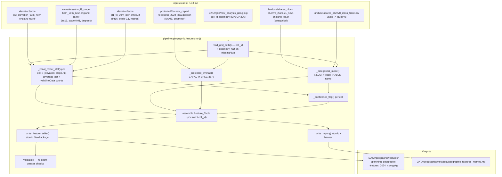

# Design Document

## Overview

This feature adds a **geographic feature-builder** pipeline stage (Sprint 1 task S1-06) that
converts the Sprint 0 geographic/environmental investigation — elevation, Horn slope, Riley
terrain ruggedness (TRI), ABARES NLUM land use, and CAPAD protected areas — into a
**per-cell feature table** keyed to the common analysis grid (`DATA/grid/nsw_analysis_grid.gpkg`,
47,311 cells at 0.05°). It emits exactly one row per grid `cell_id` (Req 6.1, 7.2, 8.3) with
terrain statistics, a dominant land-use class, a protected-area constraint, a TRI value, and a
per-cell confidence flag, plus an atomically-written method report. The table feeds the
suitability model (S1-07) and the exclusion layer (S1-08).

The stage is a **consumer of the grid**, so unlike the existing `geographic.*` stages (which run
in Sprint-0 order *before* the grid exists) it must be scheduled *after* the `grid` stage
(Req 10.4, 10.7). Section 5 resolves that ordering tension.

The design follows the pipeline's established contracts, verified against the current code:

- **Uniform stage contract** — `run(verbose: bool = False, ...) -> dict` returning a summary dict
  of output paths, matching `grid/generate.py`, `geographic/derive.py`, `validate.py` (Req 10.1–10.3).
- **Strict grid keying** — read `cell_id` + geometry from the gpkg via `geopandas.read_file`;
  reuse `cell_id` byte-for-byte (Req 8).
- **Explicit, logged CRS** — reuse `grid/config.STORAGE_CRS` (`EPSG:4326`) and
  `grid/config.COMPUTATION_CRS` (`EPSG:3577`); every reprojection logged (Req 9).
- **Atomic writes + do-not-edit banner** — `common/geo.atomic_write_text` and `common/geo.banner`
  for the report; a tmp-file + `os.replace` GeoPackage write mirroring `grid/generate.run()`
  (Req 2.7, 7.5).
- **File naming** — `{source}_{dataset}_{year/vintage}_{region}.{ext}` with region slug `nsw`
  (Req 7.4).
- **No silent passes** — validation as a list of `{"name","expected","observed","passed"}` dicts,
  exactly the shape used in `validate.py` and `geographic/validate.py` (Req 11).

### How the feature satisfies the requirements (map)

| Requirement | Where addressed in this design |
|---|---|
| R1 Per-cell terrain | §7 Zonal-statistics method; `_zonal_raster_stat` in §3 |
| R2 Documented zonal method | §7 (pixel-inclusion basis, valid/NoData counts, report) |
| R3 Dominant land use | §7 categorical mode + tie-break; ALUM table load in §3 |
| R4 Protected-area overlap | §7 CAPAD overlap in EPSG:3577; `_protected_overlap` in §3 |
| R5 Confidence flag | §7 confidence rule; `_confidence_flag` in §3 |
| R6 Out-of-coverage cells | §7 coverage test; §4 bookkeeping; §8 error handling |
| R7 Output schema/naming/format | §4 Feature_Table schema; §3 writer; §10 new output dir |
| R8 Strict cell_id keying | §3 grid reader; §8 error handling |
| R9 CRS handling | §6 CRS boundaries |
| R10 Stage under run() contract | §3 config/orchestrator additions; §5 ordering |
| R11 Validation | §9 Testing Strategy (validation checks) |
| R12 Unit tests | §9 Testing Strategy (unit tests) |
| R13 Full-grid runtime | §7 performance; §4 report; §9 |
| R14 Documentation | §10 Cross-component impact |

## Architecture

The stage sits after `grid` in the domain-sequential `STAGES` list. It reads the grid plus the
Sprint-0 geographic sources and writes one Feature_Table (GeoPackage) and one method report.



### Position in STAGES

```
... → demand → grid → geographic.features → validate
```

The stage runs immediately after `grid` and before the cross-domain `validate` stage, so the grid
producer always precedes this consumer (Req 10.4, 10.7) and the cross-domain checks can see the
new Feature_Table. See §5 for the naming/positioning decision and its interaction with
`--only geographic`.

## Components and Interfaces

### New module: `pipeline/geographic/features.py`

The stage lives in the geographic subpackage for domain cohesion (all terrain/land-use/protected
sources are geographic). The naming caveat this creates is resolved in §5.

#### Public entry point

```python
def run(verbose: bool = False) -> dict:
    """
    Build per-cell geographic/environmental features on the common analysis grid.

    Reads the grid (cell_id + geometry) and the Sprint-0 geographic sources, derives
    one Feature_Table row per cell_id, writes it atomically as a GeoPackage, and
    writes a do-not-edit method report.

    Returns
    -------
    dict with keys:
        "feature_table" : Path   # output GeoPackage (exists on disk after return)
        "report"        : Path   # method report (exists on disk after return)
        "n_cells"       : int    # rows written == grid cell_id count
        "runtime_s"     : float  # total wall-clock seconds (Req 13.2, 13.3)

    Raises
    ------
    FileNotFoundError / ValueError / RuntimeError on any halting condition
        (missing grid, missing cell_id column, duplicate cell_id, missing/unreadable
        CAPAD, undeclared source CRS, write failure) — see §8. On any raise the run
        returns no summary dict so the orchestrator halts with a non-zero exit
        (Req 10.3).
    """
```

The signature matches the other stages: `verbose` first with default `False`, returns a dict
(Req 10.1). No `bbox`/`area_name` kwargs are needed — the stage always operates over the full NSW
grid, so `_build_kwargs` supplies only `verbose` (see below).

#### Internal functions

```python
# --- grid input (Req 8) ---
def read_grid_cells(grid_path: Path) -> "gpd.GeoDataFrame":
    """Read cell_id + geometry from the grid GeoPackage (EPSG:4326).
    Raises FileNotFoundError if missing (8.4), ValueError if no cell_id column
    (8.5) or duplicate cell_ids (8.6). Does not modify or reorder cell_id (8.2)."""

# --- raster zonal statistics (Req 1, 2, 5, 6) ---
def _zonal_raster_stat(
    src: "rasterio.DatasetReader",
    cell_geom,                      # shapely polygon in the raster's CRS
    stat: str,                      # "mean" (documented per §7)
) -> "CellStat":
    """Windowed read of the raster over the cell bounds, mask to the cell polygon
    using the cell-centre inclusion rule, apply src.scales, exclude nodata.
    Returns CellStat(value, n_valid, n_nodata, in_coverage). value is None when
    n_valid == 0 (Req 1.6, 2.6). in_coverage is False when the cell centroid is
    outside the raster bounds or all sampled pixels fall outside valid data
    (Req 6.2, 6.3)."""

def _raster_coverage(src, cell_geom) -> bool:
    """Cell-centroid-in-raster-bounds test used to short-circuit the ~99% of NSW
    cells outside New England REZ / Glen-Innes coverage (Req 6.2, 13)."""

# --- categorical mode (Req 3) ---
def _categorical_mode(
    src: "rasterio.DatasetReader",
    cell_geom,
    class_table: dict[int, str],
) -> "ModeResult":
    """Mode of NLUM codes over the cell's valid pixels. Tie-break: lowest code
    wins (Req 3.2). Maps code -> ALUM name via class_table; unmapped code ->
    'unmapped:<code>' marker (Req 3.4). Returns ModeResult(land_use, code,
    n_valid, n_nodata, in_coverage); land_use is None if n_valid == 0 (Req 3.5)."""

def load_alum_class_table(path: Path) -> dict[int, str]:
    """{int(row['Value']): row['TERTV8']} from the ALUM v8 CSV — same idiom as
    geographic/inspect._load_class_table. Code 0 = 'No data / offshore'."""

# --- protected-area overlap (Req 4) ---
def _protected_overlap(
    cells_3577: "gpd.GeoDataFrame",   # cell polygons reprojected to EPSG:3577
    capad_3577: "gpd.GeoDataFrame",   # CAPAD features reprojected to EPSG:3577
) -> dict[str, tuple[bool, str]]:
    """Spatial join (intersects) in EPSG:3577 (Req 4.6, 9.2). Returns per cell_id
    (protected_area, protected_area_name) where the name is the delimiter-joined
    set of distinct CAPAD NAME values (Req 4.3); '' when no overlap (Req 4.4);
    unnamed features -> '(unnamed protected area)' placeholder (Req 4.5)."""

# --- confidence (Req 5) ---
def _confidence_flag(
    per_raster: dict[str, "CellStat | ModeResult"],
) -> str:
    """'low' if any required raster has in_coverage False, or n_nodata >= 50% of
    (n_valid + n_nodata), else 'high' (Req 5.1-5.4)."""

# --- output (Req 7) ---
def _write_feature_table(gdf: "gpd.GeoDataFrame", path: Path) -> None:
    """Atomic GeoPackage write: to_file(tmp) + os.replace, mirroring
    grid/generate.run(). Leaves any prior output intact on failure (Req 7.5, 7.6)."""

def _write_report(report_text: str, path: Path) -> None:
    """atomic_write_text with a banner('geographic.features') stamp (Req 2.7)."""

# --- validation (Req 11) ---
def validate(feature_table_path: Path, grid_path: Path) -> dict:
    """No-silent-passes checks over the written table; returns
    {"checks": [ {name, expected, observed, passed}, ... ], "passed": int,
    "total": int}. See §9."""
```

`CellStat` and `ModeResult` are small dataclasses (see §4). The functions take an open
`rasterio.DatasetReader` (`src`) so the raster is opened once per variable and windowed per cell,
never read in full (§7 performance; Req 13).

### Config additions: `pipeline/config.py`

Add the stage key to `STAGES` **after `grid` and before `validate`**, and add the domain to
`DOMAINS` mapping semantics (the stage stays under the `geographic` domain prefix):

```python
STAGES = [
    "wind.probe",
    "wind.download",
    "wind.inspect",
    "wind.validate",
    "wind.analyse",
    "geographic.probe",
    "geographic.download",
    "geographic.inspect",
    "geographic.derive",
    "geographic.validate",
    "infrastructure.download",
    "infrastructure.inspect",
    "demand",
    "grid",                 # common analysis cell (S1-02) — must run before feature layers
    "geographic.features",  # S1-06 feature-builder — CONSUMES grid, so scheduled after it
    "validate",             # cross-domain integration checks
]
```

`DOMAINS` is unchanged (`geographic` already present). See §5 for why `geographic.features`
appears out of contiguous order with the other `geographic.*` stages and how `resolve_stages`
handles it.

### Orchestrator additions: `pipeline/__main__.py`

Add a dispatch branch in `_get_runner` (placed after the `grid` branch to mirror execution order):

```python
    elif stage == "grid":
        from .grid.generate import run
        return run
    elif stage == "geographic.features":
        from .geographic.features import run
        return run
    elif stage == "validate":
        from .validate import run
        return run
```

`_build_kwargs` needs no special-casing: the stage takes only `verbose`, which the base
`kwargs = {"verbose": args.verbose}` already supplies. No change to `_build_kwargs` is required
beyond confirming the stage is not accidentally matched by an existing `if stage in (...)` branch
(it is not).

### Subpackage docstring: `pipeline/geographic/__init__.py`

Add the feature-builder to the stage list, noting its true execution position (Req 10.6):

```
Stages:
    1. probe     — Discover available geographic/environmental data sources
    2. download  — Fetch vectors (ABS, CAPAD, NE, NEM) + rasters (SRTM, NLUM)
    3. inspect   — Examine vector and raster samples (statistics, metadata)
    4. derive    — Compute slope and terrain ruggedness from DEM clips
    5. validate  — Geographic ground-truth checks (CAPAD areas, DEM, NLUM)
    6. features  — Per-cell geographic feature table on the common analysis grid
                   (S1-06). NOTE: this stage CONSUMES the grid, so it is registered
                   in config.STAGES AFTER the `grid` stage, not inline with 1–5.
```

## Data Models

### Feature_Table schema (Req 7.1)

Exactly these eight columns, plus geometry (Req 7.3). Written as a GeoPackage layer in EPSG:4326.

| Column | dtype | Units / domain | Null semantics |
|---|---|---|---|
| `cell_id` | str | grid identifier `S{lat}_E{lon}` | never null; byte-for-byte from grid (Req 8.2) |
| `elevation_m` | float64 | metres AMSL | null (NaN) when no valid elevation pixels / out of coverage (Req 1.6, 6.2) |
| `slope_deg` | float64 | degrees, plausible 0–90 | null when no valid slope pixels / out of coverage |
| `land_use` | str | ALUM v8 tertiary class name, or `unmapped:<code>` | null when no valid NLUM pixels / out of coverage (Req 3.5) |
| `protected_area` | bool | true/false | never null (Req 4.1, 4.2) |
| `protected_area_name` | str | distinct names joined by `"; "`; `""` if none | empty string, never null (Req 4.4) |
| `tri` | float64 | metres | null when no valid TRI pixels / out of coverage (only Glen-Innes has data) |
| `confidence_flag` | str | exactly `"high"` or `"low"` | never null (Req 5.4) |
| `geometry` | polygon | EPSG:4326 | copied from grid (Req 7.3) |

Null numeric values are stored as `NaN` (GeoPackage/pandas float NaN); `land_use` null is stored as
an empty string sentinel or SQL NULL — the writer uses `None`/NaN so `geopandas.read_file`
round-trips them as missing. The delimiter for `protected_area_name` is `"; "` (a single
consistent delimiter, Req 4.3).

### `CellStat` (raster zonal result, in-memory)

```python
@dataclass
class CellStat:
    value: float | None     # aggregated statistic, None when n_valid == 0
    n_valid: int            # non-NoData pixels in the clipped selection (Req 2.2)
    n_nodata: int           # NoData pixels in the clipped selection (Req 2.2)
    in_coverage: bool       # False -> cell outside raster extent (Req 6.2/6.3)
    # invariant: n_valid + n_nodata == total clipped pixels (Req 2.2)
```

### `ModeResult` (categorical result, in-memory)

```python
@dataclass
class ModeResult:
    land_use: str | None    # ALUM name or "unmapped:<code>"; None when n_valid == 0
    code: int | None        # winning NLUM code (lowest on tie, Req 3.2)
    n_valid: int
    n_nodata: int
    in_coverage: bool
```

### Check-result dict (Req 11) — reused shape

```python
{"name": str, "expected": str, "observed": str, "passed": bool}
```

Identical to `validate.py` / `geographic/validate.py`, so the report table renders the same way
(`PASS` / `**FAIL**`).

### Method report structure (Req 2.5, 5.6, 6.5, 6.6, 13.2)

Markdown, atomic-written with `banner("geographic.features")`, containing:

1. **Header + banner** (do-not-edit stamp).
2. **Method** — per raster variable: aggregation statistic, partial-cell boundary rule, NoData
   rule (Req 2.5). Land-use: mode + tie-break rule (Req 3.2). Protected areas: intersection CRS.
3. **Coverage** — per source raster, cells inside vs outside coverage, with
   `inside + outside == total cell count` (Req 6.5); documents the New England REZ extent and
   Glen-Innes-only TRI extent vs the full NSW grid (Req 6.6).
4. **NoData / zero-valid-pixel occurrences** — count of cells with zero valid pixels per raster
   (Req 2.6); any unmapped NLUM codes encountered (Req 3.4).
5. **Confidence** — count of low- vs high-confidence cells (Req 5.6).
6. **CRS transformations** — one entry per reprojection: source dataset id, source CRS, target
   CRS, operation (Req 9.3, 9.5).
7. **Runtime** — total wall-clock seconds and cells processed (Req 13.2), equal to the
   `run()` dict `runtime_s` (Req 13.3).

## Stage-ordering resolution (Req 10.4, 10.7)

**Decision: name the stage `geographic.features` (keeping it in the geographic namespace for
cohesion) but register it in `STAGES` immediately after `grid`, i.e. out of contiguous order with
the other `geographic.*` stages.**

Rationale:

- **Cohesion vs. correctness.** The stage's inputs (SRTM terrain, NLUM land use, CAPAD) are all
  geographic-domain products, and its logic belongs beside `derive`/`validate`. Keeping the
  `geographic.` prefix keeps imports and mental model consistent. But it is fundamentally a *grid
  consumer*: it cannot run until `grid` has produced `nsw_analysis_grid.gpkg`. The `STAGES` list is
  the single source of execution order, so placing the key after `grid` is what guarantees
  producer-before-consumer (Req 10.4, 10.7). The other `geographic.*` stages run in Sprint-0 order
  before the grid ever exists; `features` is the exception and is annotated as such in `config.py`
  and the `__init__` docstring.

- **Interaction with `--only geographic`.** `resolve_stages()` matches a domain filter with
  `s.startswith(only + ".")`, so `--only geographic` would select **all six** `geographic.*` stages
  *in their `STAGES` order*. Because `geographic.features` sits after `grid` in `STAGES`, the
  resolved list for `--only geographic` would be:
  `geographic.probe, geographic.download, geographic.inspect, geographic.derive,
  geographic.validate, geographic.features` — the last one appearing after the others, which is
  correct relative ordering *among geographic stages*. The subtlety is that `--only geographic`
  runs `geographic.features` **without** first running `grid`, so it depends on a
  previously-generated grid file on disk. This is acceptable and consistent with how the pipeline
  already treats cross-stage inputs (e.g. `--only validate` assumes upstream outputs exist), and
  `read_grid_cells` fails loudly with a clear error if the grid is absent (Req 8.4). This behaviour
  is documented in the README CLI notes (§10).

- **Alternative considered and rejected: a new top-level `features` / `integration.features`
  domain.** This would make the "after grid" position visually obvious and avoid the
  `--only geographic` subtlety. It was rejected because it fragments the geographic logic across two
  namespaces, requires a new `DOMAINS` entry and a new subpackage, and adds ceremony for a single
  stage. The chosen approach keeps the change minimal and cohesive while `STAGES` still enforces the
  ordering contract. If more grid-consuming feature builders are added (S1-03…S1-05, S1-07),
  revisiting a dedicated `features` domain is reasonable — noted for future work.

The README stage-order table and diagram (§10) must be updated to show `geographic.features`
between `grid` and `validate`, matching the resolved runtime order (Req 14.2, 14.3).

## CRS handling (Req 9)

Reuse the authoritative constants from `pipeline/grid/config.py` — do **not** re-hardcode:

```python
from ..grid.config import STORAGE_CRS       # "EPSG:4326"
from ..grid.config import COMPUTATION_CRS    # "EPSG:3577"
```

Explicit boundaries:

- **Storage.** The grid is read in `STORAGE_CRS` and the Feature_Table is written in `STORAGE_CRS`
  (Req 9.1, 7.3). Geometry is copied straight from the grid without reprojection.
- **Raster sampling.** Rasters are read in their own declared CRS. Cell polygons are transformed
  from `STORAGE_CRS` to each raster's `src.crs` at the read boundary (`rasterio.warp.transform_geom`
  or `rasterio.warp.transform` for the centroid), exactly as `validate._sample_raster_at` transforms
  the sample point via `warp_transform("EPSG:4326", src.crs, ...)`. If a raster's `src.crs` is
  `None` or cannot resolve to an EPSG code, the run halts (Req 9.4; §8).
- **Distance/area (protected-area intersection).** Cell polygons and CAPAD features are reprojected
  to `COMPUTATION_CRS` before the intersection (Req 4.6, 9.2). No area/distance is derived from
  `EPSG:4326` coordinates.
- **Logging.** Every reprojection appends a CRS-transformation entry to the method report
  (source dataset id, source CRS, target CRS, operation) so a reviewer can reconcile every
  transformation against the reprojection events (Req 9.3, 9.5). When `verbose`, the same entries
  are printed. This aligns with the project-wide rule in data-spec §5 (EPSG:4326 storage /
  EPSG:3577 computation, explicit at every boundary).

## Zonal-statistics method (Req 1, 2, 3, 5, 6)

### Pixel-inclusion basis and partial-cell rule (Req 2.1, 2.4, 1.5)

**Rule: cell-centre inclusion — a raster pixel belongs to a cell iff the pixel centre lies within
the cell polygon.** This is the same deterministic rule the codebase already uses for
rasterisation (`rasterio.features.rasterize(..., all_touched=False)` in `validate.py`
`_point_in_polygons` / `_mask_from_polygons`). It is applied **identically to every raster**
(elevation, slope, TRI) (Req 1.5, 2.4), is deterministic (same pixel set on repeated runs, Req 2.1),
and is recorded verbatim in the method report (Req 2.4).

Implementation: for each cell, compute the raster window from the cell bounds
(`rasterio.windows.from_bounds(...).round_offsets().round_lengths()`), read that window, and build a
boolean mask of pixel centres inside the cell polygon via `rasterio.features.geometry_mask` /
`rasterize` on the window transform with `all_touched=False`. The statistic is computed over
`window_data[mask & valid]`.

### NoData rule (Req 2.2, 2.3, 5.1)

Valid pixels are those inside the mask that are **not** equal to the raster's declared `src.nodata`
(and, for masked reads, not masked). `n_valid` counts valid pixels; `n_nodata` counts masked/nodata
pixels **and** in-cell pixel positions that fall outside the raster's data extent (counted as
NoData per Req 5.1). Invariant: `n_valid + n_nodata == total pixels in the clipped selection`
(Req 2.2). NoData pixels are excluded from every statistic (Req 2.3). If `n_valid == 0`, the
statistic is `None`/NaN and the occurrence is recorded (Req 1.6, 2.6).

**Caveat carried from `derive.py`:** the GL3 mosaic declares `nodata=0`, which conflates true
sea level with voids. The New England REZ window is inland and contains no zero pixels (per the
inspection reports), so this does not affect the current coverage; the method report repeats the
caveat so any future coastal extension is handled consciously rather than silently.

### Scaled rasters (Req 1.2, 1.3)

Slope and TRI are stored as scaled `int16` (slope scale `0.01°`, TRI scale `0.1 m`; see
`derive._write_raster`). The reader multiplies by `src.scales[0]` (defaulting to `1.0` when absent),
exactly as `validate._sample_raster_at` does. Elevation is unscaled `int16`/`float`.

### Statistic per variable (Req 1.4)

| Variable | Statistic | Justification |
|---|---|---|
| `elevation_m` | **mean** of valid pixels | Representative central value for a ~5 km cell; robust for a smooth continuous surface. |
| `slope_deg` | **mean** of valid pixels | **Frozen decision Q3** (data-spec §2, README): *"Slope aggregation statistic per cell: Mean for scoring; P90 in explanation."* This design implements the scoring statistic (mean). The Q3 evidence lives in `derive.py` Evidence 2. Using anything other than mean here would contradict a frozen decision and require the §8 change-control process. |
| `tri` | **mean** of valid pixels | Consistent with the terrain-mean treatment; TRI is a continuous ruggedness measure and mean gives the cell's typical ruggedness. |

The chosen statistic per variable is recorded in the method report (Req 1.4, 2.5). Note the slope
raster is already the derived Horn slope in degrees, so no slope computation happens here — only
aggregation.

**Frozen-decision note (Req 14.4):** this design *implements* Q3 as already frozen; it does not
change it. No §8 change-control action is triggered. If S1-07 later needs the P90 "explanation"
slope, that is an additive column and a separate decision.

### Categorical mode for land use (Req 3)

`land_use` is the ALUM class name of the **modal** NLUM code over the cell's valid pixels
(`numpy.unique(codes, return_counts=True)`, pick max count). **Tie-break: lowest code wins** —
deterministic and reproducible (Req 3.2). Code → name via the ALUM class table
(`{int(Value): TERTV8}`); a code absent from the table becomes `unmapped:<code>` and is reported
(Req 3.4). Code `0` is "No data / offshore" in the class table; it is treated as a valid class only
if it is the genuine mode (the raster's `nodata`, if declared, is excluded before the mode). If a
cell has zero valid NLUM pixels, `land_use` is null and the cell is low confidence (Req 3.5).

### Coverage test (Req 6.2, 6.3, 5.2)

Most of the 47,311 NSW cells lie outside New England REZ (elevation/slope/NLUM) and Glen-Innes
(TRI). Coverage is decided per raster per cell:

- **Centroid test (fast path).** If the cell centroid lies outside the raster bounds, the cell is
  out of coverage for that raster → variable null, `in_coverage=False` (Req 6.2). This short-circuits
  the ~99% of cells outside coverage without a windowed read (§ performance).
- **Edge test (Req 6.3).** If the centroid is inside the bounds but the cell overlaps the raster
  edge such that sampled pixel positions fall outside valid data, those positions count as NoData;
  when this makes `n_valid == 0`, the variable is null and the cell is classified out of coverage
  for that raster.

Out-of-coverage always implies null variable and (via §confidence) low confidence (Req 6.4).

### Confidence rule (Req 5)

A cell is **low** confidence if, for **any** required source raster, either:

- the cell is out of coverage (`in_coverage == False`), Req 5.2; or
- `n_nodata >= 50%` of `(n_valid + n_nodata)` (i.e. ≥50% NoData, the exactly-50% boundary counts as
  low), Req 5.1.

Otherwise **high** (Req 5.3). The flag is exactly one of `"high"`/`"low"` (Req 5.4), stored in
`confidence_flag` (Req 5.5). The required rasters for the confidence decision are elevation, slope,
and NLUM (the full-window sources); **TRI is excluded from the confidence decision** because it
covers only Glen-Innes by design — including it would flag the entire NSW grid low and destroy the
flag's signal. This scoping is documented in the method report (Req 5.6, 6.6). Counts of low vs high
cells are reported (Req 5.6).

### Performance (Req 13)

- **Windowed reads only.** Rasters are opened once per variable; per cell a small window over the
  cell bounds is read (never the national mosaic in full). `apply_vsicurl_env()` from `common/geo`
  is called first so any `/vsicurl/` reads use the project GDAL settings, matching `validate.py`.
- **Coverage short-circuit.** Out-of-coverage cells (the vast majority) skip the windowed read
  entirely via the centroid test — they resolve to null + low confidence in O(1).
- **Vectorised protected-area join.** CAPAD overlap is a single `geopandas.sjoin` in EPSG:3577 over
  all cells, not a per-cell loop.
- The stage times itself (`time.time()` around the body), reports total runtime + cells processed
  in the method report (Req 13.2), and returns `runtime_s` in the summary dict equal to the reported
  value and within 1 s of the orchestrator's per-stage timing (Req 13.3). If any cell cannot be
  processed the run raises (Req 13.4; §8) rather than reporting a successful runtime.

## Error Handling

All halting conditions raise before any Feature_Table is written (or leave a prior output intact),
so the orchestrator's `try/except` in `__main__.main()` catches the exception and exits non-zero
(Req 10.3). No partial or silently-degraded output is ever produced.

| Condition | Requirement | Behaviour |
|---|---|---|
| Grid file missing / unopenable | 8.4 | `read_grid_cells` raises `FileNotFoundError` with the grid path; nothing written. |
| Grid has no `cell_id` column | 8.5 | Raise `ValueError` naming the absent column; nothing written. |
| Grid has duplicate `cell_id` | 8.6 | Raise `ValueError` listing duplicated `cell_id`s; nothing written. |
| CAPAD source missing / unreadable | 4.7 | Halt the protected-area computation; raise `RuntimeError` identifying the missing/unreadable CAPAD path; no `protected_area`/`protected_area_name` written. |
| Source raster/vector CRS undeclared or unresolvable to EPSG | 9.4 | Raise `ValueError` identifying the affected source; do **not** assume/default a CRS; nothing written. |
| Feature_Table write fails | 7.6 | Atomic write (tmp + `os.replace`) means the tmp file is discarded and any existing table is unmodified; the underlying exception propagates as an error indication. |
| Method report cannot be produced | 10.3 | Raise; no summary dict returned. |
| Any cell not processed before completion (full-grid) | 13.4 | Raise; no successful runtime reported. |

Because writes are atomic, a crash mid-write cannot leave a truncated GeoPackage: the destination
path only ever appears via `os.replace` of a fully-written tmp file, matching `grid/generate.run()`
and `derive._write_raster`.

## Testing Strategy

The feature builder's core is a set of **pure functions** over raster/vector inputs with clear
input/output behaviour (zonal statistic, categorical mode + tie-break, NoData exclusion, confidence
threshold, coverage bookkeeping, protected-area overlap). These have genuine universal properties,
so **property-based testing applies** to the logic layer, complemented by example/edge unit tests
and no-silent-passes validation checks. The raster/vector *I/O* and the full-grid *runtime* are
verified with example-based and integration-style tests, not PBT.

### Property-based testing

- **Library:** `hypothesis` for Python (add to `requirements.txt`; do not hand-roll generators).
  It is the standard PBT library for the Python/pytest stack already used here (`pytest.ini`,
  `tests/test_*.py`). Adding `hypothesis` is a test-only dependency and is flagged in §10.
- **Configuration:** minimum 100 iterations per property (`@settings(max_examples=100)`).
- **Tagging:** each property test carries a comment
  `# Feature: geographic-environmental-features, Property {n}: {property text}`.
- **Implementation:** each correctness property in §Correctness Properties is implemented by a
  single property-based test. Generators build small synthetic numpy rasters (with a chosen
  `nodata`), synthetic cell polygons, and synthetic CAPAD-like polygons — no network, no real files,
  fast enough for 100+ iterations.

### Unit tests (Req 12)

Location: `tests/test_geographic_features.py` (repo-root `tests/`, matching `pytest.ini`
`testpaths = tests` and the existing `tests/test_grid.py`, `tests/test_wind_unit.py`). Grouped in
`Test*` classes to match the existing style.

| Test | Requirement | What it asserts |
|---|---|---|
| Terrain mean on a synthetic raster + cell | 12.1 | Computed mean equals a hand-computed value within a documented tolerance (e.g. `1e-9`). |
| Categorical mode, known dominant class | 12.2 | Mode returns the known dominant code/name. |
| Categorical mode tie-break | 12.2 | On a deliberate tie, the lowest code wins. |
| NoData exclusion + counts | 12.3 | NoData pixels are excluded from the statistic and counted separately; `n_valid + n_nodata == total`. |
| Confidence threshold >50% NoData → low | 12.4 | Cell with >50% NoData flagged low. |
| Confidence threshold exactly 50% NoData → low | 12.4 | Boundary case (==50%) flagged low. |
| Confidence >50% valid → high | 12.4 | Cell with >50% valid (and in coverage) flagged high. |
| All-NoData / zero-valid cell | 12.5 | Statistic is null and confidence is low. |
| Protected overlap true | 12.6 | Cell intersecting a protected polygon → `protected_area == True`. |
| Protected overlap false | 12.6 | Non-intersecting cell → `protected_area == False`. |

### Validation checks (Req 11) — no silent passes

`validate()` (in `features.py`, invoked after the write; also callable from a cross-domain check)
produces `{"name","expected","observed","passed"}` dicts and reports expected vs observed vs
pass/fail for each:

| Check | Requirement | Expected vs observed |
|---|---|---|
| Row count == grid cell count | 11.1 | expected = grid `cell_id` count; observed = Feature_Table row count. |
| Exact `cell_id` set match | 11.2 | expected = grid `cell_id` set; observed = missing count + extra count (both 0 to pass). |
| Schema columns match Req 7 | 11.3 | expected = the eight columns; observed = actual columns. |
| `slope_deg` ∈ [0, 90] or null | 11.4 | observed = count of out-of-range non-null cells (0 to pass). |
| `confidence_flag` ∈ {high, low} | 11.5 | observed = count of any other value (0 to pass). |

Per-domain feature checks live inside `features.validate()`; the existing cross-domain
`pipeline/validate.py` may additionally assert the Feature_Table joins 1:1 to the grid (a
cross-domain concern) — this is an optional follow-up, not required by S1-06.

### Full-grid runtime (Req 13)

A (slower, opt-in) integration test runs `run()` over the real grid if present and asserts:
the returned `n_cells` equals the grid cell count (Req 13.1), the summary dict contains
`runtime_s` (Req 13.2, 13.3), and the method report's runtime line equals `runtime_s`. This test
`pytest.skip`s when the grid GeoPackage is absent, mirroring `TestGeoPackageRoundtrip` in
`tests/test_grid.py`.

## Cross-component impact & documentation (Req 14, holistic-project-awareness)

This stage adds a new pipeline stage **and** a new output dataset, so the following files must
change together for the feature to be complete. Leaving any of these inconsistent is a partial
implementation.

### Code

| File | Change | Why |
|---|---|---|
| `pipeline/geographic/features.py` | **new module** | The stage itself (Req 10.1). |
| `pipeline/config.py` | add `"geographic.features"` to `STAGES` after `grid` | Stage registration + ordering (Req 10.4, 10.7). |
| `pipeline/__main__.py` | add `_get_runner` branch for `geographic.features` | Orchestrator dispatch (Req 10.5). `_build_kwargs` needs no change (verbose-only). |
| `pipeline/geographic/__init__.py` | add stage 6 to docstring with the "after grid" note | Req 10.6. |

### Documentation

| File | Change | Why |
|---|---|---|
| `pipeline/README.md` | add `geographic.features` to the **Stage Execution Order** block and the ASCII flow, between `grid` and `validate`; add the Feature_Table row to the Geographic expected-outputs table; add a CLI note that `--only geographic` runs `features` against a pre-existing grid | Req 14.2, 14.3 (README order must match resolved runtime order). |
| `DATA/data-specification/sprint1_data_specification.md` §4.4 (Geographic & Environmental Suitability) | add a dataset-detail entry for the Feature_Table naming its per-cell columns incl. `confidence_flag` and `tri`, and the coverage-gap description | Req 14.1, 14.5. |
| `DATA/data-specification/sprint1_data_specification.md` §7 (Pipeline Mapping) | add a row mapping the geographic sources → `geographic.features` stage → suitability/exclusion criteria | Req 14.1. |
| `DATA/data-specification/sprint1_data_specification.md` §8 | the new output is added via the §8 change-control "Adding a New Dataset" process (spec entry, provenance, source register, inspection, README) | Req 14 / holistic rule. |

**Frozen decisions (Q1–Q7):** this design *implements* Q3 (slope = mean for scoring) and Q6 (any
CAPAD intersection excludes → boolean `protected_area`) as already frozen; it does **not** change
any frozen parameter, so no §8 frozen-parameter change is triggered and no dual spec-§2/README edit
is required (Req 14.4). If review decides to change the slope statistic or the protected-area rule,
that must go through §8 and be recorded identically in data-spec §2 and README.

### New output dataset — provenance conventions

The Feature_Table is a new **derived** output under a new directory `DATA/geographic/features/`
(chosen over a top-level `DATA/features/` to keep it in the geographic domain tree alongside its
sources; justify in the spec entry). As a fully regenerable derived product (Req 7.7), it follows
the same provenance discipline as other generated layers:

- **Format: GeoPackage** (`.gpkg`), not CSV, because the table must carry geometry in EPSG:4326
  (Req 7.3) and downstream S1-07/S1-08 join spatially; GeoPackage is already the grid's format and
  is round-tripped by `geopandas`/`pyogrio` in the test suite.
- **Filename:** `optmining_geographic-features_2024_nsw.gpkg` following
  `{source}_{dataset}_{year/vintage}_{region}` with region slug `nsw` (Req 7.4). (`source` =
  `optmining` since this is a derived project product; `2024` tracks the CAPAD vintage — confirm the
  vintage token in the spec entry.)
- **Provenance:** because this is a derived product regenerable from source datasets + the grid
  (Req 7.7, like `derive.py`'s slope/TRI), it is stamped by the do-not-edit method report and does
  not require a download-manifest SHA row; if project convention treats every `DATA/` output as
  requiring a `DATA_PROVENANCE.md` / `source_register` line, add a derived-product row noting inputs
  and the producing stage. **This is a convention call to confirm with the maintainer** (derived
  layers `derive.py` currently rely on the method report rather than a manifest entry).

### Duplicated-constant hazard

The stage reuses `grid/config.STORAGE_CRS` / `COMPUTATION_CRS` and reads `CELL_DEG`/grid geometry
from the grid file itself — it does **not** re-declare grid constants. This deliberately avoids the
known duplication hazard where `integration/analyse.py` and `validate.py` re-hardcode
`GWA_ORIGIN`/`CELL_DEG`. The design keeps `grid/config.py` authoritative.

### Test dependency

`hypothesis` is added to `requirements.txt` for the property-based tests (test-only). Pinned to a
current release; no runtime dependency change. `rasterstats` is **not** added — see Dependencies.

### Dependencies: rasterstats vs pure rasterio

**Decision: implement zonal statistics with `rasterio` + `numpy` + `geopandas`/`shapely` already in
`requirements.txt`; do NOT add `rasterstats`.**

- `requirements.txt` currently pins `rasterio`, `numpy`, `geopandas`, `shapely`, `pyproj`,
  `pyogrio` — and `rasterstats` is **not** present.
- The codebase already implements the exact primitives needed: windowed reads
  (`rasterio.windows.from_bounds`), cell-centre masking (`rasterio.features.rasterize`/`geometry_mask`
  with `all_touched=False`), CRS transforms at the read boundary
  (`rasterio.warp.transform`/`transform_geom`), and scale handling (`src.scales`). These appear in
  `validate.py`, `geographic/validate.py`, and `derive.py`.
- Adding `rasterstats` would introduce a new dependency (and its own GDAL/affine assumptions) to do
  what a dozen lines of the established idiom already do, and it does not give us the coverage
  short-circuit or the CRS-logging discipline we need. Staying on pure rasterio keeps the
  partial-cell rule identical to the rest of the pipeline (Req 2.4) and avoids a supply-chain
  addition. Flagged here as an explicit dependency decision.

## Correctness Properties

*A property is a characteristic or behavior that should hold true across all valid executions of a
system — essentially, a formal statement about what the system should do. Properties serve as the
bridge between human-readable specifications and machine-verifiable correctness guarantees.*

Each property below is universally quantified and is implemented by a single property-based test
(`hypothesis`, ≥100 iterations) tagged
`# Feature: geographic-environmental-features, Property {n}: {text}`. The prework consolidated the
14 requirements' testable criteria into the following non-redundant set (the zero-valid, bijection,
confidence, protected-overlap, and zonal-statistic families were each collapsed to one property).

### Property 1: Zonal statistic equals the mean of valid pixels, NoData excluded

*For any* synthetic raster (with a declared NoData value) and *any* cell polygon, the derived
statistic equals the arithmetic mean of exactly the pixels whose centre lies inside the cell and
whose value is not NoData; adding further NoData pixels within the cell does not change the derived
value.

**Validates: Requirements 1.1, 1.2, 1.3, 2.3**

### Property 2: Valid + NoData counts partition the clipped selection

*For any* raster and cell, `n_valid + n_nodata` equals the total number of pixels in the clipped
(cell-centre) selection, and both counts are non-negative.

**Validates: Requirements 2.2**

### Property 3: Deterministic pixel selection (idempotence)

*For any* raster and cell, computing the pixel selection twice yields identical pixel index sets.

**Validates: Requirements 2.1, 2.4**

### Property 4: Identical partial-cell rule across rasters

*For any* two co-registered rasters (same grid/transform) and *any* cell, the set of selected pixel
positions is identical for both rasters.

**Validates: Requirements 1.5**

### Property 5: Zero valid pixels yield a null value and low confidence

*For any* cell whose clipped selection contains zero valid (non-NoData) pixels for a required
variable, the derived value for that variable is null and the cell's `confidence_flag` is `low`.
This holds equally for the categorical land-use variable (null `land_use`).

**Validates: Requirements 1.6, 2.6, 3.5**

### Property 6: Dominant land-use is the mapped mode with lowest-code tie-break

*For any* categorical NLUM raster, cell, and ALUM class table, the returned dominant code is a most-
frequent code among the cell's valid pixels; when two or more codes tie for most-frequent, the
lowest code is returned; the returned code maps to `table[code]` when present and to
`unmapped:<code>` when absent from the table.

**Validates: Requirements 3.1, 3.2, 3.3, 3.4**

### Property 7: Protected-area flag and names match the intersecting CAPAD features

*For any* cell and *any* set of CAPAD features (in EPSG:3577), `protected_area` is true iff the cell
intersects at least one feature; when true, `protected_area_name` is the delimiter-joined set of
distinct feature names with duplicates collapsed; when false, `protected_area_name` is the empty
string.

**Validates: Requirements 4.1, 4.2, 4.3, 4.4**

### Property 8: Unnamed intersecting features still flag true with a placeholder

*For any* cell that intersects one or more CAPAD features whose name is missing or null,
`protected_area` is true and `protected_area_name` contains the unnamed-protected-area placeholder
for each such feature.

**Validates: Requirements 4.5**

### Property 9: Confidence flag is the coverage/NoData biconditional over required rasters

*For any* cell, `confidence_flag` is `low` if and only if, for at least one required source raster,
the cell is out of coverage or its NoData fraction is ≥ 50%; otherwise it is `high`. In all cases
`confidence_flag` is exactly one of `high` or `low`.

**Validates: Requirements 5.1, 5.2, 5.3, 5.4, 6.4**

### Property 10: Out-of-coverage cells have null variables

*For any* cell whose centroid lies outside a required raster's coverage extent, every variable
derived from that raster is null and the cell is classified out of coverage for that raster.

**Validates: Requirements 6.2**

### Property 11: Coverage bookkeeping partitions the grid per raster

*For any* grid and *any* source raster, the count of cells inside coverage plus the count outside
coverage equals the total number of grid cells, and both counts are non-negative integers.

**Validates: Requirements 6.5**

### Property 12: Output cell_id set is a bijection with the grid, values preserved

*For any* Analysis_Grid, the multiset of `cell_id` values in the Feature_Table equals the multiset
of `cell_id` values in the grid — every grid `cell_id` appears exactly once, no `cell_id` is missing,
none is duplicated, and each value is reused byte-for-byte without re-derivation, renumbering, or
reordering.

**Validates: Requirements 6.1, 7.2, 8.2, 8.3**

### Property 13: Feature_Table has exactly the required schema

*For any* run, the Feature_Table columns are exactly `cell_id`, `elevation_m`, `slope_deg`,
`land_use`, `protected_area`, `protected_area_name`, `tri`, `confidence_flag` (plus geometry).

**Validates: Requirements 7.1**

### Property 14: Regeneration is deterministic

*For any* fixed set of source inputs and grid, running the feature builder twice produces an
identical Feature_Table (same rows, same values).

**Validates: Requirements 7.7**

### Property 15: Resolved stage order places the feature builder after the grid

*For any* CLI invocation whose resolved stage list contains both `grid` and `geographic.features`,
`geographic.features` appears after `grid`.

**Validates: Requirements 10.4, 10.7**

## Review

The design covers all 14 requirements (see the map in §Overview) and is grounded in the current
codebase (`grid/config.py` CRS constants, `derive.py` scaled-raster + atomic-write idioms,
`validate.py` cell-centre rasterisation + check-dict shape, `geographic/inspect.py` ALUM class-table
load, `config.STAGES` / `__main__` dispatch). Key decisions flagged for your review:

1. **Stage naming/position** — `geographic.features` registered after `grid` in `STAGES` (§5), with
   the `--only geographic` implication documented. Alternative (new `features` domain) considered and
   rejected.
2. **Slope statistic** — implemented as **mean**, honouring frozen decision Q3; not a change to Q3.
3. **TRI excluded from the confidence decision** (§7 confidence) so Glen-Innes-only coverage does not
   flag the whole grid low — please confirm this scoping.
4. **Output location/format** — new `DATA/geographic/features/optmining_geographic-features_2024_nsw.gpkg`
   (GeoPackage, EPSG:4326). Provenance treatment for a derived product (method report vs a
   `DATA_PROVENANCE.md` row) is a convention call flagged in §10.
5. **Dependencies** — pure rasterio/numpy/geopandas (no `rasterstats`); `hypothesis` added test-only.

If any of these gaps or assumptions are wrong — particularly the coverage/confidence scoping or the
requirements themselves — I can return to requirements clarification before we proceed to tasks.
