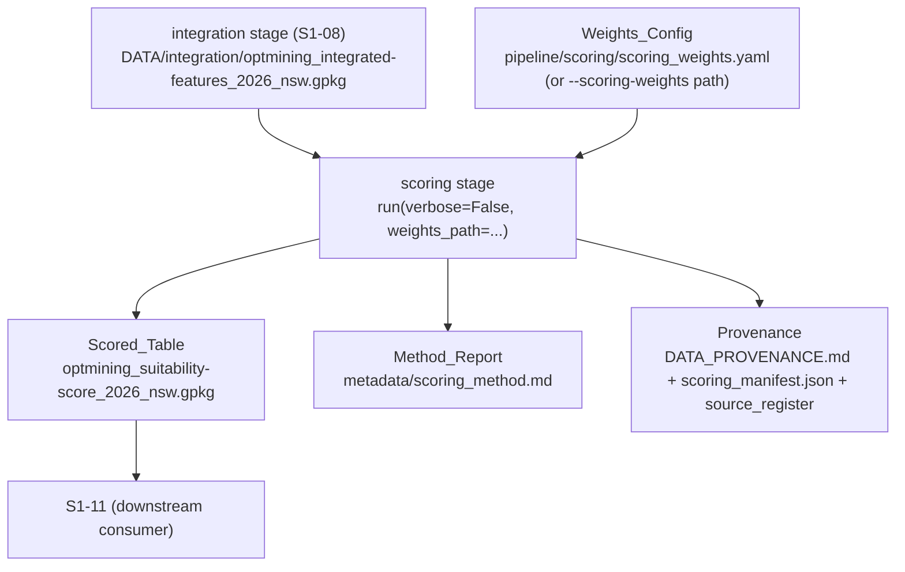

# Design Document

## Overview

This design specifies the **baseline suitability-model** stage (`s1-10-baseline-suitability-model`) for the Opt-Mining geospatial pipeline. It adds a new **scoring** subpackage under `pipeline/scoring/` that consumes the integrated NSW feature table (S1-08) and produces a per-cell **suitability score** using a transparent, deterministic weighted multi-criteria decision analysis (MCDA) function.

For every eligible analysis cell in the integrated feature table (`DATA/integration/optmining_integrated-features_2026_nsw.gpkg`, one row per `cell_id` across the 47,311 NSW cells), the stage:

- normalises each configured criterion to the `[0, 1]` range using bounds computed from the **eligible** cell population,
- applies the user-configured per-criterion weights to produce a `suitability_score` in `[0, 1]`,
- records a **per-criterion contribution** so every score is fully explainable,
- assigns a dense descending `rank` with a documented deterministic tie-break,
- carries through the S1-09 composite `confidence` value (`high` / `low`), and
- writes a null score/rank/contributions for every **excluded** cell (S1-07 `eligible = false`), so ineligible land is never ranked.

The resulting Scored_Table feeds S1-11. The model is deliberately **not** a machine-learning black box: it is a weighted sum over normalised feature columns, driven entirely by user-supplied criteria weights loaded from a configuration file (never hard-coded), where the contribution of every criterion to every cell's score is retrievable. This directly satisfies the constitution's constraints — weights are user inputs, a recommendation the planner cannot interrogate is treated as an assertion rather than a recommendation, the model is never circular (wind is an input criterion, never a prediction target), and the scoring computation is independently replaceable without touching the data-loading layer.

The design satisfies the pipeline's established contracts: the uniform `run(verbose=False, ...) -> dict` stage contract, strict keying to the grid's `cell_id`, weights loaded from configuration, the project file-naming convention (`{source}_{dataset}_{year/vintage}_{region}.{ext}`, region slug `nsw`), atomic writes with a do-not-edit banner on generated reports, provenance capture for a derived product, and the "no silent passes" validation rule.

### Design Grounding — Research and Existing Conventions

The design reuses existing pipeline infrastructure rather than introducing new patterns:

- **Stage contract & orchestration** — `pipeline/__main__.py` resolves the stage list from `config.STAGES`, dispatches each stage's `run()` via `_get_runner`, and builds kwargs via `_build_kwargs`. Every registered stage exposes `run(verbose=False, ...) -> dict`. This stage registers there and follows the identical pattern used by `integration.merge.run` and `infrastructure.features.run` (Requirement 11).
- **Sole feature input** — `pipeline/integration/merge.py` produces the integrated table `DATA/integration/optmining_integrated-features_2026_nsw.gpkg` (+ `.csv`), one row per `cell_id`, in EPSG:4326. `pipeline/integration/config.py::OUTPUT_COLUMNS` is authoritative for its schema; it carries the criterion columns `wind_speed`, `demand_proxy`, `dist_transmission_km`, `dist_substation_km`, `slope_deg`, `inside_rez`, the `eligible` flag (S1-07), and the S1-09 composite confidence. `SCORED_FEATURE_COLUMNS` in that module enumerates the ten feature columns downstream scoring consumes. This stage **reads** those columns and never re-derives the grid or the features (Requirements 1, 6).
- **Grid contract** — `pipeline/grid/config.py` is authoritative for `STORAGE_CRS = "EPSG:4326"`, `COMPUTATION_CRS = "EPSG:3577"`, and `CELL_DEG = 0.05`. The Scored_Table reuses the integrated table's `cell_id` values byte-for-byte and, where geometry is carried, stores it in EPSG:4326 (Requirements 1.2, 6.6).
- **Atomic writes, banners, timestamps** — `pipeline/common/geo.py` provides `atomic_write_text`, `atomic_write_json`, `banner(module_name)`, `utc_now()`, `sha256_file`, and `human_bytes`. This stage uses them for the Scored_Table sidecars, the method report, and provenance (Requirements 6.7, 12, 13). The GeoPackage itself is written through the same `tmp + os.replace` discipline `integration.merge.write_gpkg` uses.
- **Provenance pattern** — `integration.merge.record_provenance` shows the established derived-product provenance triple: a `DATA_PROVENANCE.md` table row, a manifest JSON (SHA-256, byte count, UTC timestamp, generation params), and the `source_register`. This stage mirrors that pattern for the Scored_Table (Requirement 12).
- **Weights from configuration (YAML)** — the pipeline already loads runtime configuration from YAML for the sibling `exclusions` stage (`pipeline/exclusions/exclusion_rules.yaml`, exposed by the `--exclusion-rules` CLI flag). The scoring stage adopts the identical convention with a shipped default `pipeline/scoring/scoring_weights.yaml` and a `--scoring-weights` CLI flag (Requirements 2, 3).

**Research summary — MCDA normalisation.** Weighted-sum MCDA over min-max-normalised criteria is the standard transparent, explainable scoring approach for site-suitability screening: each criterion is linearly rescaled to a common `[0, 1]` range so that criteria measured in different units (m/s, km, degrees, boolean) are comparable, and a weighted average yields a score in `[0, 1]`. For a `higher_is_better` criterion the rescale is `(v - min) / (max - min)`; for `lower_is_better` it is `1 - (v - min) / (max - min)`. The weighted average of values in `[0, 1]` with non-negative weights is itself in `[0, 1]`, which gives the score-range invariant for free. The one numerical hazard is a constant criterion (`min == max`), which is handled by a documented constant fill rather than a divide-by-zero. This grounding informs the Scoring_Function design and the correctness properties below.

## Architecture

### Placement in the pipeline

The stage is a new subpackage `pipeline/scoring/` whose `run.py` (or `score.py`) module exposes `run(verbose=False, ...) -> dict`. It is registered in `pipeline/config.py` `STAGES` **after** `integration` (the producer of its sole input) and before `validate`, and a new `"scoring"` entry is added to `DOMAINS`.



### Updated stage execution order

```
... → demand → grid → wind.features → geographic.features → infrastructure.features
→ demand.feature → exclusions → integration → scoring → validate
```

`scoring` is placed immediately after `integration` because it consumes the integrated feature table, and before `validate` so the cross-domain checks see its output. `config.STAGES` is the single source of truth for order; the orchestrator's resolved order MUST place `scoring` after `integration` for every invocation that includes both (Requirements 11.4, 11.8).

> **Naming note.** The stage key is `scoring` (a new domain). It is added to both `config.STAGES` (after `integration`, before `validate`) and `config.DOMAINS`, so `--only scoring` and `--skip scoring` resolve. The README stage-order table and `__main__.py` dispatch are kept in sync with `config.STAGES` (Requirements 11, 16).

### Internal data flow

```mermaid
flowchart LR
    A["1. Load Weights_Config<br/>(default or --scoring-weights)<br/>validate directions/weights/sum"] --> B["2. Load integrated table<br/>validate cell_id + criterion + eligible + confidence cols"]
    B --> C["3. Split eligible vs excluded"]
    C --> D["4. Compute Normalisation_Bounds<br/>from ELIGIBLE population only"]
    D --> E["5. Scoring_Function (PURE)<br/>DataFrame + Weights → scored DataFrame"]
    E --> F["6. Rank eligible cells<br/>descending score, documented tie-break"]
    F --> G["7. Null-out excluded cells<br/>score/rank/contributions = null"]
    G --> H["8. Assemble Scored_Table<br/>reattach cell_id, confidence, geometry EPSG:4326"]
    H --> I["9. Atomic write + method report + provenance"]
    I --> J["10. Validate (no silent passes)"]
```



The dashed boundary between step 5 (the pure Scoring_Function) and the surrounding I/O (steps 1–4, 8–10) is deliberate and enforced: the Scoring_Function receives an in-memory DataFrame and a Weights_Config object and returns a scored DataFrame with no file access, so it is independently replaceable without changing the data-loading wrapper (Requirement 5.5).

### Weights-configuration discipline

Criteria weights are **user inputs**, never constants in the source (Requirement 2.2). The stage loads them at runtime from a YAML file — the shipped default `pipeline/scoring/scoring_weights.yaml`, or an alternative path supplied through the `--scoring-weights` CLI flag and threaded via `_build_kwargs`. Loading validates the config before any scoring begins and halts on: unparsable file, a direction other than `higher_is_better`/`lower_is_better`, a negative or non-numeric weight, or a zero weight sum (Requirements 2.5–2.8). This "fail before write" rule mirrors the halt-early discipline used across the pipeline.

## Components and Interfaces

### 1. Stage entry point — `pipeline/scoring/run.py`

```python
def run(
    verbose: bool = False,
    weights_path: Path | None = None,     # defaults to scoring/scoring_weights.yaml
    integrated_path: Path | None = None,  # defaults to config.INTEGRATION output
    confidence_discount: bool | None = None,  # None → value from Weights_Config
) -> dict:
    """
    Score every eligible analysis cell with a weighted MCDA over normalised
    criteria and write the Scored_Table + method report.

    Returns a summary dict with at least:
        {
          "scored_table_path": str,   # existing path on disk (11.2)
          "method_report_path": str,  # existing path on disk (11.2)
          "n_cells": int,             # 47,311 for full NSW grid
          "n_scored": int,            # eligible cells scored
          "n_excluded": int,          # excluded cells with null score
          "n_high_confidence": int,
          "n_low_confidence": int,
          "weights_config_id": str,   # content hash of the weights used (12.2)
          "runtime_seconds": float,
        }

    Raises on: missing/unreadable integrated table, absent cell_id / criterion /
    eligible / confidence columns, missing/invalid Weights_Config, or write
    failure — so the orchestrator halts with a non-zero exit status (11.3).
    """
```

The signature matches the registered-stage contract (first parameter `verbose`, defaults to `False`, returns a dict — Requirement 11.1). Satisfies Requirements 11.1, 11.2, 11.3.

### 2. Weights loader & validator — `pipeline/scoring/weights.py` (Requirements 2, 3)

```python
@dataclass(frozen=True)
class Criterion:
    feature: str            # integrated-table column name
    weight: float           # non-negative
    direction: str          # "higher_is_better" | "lower_is_better"
    rationale: str          # non-empty

@dataclass(frozen=True)
class WeightsConfig:
    criteria: tuple[Criterion, ...]
    confidence_discount: bool
    confidence_factors: dict[str, float]   # e.g. {"high": 1.0, "low": 0.8}
    config_id: str          # content hash of the source YAML (12.2)

def load_weights(path: Path) -> WeightsConfig:
    """
    Parse and validate the Weights_Config YAML. Halts (raises) BEFORE any
    scoring on: unparsable file (2.5); a direction not in
    {higher_is_better, lower_is_better} (2.6); a negative or non-numeric
    weight (2.7); a zero weight sum (2.8). Records config_id = sha256 of the
    file content so the exact weights are traceable (12.2).
    """
```

- Weights, directions, and rationales are read from the file at runtime; no weight literals live in `scoring/` source (2.1, 2.2).
- Each YAML entry becomes a `Criterion(feature, weight, direction, rationale)` (2.3).
- The default `scoring_weights.yaml` ships every criterion with a weight, direction, and a non-empty rationale (3.1, 3.3), defining `wind_speed` (`higher_is_better`), `dist_transmission_km` (`lower_is_better`), `dist_substation_km` (`lower_is_better`), `demand_proxy` (`higher_is_better`), `slope_deg` (`lower_is_better`), and `inside_rez` (`higher_is_better`) (3.2). Every default criterion name resolves to a real `OUTPUT_COLUMNS` column of the integrated table (3.4).

### 3. Integrated-table loader — `pipeline/scoring/load.py` (Requirement 1, 10.4)

```python
def load_integrated(path: Path, criteria: Sequence[Criterion]) -> gpd.GeoDataFrame:
    """
    Read the S1-08 integrated feature table as the SOLE feature input.
    Halts BEFORE any output on: missing/unreadable file (1.3); no cell_id
    column (1.4); any configured criterion column, the `eligible` column, or
    the S1-09 composite confidence column absent (1.5, 10.4). Reuses cell_id
    byte-for-byte; never re-derives, renumbers, reformats, or reorders (1.2).
    """
```

The loader is the only file-reading path for feature data; it hands a fully in-memory frame to the pure Scoring_Function. Satisfies Requirements 1.1–1.5, 10.4.

### 4. Normalisation — `pipeline/scoring/normalise.py` (Requirement 4, 7.3)

```python
CONSTANT_CRITERION_VALUE = 1.0   # documented constant fill when min == max (4.5)

def compute_bounds(eligible: pd.DataFrame, criteria) -> dict[str, tuple[float, float]]:
    """Min/max per criterion from the ELIGIBLE population only (4.3, 7.3)."""

def normalise(value, lo, hi, direction) -> float:
    """
    higher_is_better: (v - lo) / (hi - lo)               (4.1)
    lower_is_better : 1 - (v - lo) / (hi - lo)           (4.2)
    lo == hi        : return CONSTANT_CRITERION_VALUE     (4.5, no /0)
    Result clamped to the inclusive [0, 1] range.         (4.4)
    Boolean criteria (e.g. inside_rez) map False→0.0/True→1.0
    for higher_is_better (inverted for lower_is_better).  (4.7)
    """
```

- Bounds are computed from the eligible population only; excluded-cell values never influence a bound (4.3, 7.3).
- A constant criterion (`min == max`) is filled with the documented `CONSTANT_CRITERION_VALUE` and flagged in the method report as constant, rather than dividing by zero (4.5).
- Normalisation is a pure function of `(value, bounds, direction)`, so it is deterministic and reproducible (4.6). Satisfies Requirements 4.1–4.7, 7.3.

### 5. Scoring_Function (PURE) — `pipeline/scoring/score.py` (Requirement 5, 9)

```python
def score_frame(features: pd.DataFrame, weights: WeightsConfig) -> pd.DataFrame:
    """
    PURE: DataFrame in, DataFrame out, NO file I/O (5.5). Independently
    replaceable without changing the data-loading layer.

    For each eligible cell:
      norm_i        = normalise(value_i, bounds_i, direction_i)
      contribution_i (pre-discount) = (weight_i * norm_i) / sum(weights)
      raw_score     = sum_i contribution_i                              (5.1)
      final_score   = raw_score * confidence_factor  if discount else raw_score (5.3, 5.4)
      final contribution_i = contribution_i * confidence_factor (if discount) (9.3)

    Excluded cells (eligible == False) receive null score / null rank /
    null contributions and take no part in the bounds or the rank ordering
    (6.4, 7.2). wind_speed participates ONLY as an input criterion and is
    never a prediction target (5.7). Deterministic: identical inputs +
    identical weights → identical output (5.6).

    Returns a DataFrame keyed on cell_id with: suitability_score, one
    contribution column per criterion, and the intermediate normalised
    values (dropped before write).
    """
```

- The score is the weight-weighted sum of normalised features divided by the sum of applied weights, constrained to `[0, 1]` (5.1, 5.2).
- Per-criterion contributions are additive and reconstruct the final score within a documented tolerance; when confidence discounting is enabled the same factor is applied to both the score and the contributions, so reconciliation still holds (9.1, 9.2, 9.3).
- The function performs no I/O and depends only on its two arguments, so it is independently replaceable (5.5) and deterministic (5.6). Satisfies Requirements 5.1–5.7, 9.1–9.3.

### 6. Ranking — `pipeline/scoring/rank.py` (Requirement 8)

```python
def assign_ranks(scored: pd.DataFrame) -> pd.Series:
    """
    Dense rank over ELIGIBLE cells only, descending by final
    suitability_score; rank 1 = highest score (8.1). Ties broken by a
    documented deterministic rule — ascending cell_id — so repeated runs
    over identical inputs produce identical ranks (8.2, 8.4). Excluded cells
    receive a null rank and are omitted from the ordering (8.3).
    """
```

The tie-break (`sort by score descending, then cell_id ascending`) is documented in the method report and makes the rank a deterministic permutation of the eligible cells. Satisfies Requirements 8.1–8.4.

### 7. Confidence carry-through — `pipeline/scoring/score.py` (Requirement 10)

- `confidence` is copied per-cell from the S1-09 composite confidence flag in the integrated table (10.1); no value is fabricated.
- Every scored cell's `confidence` is exactly one of `high` or `low` (10.2). A value outside that set is a validation failure.
- When confidence discounting is enabled, the Confidence_Factor is derived from the cell's `confidence` via the documented mapping in `WeightsConfig.confidence_factors` (10.3).
- If the composite confidence column is absent, the loader halts before any write (10.4). Satisfies Requirements 10.1–10.4.

### 8. Output writer — `pipeline/scoring/write.py` (Requirement 6)

```python
def write_scored_table(table: gpd.GeoDataFrame, path: Path) -> None:
    """
    Atomic write (tmp + os.replace) of the Scored_Table GeoPackage, mirroring
    integration.merge.write_gpkg. Any geometry is stored in EPSG:4326 (6.6).
    On write failure any pre-existing output is left unmodified and an error
    is raised (6.8). A CSV sidecar is written the same way for reviewers.
    """
```

- Filename follows the `{source}_{dataset}_{year/vintage}_{region}.{ext}` convention with region slug `nsw`: **`optmining_suitability-score_2026_nsw.gpkg`** (6.5).
- Exactly one row per integrated-table `cell_id`, no missing and no duplicate `cell_id`, joinable to the grid on `cell_id` (6.3).
- Excluded cells carry null `suitability_score`, null `rank`, and null contributions (6.4).
- Fully regenerable derived product, reproducible from the integrated table and the Weights_Config with no manual editing (6.9). Satisfies Requirements 6.1–6.9.

### 9. Method report & provenance — `pipeline/scoring/report.py` (Requirements 12, 13)

`write_method_report(...)` writes `DATA/scoring/metadata/scoring_method.md` via `common.geo.atomic_write_text`, stamped with `common.geo.banner("scoring")` (12.4). It records:

- the scoring formula, and each configured criterion with its weight, direction, and rationale (13.1);
- the normalisation rule per criterion and, per criterion, the Normalisation_Bounds (min/max) from the eligible population for the run (13.1, 13.2);
- whether confidence discounting was enabled and, if so, the Confidence_Factor mapping (13.3);
- the count of eligible cells scored, excluded cells assigned a null score, and cells at each `confidence` value (13.4, 7.4);
- whether normalisation was linear and, where a non-linear (e.g. logarithmic) rule is applied to a distance criterion, the affected criteria and the function (13.5);
- the definition of a Per_Criterion_Contribution and the reconciliation rule (9.4).

`record_provenance(...)` mirrors `integration.merge.record_provenance`: a `DATA/scoring/DATA_PROVENANCE.md` row, a `scoring_manifest.json` (SHA-256, byte count, UTC timestamp, generation params, the integrated-table input, and the `weights_config_id`), and a `source_register` entry — labelling the Scored_Table a **derived product** (12.1, 12.2, 12.3).

### 10. Orchestrator integration — `pipeline/config.py`, `pipeline/__main__.py` (Requirement 11)

- `pipeline/config.py`: insert `"scoring"` into `STAGES` immediately after `"integration"` and before `"validate"`; add `"scoring"` to `DOMAINS` (11.4, 11.7).
- `pipeline/__main__.py`: add an `_get_runner` branch `from .scoring.run import run`; extend `_build_kwargs` to pass `verbose` and `weights_path` for the stage; add a `--scoring-weights` CLI flag (default `pipeline/scoring/scoring_weights.yaml`) (11.5).
- `pipeline/scoring/__init__.py`: docstring describes the scoring stage and its position after `integration` in the sequence (11.6). Satisfies Requirements 11.4–11.8.

### 11. Validation — `pipeline/scoring/validate.py` + `pipeline/validate.py` (Requirement 14)

Validation follows the "no silent passes" rule — each check reports expected vs observed vs pass/fail — and runs at the end of `run()`. Cross-domain checks (Scored_Table `cell_id` set equals the grid/integrated-table `cell_id` set) are placed in the cross-domain `pipeline/validate.py` tier per the pipeline's validation-tier convention (14.8). Checks:

- exactly one row per integrated-table `cell_id`: expected cell count vs observed row count, pass/fail (14.1);
- every `cell_id` present, none missing, none extra (14.2);
- every non-null `suitability_score` in `[0, 1]`; report out-of-range count (14.3);
- eligible ↔ non-null score, excluded ↔ null score; report violators (14.4);
- per-criterion contributions reconcile to the score within tolerance for every scored eligible cell; report violators (14.5);
- `confidence` ∈ {`high`, `low`} only; any other value fails (14.6);
- `rank` is a contiguous ordering over the scored eligible cells with no rank on an excluded cell (14.7). Satisfies Requirements 14.1–14.8.

## Data Models

### Scored_Table (Requirement 6)

Written to `DATA/scoring/` as a GeoPackage following the `{source}_{dataset}_{year/vintage}_{region}.{ext}` convention with region slug `nsw`:

**`optmining_suitability-score_2026_nsw.gpkg`** (+ `.csv` sidecar)

| Column | Type | Units / Domain | Nullable | Notes |
|--------|------|----------------|----------|-------|
| `cell_id` | grid-native | matches integrated table | no | Reused byte-for-byte (1.2, 6.3) |
| `suitability_score` | float | `[0, 1]` | yes (excluded → null) | Final score, incl. optional discount (5.1–5.4) |
| `rank` | integer | `1..n_eligible` | yes (excluded → null) | Descending by score, tie-break asc `cell_id` (8.1, 8.2) |
| `confidence` | string | `high` \| `low` | no | Carried from S1-09 composite flag (10.1, 10.2) |
| `contrib_wind_speed` | float | additive share of score | yes | One per criterion (6.1, 6.2, 9.1) |
| `contrib_dist_transmission_km` | float | additive share of score | yes | |
| `contrib_dist_substation_km` | float | additive share of score | yes | |
| `contrib_demand_proxy` | float | additive share of score | yes | |
| `contrib_slope_deg` | float | additive share of score | yes | |
| `contrib_inside_rez` | float | additive share of score | yes | |
| `geometry` | Polygon | EPSG:4326 | no (if carried) | Cell polygon in storage CRS (6.6) |

- Per-criterion contribution columns follow the stable, documented naming pattern `contrib_{criterion_feature}`, one per configured criterion, so the set of contribution columns is fully determined by the Weights_Config (6.2).
- Exactly one row per integrated-table `cell_id`, no missing and no duplicate `cell_id`, joinable to the grid on `cell_id` (6.3).
- Excluded cells (`eligible == False`) carry null `suitability_score`, `rank`, and all contributions (6.4).
- The configured contributions for an eligible cell reconstruct its `suitability_score` within a documented tolerance (default `1e-9`) (9.2).
- Written via atomic write (`common.geo`, tmp + `os.replace`); on write failure, any pre-existing output is left unmodified and an error is raised (6.7, 6.8).
- Fully regenerable derived product, reproducible from the integrated table and the Weights_Config with no manual editing (6.9).

### WeightsConfig / Criterion (Requirements 2, 3)

```python
@dataclass(frozen=True)
class Criterion:
    feature: str            # integrated-table column, e.g. "wind_speed"
    weight: float           # non-negative
    direction: str          # "higher_is_better" | "lower_is_better"
    rationale: str          # non-empty documented rationale

@dataclass(frozen=True)
class WeightsConfig:
    criteria: tuple[Criterion, ...]
    confidence_discount: bool                 # discount on/off
    confidence_factors: dict[str, float]      # {"high": 1.0, "low": 0.8}
    config_id: str                            # sha256 of source YAML (12.2)
```

**Default `scoring_weights.yaml` (illustrative):**

```yaml
confidence_discount: false
confidence_factors:
  high: 1.0
  low: 0.8
criteria:
  - feature: wind_speed
    weight: 0.30
    direction: higher_is_better
    rationale: "Higher mean wind speed is the primary driver of energy yield."
  - feature: dist_transmission_km
    weight: 0.20
    direction: lower_is_better
    rationale: "Shorter distance to transmission lowers connection cost."
  - feature: dist_substation_km
    weight: 0.15
    direction: lower_is_better
    rationale: "Proximity to a substation reduces interconnection works."
  - feature: demand_proxy
    weight: 0.15
    direction: higher_is_better
    rationale: "Nearer electrical demand improves offtake and reduces losses."
  - feature: slope_deg
    weight: 0.10
    direction: lower_is_better
    rationale: "Gentler terrain lowers civil works and turbine-siting cost."
  - feature: inside_rez
    weight: 0.10
    direction: higher_is_better
    rationale: "Cells inside a Renewable Energy Zone have coordinated grid access."
```

### Run summary dict (Requirements 11, 13)

```python
{
    "scored_table_path": str,     # exists on disk (11.2)
    "method_report_path": str,    # exists on disk (11.2)
    "n_cells": int,               # 47,311 for full NSW grid
    "n_scored": int,              # eligible cells scored (7.4, 13.4)
    "n_excluded": int,            # excluded cells with null score (7.4, 13.4)
    "n_high_confidence": int,     # (13.4)
    "n_low_confidence": int,      # (13.4)
    "weights_config_id": str,     # content hash of weights used (12.2)
    "runtime_seconds": float,
}
```

## Correctness Properties

*A property is a characteristic or behavior that should hold true across all valid executions of a system — essentially, a formal statement about what the system should do. Properties serve as the bridge between human-readable specifications and machine-verifiable correctness guarantees.*

The properties below were derived from the acceptance-criteria prework and consolidated to remove redundancy: the cell_id-preservation criteria (1.2, 6.3, 14.1, 14.2) collapse into one property; the normalisation criteria (4.1, 4.2, 4.7) into one directional-formula property plus one `[0, 1]` range invariant (4.4, 14.3-norm); the eligible-scoring criteria (7.1, 7.2, 8.3, 6.4, 14.4) into one property; the rank criteria (8.1, 8.2, 8.4, 14.7) into one property; the reconciliation criteria (9.1, 9.2, 9.3, 14.5) into one property; the confidence criteria (10.1, 10.2, 14.6) into one property; and the determinism criteria (4.6, 5.6, 6.9, 8.4) into one property.

### Property 1: cell_id preservation and one row per cell

*For any* integrated feature table, the multiset of `cell_id` values in the Scored_Table equals the set of `cell_id` values in the integrated table exactly — every `cell_id` appears exactly once, none is missing, none is duplicated, and none appears that is absent from the input — with each `cell_id` reused byte-for-byte from the input.

**Validates: Requirements 1.2, 6.3, 14.1, 14.2**

### Property 2: Directional normalisation correctness

*For any* criterion value and *any* Normalisation_Bounds with distinct minimum and maximum, the Normalised_Feature equals `(v - min) / (max - min)` when the direction is `higher_is_better` and `1 - (v - min) / (max - min)` when the direction is `lower_is_better`; and *for any* boolean criterion the values `False` and `True` map to the fixed `[0, 1]` endpoints consistent with the criterion's direction.

**Validates: Requirements 4.1, 4.2, 4.7**

### Property 3: Normalised features lie in [0, 1]

*For any* eligible cell population and *any* criterion, every Normalised_Feature the Scoring_Function produces lies within the inclusive `[0, 1]` range.

**Validates: Requirements 4.4**

### Property 4: Normalisation bounds come from the eligible population only

*For any* integrated table containing both eligible and excluded cells, each criterion's Normalisation_Bounds equal the minimum and maximum of that criterion over the eligible cells only, and are unchanged by any modification to the excluded cells' values for that criterion.

**Validates: Requirements 4.3, 7.3**

### Property 5: Weighted-sum scoring correctness

*For any* eligible cell, *any* set of configured criteria, and *any* non-negative weights with a positive sum, the `suitability_score` equals the sum over criteria of `(weight_i × normalised_feature_i)` divided by the sum of the applied weights (prior to any confidence discount).

**Validates: Requirements 5.1**

### Property 6: Suitability score lies in [0, 1]

*For any* eligible cell scored with non-negative weights of positive sum, the final `suitability_score` lies within the inclusive `[0, 1]` range.

**Validates: Requirements 5.2, 14.3**

### Property 7: Contributions reconcile to the score

*For any* scored eligible cell, under both the discount-enabled and discount-disabled settings, the sum of the cell's configured Per_Criterion_Contributions equals its final `suitability_score` within the documented numeric tolerance, because the same Confidence_Factor (if any) is applied to both the score and every contribution.

**Validates: Requirements 9.1, 9.2, 9.3, 14.5**

### Property 8: Confidence discount relation

*For any* eligible cell, when confidence discounting is enabled the final score equals the raw weighted-sum score multiplied by the cell's Confidence_Factor derived from its `confidence` via the documented mapping, and when discounting is disabled the final score equals the raw weighted-sum score.

**Validates: Requirements 5.3, 5.4, 10.3**

### Property 9: Only eligible cells are scored; excluded cells are null and unranked

*For any* integrated table, every cell whose `eligible` value is true receives a non-null `suitability_score`, a `rank`, and non-null contributions, and every cell whose `eligible` value is false receives a null `suitability_score`, a null `rank`, and null contributions and takes no part in the rank ordering.

**Validates: Requirements 6.4, 7.1, 7.2, 8.3, 14.4**

### Property 10: Deterministic rank ordering with documented tie-break

*For any* set of scored eligible cells, `rank` is a contiguous ordering `1..n` assigned in descending order of final `suitability_score` with ties broken by ascending `cell_id`, so `rank` 1 is the highest-scoring eligible cell and repeated runs over identical inputs produce identical ranks; no `rank` is assigned to an excluded cell.

**Validates: Requirements 8.1, 8.2, 8.4, 14.7**

### Property 11: Confidence carried through and two-valued

*For any* scored cell, its `confidence` equals the value carried from the S1-09 composite confidence flag for that `cell_id` and is always exactly one of the two values `high` or `low`, never any other value and never fabricated.

**Validates: Requirements 10.1, 10.2, 14.6**

### Property 12: Weights come from configuration; invalid configurations are rejected

*For any* Weights_Config that declares a direction other than `higher_is_better`/`lower_is_better`, or a negative or non-numeric weight, or a set of weights summing to zero, the stage halts before writing any Scored_Table output and returns an error identifying the offending condition; and *for any* two distinct valid configurations, the scores are determined by the loaded weights rather than by any hard-coded constant.

**Validates: Requirements 2.2, 2.5, 2.6, 2.7, 2.8**

### Property 13: No circular modelling

*For any* eligible cell, `wind_speed` affects the `suitability_score` only through its own Normalised_Feature and weighted contribution and is never used as, or reconstructed as, a prediction target; the Scored_Table contains no wind prediction column.

**Validates: Requirements 5.7**

### Property 14: Regeneration is deterministic (idempotent)

*For any* fixed integrated table and Weights_Config, running the stage twice produces identical Normalised_Features, Suitability_Scores, ranks, and contributions, confirming the output is a fully regenerable derived product with no dependence on prior state or manual editing.

**Validates: Requirements 4.6, 5.6, 6.9, 8.4**

### Property 15: Successful run returns existing output paths

*For any* valid inputs, when `run()` completes successfully it returns a summary dict whose `scored_table_path` and `method_report_path` are non-empty filesystem paths that exist on disk after the call returns.

**Validates: Requirements 11.2**

### Property 16: Resolved execution order places scoring after integration

*For any* orchestrator invocation whose resolved stage list includes both `integration` and `scoring`, the index of `integration` is strictly less than the index of `scoring`.

**Validates: Requirements 11.4, 11.8**

## Error Handling

The stage fails loud and early, never silently. All halt conditions occur **before** any Scored_Table output is written, so a failed run never leaves a partial or corrupt output.

| Condition | Handling | Requirement |
|-----------|----------|-------------|
| Integrated table missing / unopenable | Raise `FileNotFoundError`/`RuntimeError` naming the path; no output written | 1.3 |
| Integrated table has no `cell_id` column | Raise error naming the absent column; no output written | 1.4 |
| A configured criterion column or the `eligible` column absent | Raise error identifying the missing column; no output written | 1.5 |
| Composite confidence column absent | Raise error naming the missing confidence column; no fabricated value; no output written | 10.4 |
| Weights_Config missing / unparsable | Raise error naming the config path; no output written | 2.5 |
| Criterion direction not `higher_is_better`/`lower_is_better` | Raise error identifying the criterion and its invalid direction; no output written | 2.6 |
| Criterion weight negative or non-numeric | Raise error identifying the criterion; no output written | 2.7 |
| Sum of configured weights is zero | Raise error stating weights sum to zero; no output written | 2.8 |
| Criterion with equal min == max over eligible population | Not fatal: assign the documented `CONSTANT_CRITERION_VALUE`; record the criterion as constant in the method report; never divide by zero | 4.5 |
| Scored_Table write fails | Leave any pre-existing Scored_Table unmodified (atomic tmp + `os.replace`); raise an error indication | 6.8 |
| Cannot produce Scored_Table or method report | Raise an error indicating the cause; do NOT return a summary dict, so the orchestrator halts with a non-zero exit | 11.3 |

The distinction between **fatal** conditions (missing input, bad config, absent required column → halt before any write) and the single **handled** numeric edge (a constant criterion → documented constant fill) is deliberate: malformed inputs must abort loudly, while a legitimate constant criterion must be scored honestly rather than crash on a divide-by-zero.

## Testing Strategy

The scoring stage is a pure data-transformation feature — normalisation, the weighted sum, contribution decomposition, ranking, and confidence carry-through are deterministic functions of the input feature table and the Weights_Config — so **property-based testing applies** to the core logic. Infrastructure-boundary concerns (orchestrator wiring, provenance content, documentation consistency, file I/O) are covered by example, integration, and smoke tests instead.

### Dual approach

- **Property tests** verify the universal properties in the Correctness Properties section across many generated inputs (random integrated tables of eligible/excluded cells, random valid and invalid Weights_Configs, both discount settings, constant criteria).
- **Unit (example) tests** verify specific hand-computed normalisations, scores, and contributions, plus edge cases and error conditions (Requirement 15).
- **Integration tests** verify the full-NSW-grid run over all 47,311 cells and orchestrator ordering.
- **Smoke tests** verify config/wiring (`STAGES` membership and position, `DOMAINS`, `--scoring-weights` flag, `_get_runner`/`_build_kwargs`, `__init__` docstring, default `scoring_weights.yaml` presence).

### Property-based testing

- Library: **Hypothesis** (the standard PBT library for Python; the repo already vendors a `.hypothesis` cache). PBT is not implemented from scratch.
- Each property is implemented as a **single** property-based test running a **minimum of 100 iterations**.
- Each test is tagged with a comment referencing its design property, in the format:
  `# Feature: s1-10-baseline-suitability-model, Property {number}: {property_text}`
- Generators: synthetic in-memory feature DataFrames with unique `cell_id`s, a random `eligible` boolean per cell, random criterion values (including negatives, zeros, and equal-valued columns to exercise constant criteria), and a random `confidence` in {`high`, `low`}; random valid Weights_Configs (non-negative weights, valid directions, positive sum) and separately random invalid ones (bad direction, negative/non-numeric weight, zero sum). The pure Scoring_Function is exercised directly with in-memory frames so no filesystem access is needed.

| Property | Test focus |
|----------|-----------|
| 1 cell_id preservation | Output `cell_id` multiset == input `cell_id` set exactly; values unchanged |
| 2 Directional normalisation | `higher_is_better`/`lower_is_better` formulae and boolean endpoint mapping vs independent recomputation |
| 3 Normalised range | All normalised features in `[0, 1]` |
| 4 Bounds from eligible only | Bounds == eligible min/max; unchanged when excluded values are perturbed |
| 5 Weighted-sum correctness | Score == Σ(w·norm)/Σw vs independent recomputation |
| 6 Score range | All eligible scores in `[0, 1]` |
| 7 Contributions reconcile | Σ contributions == score within tolerance, both discount settings |
| 8 Discount relation | discounted == raw × factor; disabled == raw |
| 9 Eligible-only scoring | eligible → non-null score/rank/contrib; excluded → null and unranked |
| 10 Rank + tie-break | Descending by score, ties by asc `cell_id`, contiguous `1..n`, no rank on excluded |
| 11 Confidence carry-through | `confidence` == input flag; always in {high, low} |
| 12 Config rejection | Invalid configs raise and write nothing; distinct valid configs change scores |
| 13 No circular modelling | Perturbing `wind_speed` moves the score only via its contribution; no wind prediction column |
| 14 Determinism/idempotence | Two runs on fixed inputs produce identical outputs |
| 15 Returned paths exist | After `run()`, returned paths exist on disk |
| 16 Integration-before-scoring order | For any resolved stage list containing both, integration index < scoring index |

### Unit tests (Requirement 15)

Explicit hand-computed synthetic examples, complementing the properties:

- 15.1 `higher_is_better` normalisation on a small synthetic set vs hand-computed values within a documented tolerance.
- 15.2 `lower_is_better` normalisation vs hand-computed values within tolerance.
- 15.3 Weighted score on a synthetic set with a known Weights_Config vs hand-computed values within tolerance.
- 15.4 Contributions reconstruct the final score within tolerance for the synthetic input.
- 15.5 An excluded cell receives null score, null rank, and null contributions.
- 15.6 Rank ordering is descending by score and the tie-break produces deterministic ranks for equal scores.
- 15.7 A constant criterion (`min == max`) is handled by the documented constant-value rule rather than raising divide-by-zero.
- 15.8 The Scoring_Function returns identical outputs for two runs over identical inputs and config (determinism).

Additional example/error-condition unit tests cover: schema exactness incl. one `contrib_*` column per criterion (6.1, 6.2), filename convention (6.5), atomic write + banner (6.7, 12.4), write-failure leaves prior output intact (6.8), input error conditions (1.3–1.5, 10.4), config error conditions (2.5–2.8), the pure Scoring_Function performing no file I/O (5.5), `run()` signature and error-on-failure (11.1, 11.3), and method-report/provenance content (7.4, 12.1–12.3, 13.1–13.5).

### Integration and smoke tests

- **Full-NSW-grid integration** (Requirement 6, 14): run over all 47,311 cells; assert one row per `cell_id`, the eligible/excluded counts match the integrated table's `eligible` flag, the runtime is recorded, and a second run reproduces the table byte-identically (regenerable derived product).
- **Orchestrator smoke** (11.4–11.7): assert `scoring` is in `config.STAGES` immediately after `integration` and before `validate`, `scoring` is in `config.DOMAINS`, `--scoring-weights` exists and is forwarded by `_build_kwargs`, `_get_runner("scoring")` returns the stage `run`, and the subpackage `__init__` docstring describes the stage and its position. A default-config smoke test asserts `scoring_weights.yaml` ships and loads with non-empty rationales for every criterion (3.1–3.4).
- **Documentation consistency** (16.2, 16.3): assert the README stage-order table/name for `scoring` matches the resolved runtime stage configuration.

### Cross-component impact (must be delivered with this stage)

Per the holistic-project-awareness rule, this feature is not complete until these related components are updated consistently. The scoring stage is a **new consumer** of the S1-08 integrated table and a **new producer** of the Scored_Table, so the ripple crosses config, orchestration, provenance, and documentation:

- `pipeline/config.py` — add `"scoring"` to `STAGES` (after `integration`, before `validate`) and to `DOMAINS`. These are the authoritative single source for stage order and domain resolution; the README and `__main__.py` are kept in sync with them.
- `pipeline/__main__.py` — `_get_runner` dispatch branch (`from .scoring.run import run`), `_build_kwargs` handling for `weights_path`, and the new `--scoring-weights` CLI flag (default `pipeline/scoring/scoring_weights.yaml`).
- `pipeline/scoring/` (new subpackage) — `__init__.py` docstring, `run.py`, `weights.py`, `load.py`, `normalise.py`, `score.py`, `rank.py`, `write.py`, `report.py`, `validate.py`, and the shipped `scoring_weights.yaml`.
- **Producer/consumer contract with S1-08** — this stage reads the integrated table's criterion columns (`wind_speed`, `demand_proxy`, `dist_transmission_km`, `dist_substation_km`, `slope_deg`, `inside_rez`), the `eligible` flag (S1-07), and the S1-09 composite confidence. If any of those integrated-table column names change upstream (`integration/config.py::OUTPUT_COLUMNS`, `SCORED_FEATURE_COLUMNS`), the default `scoring_weights.yaml` criterion names and the loader's required-column checks MUST be updated in lockstep (Requirement 3.4). The default confidence-column name must track whatever S1-09 emits as the composite confidence.
- `pipeline/validate.py` — add the cross-domain Scored_Table checks (one row per `cell_id`, `cell_id` set equals the grid/integrated set, score range, eligible↔null, contribution reconciliation, `confidence` vocabulary, contiguous rank) at the cross-domain tier (14.8), consistent with how `integration` cross-checks are placed.
- `DATA/scoring/DATA_PROVENANCE.md`, `scoring_manifest.json`, `source_register` — provenance for the derived Scored_Table (integrated-table input, `weights_config_id`, UTC timestamp), labelled a derived product, using `common.geo` atomic writes and the `banner()` stamp.
- `DATA/data-specification/sprint1_data_specification.md` §4 (dataset detail) and §7 (dataset→stage→criterion mapping) — add the Scored_Table output, its columns, and the scoring stage that produces it, via the §8 change-control process.
- `pipeline/README.md` — stage-order table and CLI documentation listing `scoring` at the resolved runtime position (after `integration`), the scoring formula, the weights source (the Weights_Config), the normalisation rule, and the eligible-only scoring rule (16.2, 16.4).
- **Frozen decisions (Q1–Q7)** — if any frozen parameter is affected, follow the spec §8 change-control process and update both the spec §2 and the README identically (16.5). This stage does not currently change a frozen parameter; the criteria weights are user inputs in a config file, not a frozen decision.
