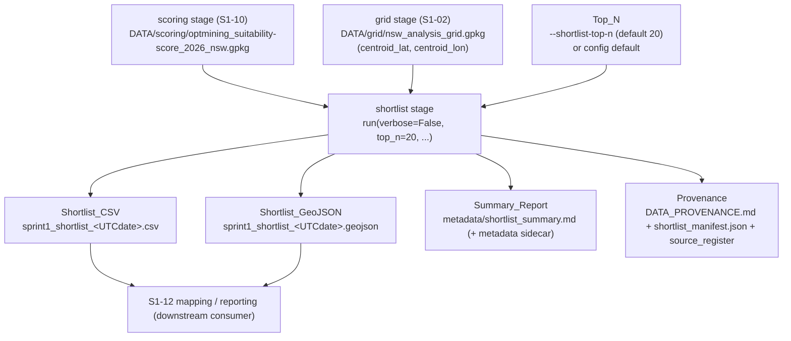

# Design Document

## Overview

This design specifies the **ranked-shortlist** stage (`s1-11-generate-ranked-shortlist`) for the Opt-Mining geospatial pipeline. It adds a new **shortlist** subpackage under `pipeline/shortlist/` that consumes the per-cell Scored_Table produced by the scoring stage (S1-10) and produces the Sprint 1 headline output: a ranked list of the top candidate NSW cells for wind-energy development, exported for both tabular review (CSV) and map visualisation (GeoJSON), together with a Summary_Report of descriptive statistics.

For a single run the stage:

- reads the S1-10 Scored_Table (`DATA/scoring/optmining_suitability-score_2026_nsw.gpkg` + CSV sidecar, one row per `cell_id` across the 47,311 NSW cells) as its **sole score input**,
- selects the Eligible_Cells (non-null `suitability_score` **and** non-null `rank`) with the smallest `rank` values up to the effective Top_N, ordered ascending by `rank` (rank 1 first),
- joins each shortlisted cell's `centroid_lat`/`centroid_lon` from the Analysis_Grid (`DATA/grid/nsw_analysis_grid.gpkg`) on `cell_id`, in EPSG:4326,
- writes a Shortlist_CSV and a Shortlist_GeoJSON that carry the **same** `cell_id` set in the **same** rank order,
- computes Summary_Statistics (score distribution over eligible cells only, geographic spread and confidence distribution of the top sites, and total/eligible/scored counts), and
- stamps every output and its metadata with the Preliminary_Disclaimer and the Analysis_Resolution statement.

This stage is deliberately a **filtering and formatting** step, **not** a modelling step. The suitability scores and the rank ordering are computed upstream in S1-10; this stage performs **no re-scoring and no re-ranking**. It relies on the S1-10 `suitability_score` and `rank` values exactly as produced and never re-derives the grid or the scores. The Opt-Mining constitution constrains the stage directly: the shortlist is a **preliminary screening starting point**, not a site approval, so the disclaimer and the ~5 km analysis resolution travel with every output.

The design satisfies the pipeline's established contracts: the uniform `run(verbose=False, ...) -> dict` stage contract, strict keying to the grid's `cell_id`, explicit CRS handling (EPSG:4326 storage and GeoJSON output), the project file-naming convention for timestamped/versioned outputs (region slug `nsw`), atomic writes with a do-not-edit banner on generated reports, provenance capture for a derived product, and the "no silent passes" validation rule.

### Design Grounding — Research and Existing Conventions

The design reuses existing pipeline infrastructure rather than introducing new patterns:

- **Stage contract & orchestration** — `pipeline/__main__.py` resolves the stage list from `config.STAGES`, dispatches each stage's `run()` via `_get_runner`, and builds kwargs via `_build_kwargs`. Every registered stage exposes `run(verbose=False, ...) -> dict`. This stage registers there and follows the identical pattern used by `integration.merge.run` and the scoring stage's `scoring.run.run` (Requirement 10).
- **Sole score input** — the scoring stage (S1-10) produces the Scored_Table `DATA/scoring/optmining_suitability-score_2026_nsw.gpkg` (+ `.csv` sidecar), one row per `cell_id`, in EPSG:4326, carrying `cell_id`, `suitability_score` (float `[0, 1]`, null for excluded), `rank` (int, null for excluded), `confidence` (`high`/`low`), the `contrib_*` columns, and a Polygon geometry. This stage **reads** those columns and never re-scores or re-ranks (Requirements 1, 2).
- **Grid contract** — `pipeline/grid/config.py` is authoritative for `STORAGE_CRS = "EPSG:4326"` and `CELL_DEG = 0.05` (~5 km cell). The Analysis_Grid `DATA/grid/nsw_analysis_grid.gpkg` carries `centroid_lat`/`centroid_lon` per `cell_id`; this stage joins those coordinates on `cell_id` and never re-derives the grid (Requirements 4.2, 8.2).
- **Atomic writes, banners, timestamps** — `pipeline/common/geo.py` provides `atomic_write_text`, `atomic_write_json`, `banner(module_name)`, `utc_now()`, and `sha256_file`. This stage uses them for the CSV/GeoJSON outputs, the Summary_Report, the metadata sidecars, and provenance (Requirements 5.6, 7.2, 8, 11). The single `utc_now()`-derived Run_Timestamp is reused across filenames and metadata.
- **Provenance pattern** — `integration.merge.record_provenance` shows the established derived-product provenance triple: a `DATA_PROVENANCE.md` table row, a manifest JSON (SHA-256, byte count, UTC timestamp, generation params), and the `source_register`. This stage mirrors that pattern for the shortlist outputs (Requirement 11).
- **CLI-flag threading** — `_build_kwargs` already threads per-stage options (e.g. `--exclusion-rules → rules_path`, `--infra-features-crs → computation_crs`). The shortlist stage adopts the identical convention with a `--shortlist-top-n` flag (default 20) forwarded as `top_n` (Requirement 3.2).

**Research summary — top-N selection over a precomputed rank.** Because S1-10 already assigns a dense, deterministic `rank` (rank 1 = best) with a documented tie-break, the shortlist reduces to a stable partial sort: filter to eligible rows, order ascending by `rank`, take the first Top_N. Sorting by the existing integer `rank` (rather than re-sorting by `suitability_score`) guarantees the shortlist ordering is *identical* to the upstream ordering, including through S1-10 ties and gaps — the requirement that the shortlist "reflects the upstream ranking exactly" (2.3, 2.4). No re-ranking is performed, so the stage cannot diverge from S1-10. The one selection subtlety is the Top_N-exceeds-eligible case, handled by clamping the take to the eligible count with no padding (3.4), and the zero-eligible case, handled by emitting empty-but-well-formed outputs with headers and the disclaimer (3.6). This grounding informs the Selection component and the correctness properties below.

## Architecture

### Placement in the pipeline

The stage is a new subpackage `pipeline/shortlist/` whose `run.py` module exposes `run(verbose=False, ...) -> dict`. It is registered in `pipeline/config.py` `STAGES` **after** `scoring` (the producer of its sole score input) and before `validate`, and a new `"shortlist"` entry is added to `DOMAINS`.



### Updated stage execution order

```
... → grid → wind.features → geographic.features → infrastructure.features
→ demand.feature → exclusions → integration → scoring → shortlist → validate
```

`shortlist` is placed immediately after `scoring` because it consumes the Scored_Table, and before `validate` so the cross-domain checks see its output. `config.STAGES` is the single source of truth for order; the orchestrator's resolved order MUST place `shortlist` after `scoring` for every invocation that includes both (Requirements 10.4, 10.8).

> **Naming note.** The stage key is `shortlist` (a new domain). It is added to both `config.STAGES` (after `scoring`, before `validate`) and `config.DOMAINS`, so `--only shortlist` and `--skip shortlist` resolve. The README stage-order table and `__main__.py` dispatch are kept in sync with `config.STAGES` (Requirements 10, 14).

### Internal data flow

```mermaid
flowchart LR
    A["1. Resolve effective Top_N<br/>(CLI > config > default 20)<br/>reject non-positive-integer"] --> B["2. Load Scored_Table<br/>validate cell_id + score + rank + confidence cols"]
    B --> C["3. Filter to Eligible_Cells<br/>(non-null score AND rank)"]
    C --> D["4. Select top-N by ascending rank<br/>clamp to eligible count, no padding"]
    D --> E["5. Load Analysis_Grid<br/>join centroid_lat/lon on cell_id<br/>halt on unmatched cell_id"]
    E --> F["6. Assemble Shortlist frame<br/>documented column order"]
    F --> G["7. Compute Summary_Statistics<br/>score dist (eligible only), spread, confidence"]
    G --> H["8. Derive single UTC Run_Timestamp<br/>resolve versioned filenames"]
    H --> I["9. Atomic write CSV + GeoJSON<br/>+ Summary_Report + metadata (disclaimer + resolution)"]
    I --> J["10. Provenance (derived product)"]
    J --> K["11. Validate (no silent passes)"]
```



The stage never mutates the Scored_Table or the grid; it reads both, derives an in-memory selection, and writes new derived products. The selection and formatting logic (steps 3–7) is a set of pure functions over in-memory frames, so it is independently testable without filesystem access.

### CRS discipline

The storage and output CRS is **EPSG:4326** throughout (Requirement 5.3). `centroid_lat`/`centroid_lon` are read from the grid in EPSG:4326 and carried unchanged; the GeoJSON geometry is written in EPSG:4326 and the CRS is stated explicitly rather than assumed. This stage performs **no** reprojection — there is no distance or area computation here — so no EPSG:3577 boundary arises. The documented geometry choice for each GeoJSON feature (centroid **Point** vs cell **Polygon**) is stated in the Summary_Report (5.4); the design default is the **centroid Point**, since the shortlist is a point-of-interest layer keyed to `centroid_lat`/`centroid_lon` and the point representation is unambiguous at the ~5 km analysis resolution.

## Components and Interfaces

### 1. Stage entry point — `pipeline/shortlist/run.py` (Requirement 10)

```python
def run(
    verbose: bool = False,
    top_n: int | None = None,            # None → config default → 20 (Req 3.1, 3.3)
    scored_path: Path | None = None,     # defaults to DATA/scoring/optmining_suitability-score_2026_nsw.gpkg
    grid_path: Path | None = None,       # defaults to DATA/grid/nsw_analysis_grid.gpkg
    geometry: str = "centroid",          # documented GeoJSON geometry choice: "centroid" | "polygon" (5.4)
) -> dict:
    """
    Select the top-N eligible cells by S1-10 rank, join coordinates, and write
    the Shortlist_CSV, Shortlist_GeoJSON, and Summary_Report.

    Returns a summary dict with at least:
        {
          "shortlist_csv_path": str,      # existing path on disk (10.2)
          "shortlist_geojson_path": str,  # existing path on disk (10.2)
          "summary_report_path": str,     # existing path on disk (10.2)
          "effective_top_n": int,         # resolved Top_N (9.2)
          "n_shortlisted": int,           # rows actually included (2.5, 9.2)
          "n_eligible": int,              # eligible cells available (2.5, 6.5)
          "n_scored": int,                # scored cells (6.5)
          "n_cells": int,                 # 47,311 for full NSW grid (6.5)
          "run_timestamp": str,           # single UTC Run_Timestamp (7.2, 9.1)
          "runtime_seconds": float,
        }

    Raises on: missing/unreadable Scored_Table or grid, absent required column,
    non-positive-integer Top_N, an unmatched shortlisted cell_id, or a write
    failure — so the orchestrator halts with a non-zero exit status (10.3).
    """
```

The signature matches the registered-stage contract (first parameter `verbose`, defaults to `False`, returns a dict — Requirement 10.1). Satisfies Requirements 10.1, 10.2, 10.3.

### 2. Top_N resolver — `pipeline/shortlist/config.py` + `run.py` (Requirement 3)

```python
DEFAULT_TOP_N = 20

def resolve_top_n(cli_value: int | None, config_value: int | None) -> int:
    """
    Effective Top_N precedence (3.1, 3.3):
        explicit CLI value  >  pipeline-config value  >  DEFAULT_TOP_N (20)
    Halts (raises) BEFORE any output if the resolved value is not a positive
    integer (3.5), identifying the invalid value.
    """
```

- Default Top_N is 20 when nothing is supplied (3.1); an explicit `--shortlist-top-n` value wins over the configuration default (3.3).
- A non-positive-integer Top_N (zero, negative, non-integer) halts before any write (3.5). Satisfies Requirements 3.1, 3.3, 3.5.

### 3. Scored_Table loader — `pipeline/shortlist/load.py` (Requirement 1)

```python
REQUIRED_SCORE_COLUMNS = ("cell_id", "suitability_score", "rank", "confidence")

def load_scored_table(path: Path) -> gpd.GeoDataFrame:
    """
    Read the S1-10 Scored_Table as the SOLE per-cell score input (1.1).
    Halts BEFORE any output on: missing/unreadable file (1.4); any of
    REQUIRED_SCORE_COLUMNS absent (1.5), identifying the missing column.
    Reuses cell_id byte-for-byte and never re-derives, renumbers, reformats,
    or reorders cell_id (1.2). Never re-scores or re-ranks; suitability_score
    and rank are used exactly as produced by S1-10 (1.3).
    """
```

The loader is the only file-reading path for score data. Satisfies Requirements 1.1–1.5.

### 4. Selection — `pipeline/shortlist/select.py` (Requirements 2, 3)

```python
def eligible_cells(scored: pd.DataFrame) -> pd.DataFrame:
    """Rows with BOTH non-null suitability_score AND non-null rank (Eligible_Cell)."""

def select_shortlist(scored: pd.DataFrame, top_n: int) -> pd.DataFrame:
    """
    PURE selection. Filter to Eligible_Cells (2.2), order ascending by `rank`
    so rank 1 appears first (2.1, 2.3), and take the first min(top_n, n_eligible)
    rows. Preserves the S1-10 rank ordering exactly through ties and gaps; does
    NOT re-assign ranks (2.4). Never includes an Excluded_Cell and never pads
    (3.4). When n_eligible == 0, returns an empty frame with the documented
    columns so downstream still emits headered outputs (3.6).
    """
```

- Selection is by the existing integer `rank`, not by re-sorting on `suitability_score`, guaranteeing the ordering is identical to S1-10 (2.3, 2.4).
- `Top_N > n_eligible` → include every Eligible_Cell, no padding, and the Summary_Report notes that the requested Top_N exceeded the eligible count (3.4).
- `n_eligible == 0` → empty Shortlist, recorded in the Summary_Report, with output files still emitted with headers and the disclaimer (3.6). Satisfies Requirements 2.1–2.4, 3.4, 3.6.

### 5. Coordinate join — `pipeline/shortlist/coords.py` (Requirement 4)

```python
def load_grid(path: Path) -> gpd.GeoDataFrame:
    """Read the Analysis_Grid; halt BEFORE any output if missing/unreadable (4.4)."""

def join_coordinates(shortlist: pd.DataFrame, grid: pd.DataFrame) -> pd.DataFrame:
    """
    Left-join centroid_lat/centroid_lon from the Analysis_Grid on cell_id,
    in EPSG:4326 (4.2). If ANY shortlisted cell_id has no matching grid row,
    HALT before any write and raise identifying the unmatched cell_id — never
    emit a row with a fabricated or null coordinate (4.5). suitability_score,
    confidence, and rank are carried straight from the Scored_Table and never
    recomputed (4.6).
    """
```

Satisfies Requirements 4.2, 4.4, 4.5, 4.6.

### 6. Shortlist assembly & schema — `pipeline/shortlist/assemble.py` (Requirement 4.1, 4.3)

```python
SHORTLIST_COLUMNS = ("rank", "cell_id", "suitability_score", "confidence",
                     "centroid_lat", "centroid_lon")   # documented order (4.1)
OPTIONAL_CONTEXT_COLUMNS = ("rez", "nearby_wind_farm")  # added WHERE available (4.3)
```

- The Shortlist carries at least `rank`, `cell_id`, `suitability_score`, `confidence`, `centroid_lat`, `centroid_lon`, in that documented order (4.1).
- Where an optional context column (`rez`, nearby-existing-wind-farm indicator) is available from an upstream layer, it is appended as a named, documented column and its definition and source recorded in the Summary_Report (4.3). Satisfies Requirements 4.1, 4.3.

### 7. Output writers — `pipeline/shortlist/write.py` (Requirements 5, 8)

```python
def write_csv(shortlist: pd.DataFrame, path: Path) -> None:
    """
    Atomic write (common.geo.atomic_write_text, tmp + os.replace) of the
    Shortlist_CSV with SHORTLIST_COLUMNS in documented order (5.1, 5.6).
    Emits headers even for an empty shortlist (3.6). On failure leaves any
    pre-existing output unmodified and raises (5.7).
    """

def write_geojson(shortlist: gpd.GeoDataFrame, path: Path, geometry: str) -> None:
    """
    Atomic write of the Shortlist_GeoJSON: one feature per shortlisted cell,
    SHORTLIST_COLUMNS carried as feature properties (5.2), geometry in EPSG:4326
    stated explicitly (5.3). Geometry per the documented choice — "centroid"
    Point (default) or cell "polygon" — stated in the Summary_Report (5.4).
    Carries the Preliminary_Disclaimer and Analysis_Resolution in file-level
    metadata/properties (8.3). On failure leaves any pre-existing output
    unmodified and raises (5.7).
    """
```

- Both writers draw from the same in-memory Shortlist frame, so the CSV and GeoJSON contain the **same** `cell_id` set in the **same** rank order (5.5).
- Both use `common/geo` atomic writes (tmp + `os.replace`); a failed write leaves any prior output intact (5.6, 5.7). Satisfies Requirements 5.1–5.7, 8.3.

### 8. Summary statistics — `pipeline/shortlist/summary.py` (Requirement 6)

```python
@dataclass(frozen=True)
class SummaryStats:
    score_dist: dict          # {"min","max","mean","std"} over ELIGIBLE cells only (6.1, 6.6)
    lat_range: tuple          # (min, max) of shortlisted centroid_lat (6.2)
    lon_range: tuple          # (min, max) of shortlisted centroid_lon (6.2)
    rez_represented: list     # REZs among top sites, WHERE available (6.3)
    confidence_dist: dict     # {"high": n, "low": n} over top sites (6.4)
    n_cells: int              # total cells (6.5)
    n_eligible: int           # eligible cells (6.5)
    n_scored: int             # scored cells (6.5)
```

- The score distribution (`min`/`max`/`mean`/`std` of `suitability_score`) is computed over the **Eligible_Cell** population only; Excluded_Cell values are never included (6.1, 6.6).
- The geographic spread reports the latitude and longitude ranges of the shortlisted `centroid_lat`/`centroid_lon` (6.2); where REZ membership is available for shortlisted cells, the represented REZs are reported (6.3).
- The confidence distribution reports the count of shortlisted cells at each `confidence` value (`high`, `low`) (6.4).
- Total, eligible, and scored cell counts for the run are recorded (6.5). Satisfies Requirements 6.1–6.6.

### 9. Timestamped filenames — `pipeline/shortlist/naming.py` (Requirement 7)

```python
def run_timestamp() -> str:
    """Single UTC Run_Timestamp for the run, derived once via common.geo.utc_now()."""

def resolve_output_paths(out_dir: Path, ts: str) -> tuple[Path, Path]:
    """
    Timestamped/versioned names sprint1_shortlist_<UTCdate>.csv / .geojson (7.1).
    The SAME Run_Timestamp is used in both filenames and in the metadata (7.2).
    Region slug `nsw` is used wherever the {source}_{dataset}_{year/vintage}_{region}.{ext}
    convention applies (7.3). If a resolved name already exists, append a
    finer-grained UTC time component (documented deterministic rule) rather than
    silently overwriting, and record the collision outcome in the Summary_Report (7.4).
    """
```

Satisfies Requirements 7.1–7.4.

### 10. Disclaimer & metadata — `pipeline/shortlist/report.py` (Requirements 8, 9, 11)

`write_summary_report(...)` writes `DATA/shortlist/metadata/shortlist_summary.md` via `common.geo.atomic_write_text`, stamped with `common.geo.banner("shortlist")` (11.4). It records the Summary_Statistics (6), the effective Top_N, the eligible-vs-included counts (2.5), the geometry choice (5.4), any optional context-column definitions (4.3), the collision outcome if any (7.4), the Preliminary_Disclaimer (8.1), and the Analysis_Resolution statement (~5 km / 0.05 degree cell) (8.2).

`write_metadata_sidecar(...)` writes a JSON metadata sidecar via `common.geo.atomic_write_json` recording, identically to the Summary_Report for a single run (9.4):

- `pipeline_version` (Pipeline_Version) and `run_timestamp` (UTC) (9.1);
- `effective_top_n` and `n_shortlisted` (9.2);
- `scored_table_id` — an identifier of the Scored_Table input (path + `sha256_file` digest) so the exact scores are traceable (9.3);
- the Preliminary_Disclaimer and the Analysis_Resolution statement (8.1, 8.2, 8.4).

The stage NEVER emits any output that omits **both** the disclaimer and the resolution statement: the GeoJSON carries them in file-level metadata/properties (8.3); the CSV, which has no metadata rows, has them travel via the Summary_Report and the metadata sidecar (8.4). Satisfies Requirements 8.1–8.5, 9.1–9.4.

### 11. Provenance — `pipeline/shortlist/report.py::record_provenance` (Requirement 11)

Mirrors `integration.merge.record_provenance`: a `DATA/shortlist/DATA_PROVENANCE.md` row, a `shortlist_manifest.json` (SHA-256, byte count, UTC Run_Timestamp, generation params — the Scored_Table and Analysis_Grid inputs and the effective Top_N), and a `source_register` entry — labelling each shortlist output a **derived product** so it is not mistaken for custodial source data (11.1, 11.2, 11.3). The Summary_Report is atomic-written and banner-stamped (11.4). Satisfies Requirements 11.1–11.4.

### 12. Orchestrator integration — `pipeline/config.py`, `pipeline/__main__.py` (Requirement 10)

- `pipeline/config.py`: insert `"shortlist"` into `STAGES` immediately after `"scoring"` and before `"validate"`; add `"shortlist"` to `DOMAINS` (10.4, 10.7).
- `pipeline/__main__.py`: add an `_get_runner` branch `from .shortlist.run import run`; extend `_build_kwargs` to pass `verbose` and `top_n` for the stage; add a `--shortlist-top-n` CLI flag (default 20) (10.5).
- `pipeline/shortlist/__init__.py`: docstring describes the shortlist stage and its position after `scoring` in the sequence (10.6). Satisfies Requirements 10.4–10.8.

### 13. Validation — `pipeline/shortlist/validate.py` + `pipeline/validate.py` (Requirement 12)

Validation follows the "no silent passes" rule — each check reports expected vs observed vs pass/fail — and runs at the end of `run()`. Cross-domain checks (shortlisted `cell_id` set is a subset of the Scored_Table/grid `cell_id` set) are placed in the cross-domain `pipeline/validate.py` tier per the pipeline's validation-tier convention (12.7). Checks:

- shortlist row count ≤ effective Top_N: report effective Top_N, observed row count, pass/fail (12.1);
- every shortlisted cell is an Eligible_Cell (non-null `suitability_score` **and** `rank`): report violator count, pass/fail (12.2);
- ordering is ascending `rank` consistent with S1-10: report ordering-violation count, pass/fail (12.3);
- every shortlisted cell has non-null `centroid_lat`/`centroid_lon`: report missing-coordinate count, pass/fail (12.4);
- CSV and GeoJSON contain the same `cell_id` set in the same order: pass/fail (12.5);
- each output and its metadata carry the Preliminary_Disclaimer and the Analysis_Resolution statement: pass/fail (12.6). Satisfies Requirements 12.1–12.7.

## Data Models

### Shortlist output schema (Requirements 4, 5)

The Shortlist frame is exported as both the Shortlist_CSV and the Shortlist_GeoJSON, with the columns below carried in the CSV and as GeoJSON feature properties, in this documented order:

| # | Column | Type | Units / Domain | Nullable | Notes |
|---|--------|------|----------------|----------|-------|
| 1 | `rank` | integer | `1..n_eligible` | no | From S1-10, ascending; rank 1 first (2.1, 4.6) |
| 2 | `cell_id` | grid-native | matches Scored_Table & grid | no | Reused byte-for-byte (1.2) |
| 3 | `suitability_score` | float | `[0, 1]` | no | From S1-10, not recomputed (4.6) |
| 4 | `confidence` | string | `high` \| `low` | no | From S1-10, not recomputed (4.6) |
| 5 | `centroid_lat` | float | degrees, EPSG:4326 | no | Joined from Analysis_Grid on `cell_id` (4.2) |
| 6 | `centroid_lon` | float | degrees, EPSG:4326 | no | Joined from Analysis_Grid on `cell_id` (4.2) |
| 7 | `rez` *(optional)* | string | REZ name / null | yes | Added WHERE available; defined in Summary_Report (4.3) |
| 8 | `nearby_wind_farm` *(optional)* | bool/string | indicator / null | yes | Added WHERE available; defined in Summary_Report (4.3) |

- Only Eligible_Cells appear; no Excluded_Cell and no fabricated/padded row (2.2, 3.4).
- The Shortlist_GeoJSON stores geometry in EPSG:4326, stated explicitly, one feature per shortlisted cell, using the documented geometry choice (centroid Point by default, or cell polygon) (5.2, 5.3, 5.4).
- The Shortlist_CSV and Shortlist_GeoJSON contain the same `cell_id` set in the same rank order (5.5).
- Both outputs are written via `common/geo` atomic writes; a failed write leaves any prior output intact (5.6, 5.7).

### Output filenames (Requirement 7)

Written to `DATA/shortlist/`, timestamped/versioned with a single UTC Run_Timestamp reused in both names and the metadata:

```
sprint1_shortlist_<UTCdate>.csv
sprint1_shortlist_<UTCdate>.geojson
```

Region slug `nsw` is used wherever the `{source}_{dataset}_{year/vintage}_{region}.{ext}` convention applies (7.3). On a name collision, a finer-grained UTC component is appended by a documented deterministic rule and the outcome recorded in the Summary_Report (7.4).

### SummaryStats (Requirement 6)

```python
@dataclass(frozen=True)
class SummaryStats:
    score_dist: dict          # {"min","max","mean","std"} over ELIGIBLE cells only (6.1, 6.6)
    lat_range: tuple          # (min, max) of shortlisted centroid_lat (6.2)
    lon_range: tuple          # (min, max) of shortlisted centroid_lon (6.2)
    rez_represented: list     # REZs among top sites, WHERE available (6.3)
    confidence_dist: dict     # {"high": n, "low": n} over top sites (6.4)
    n_cells: int              # total cells (6.5)
    n_eligible: int           # eligible cells (6.5)
    n_scored: int             # scored cells (6.5)
```

### Output metadata sidecar (Requirements 8, 9)

```python
{
    "pipeline_version": str,       # Pipeline_Version (9.1, 9.4)
    "run_timestamp": str,          # single UTC Run_Timestamp, reused in filenames (7.2, 9.1)
    "effective_top_n": int,        # resolved Top_N (9.2)
    "n_shortlisted": int,          # cells included in the Shortlist (9.2)
    "scored_table_id": {           # Scored_Table input identifier (9.3)
        "path": str,
        "sha256": str,
    },
    "geometry": str,               # "centroid" | "polygon" (5.4)
    "preliminary_disclaimer": str, # (8.1, 8.4)
    "analysis_resolution": str,    # "~5 km (0.05 degree) analysis grid cell" (8.2, 8.4)
}
```

### Run summary dict (Requirement 10)

```python
{
    "shortlist_csv_path": str,      # exists on disk (10.2)
    "shortlist_geojson_path": str,  # exists on disk (10.2)
    "summary_report_path": str,     # exists on disk (10.2)
    "effective_top_n": int,         # (9.2)
    "n_shortlisted": int,           # (2.5, 9.2)
    "n_eligible": int,              # (2.5, 6.5)
    "n_scored": int,                # (6.5)
    "n_cells": int,                 # 47,311 for full NSW grid (6.5)
    "run_timestamp": str,           # single UTC Run_Timestamp (7.2)
    "runtime_seconds": float,
}
```

## Correctness Properties

*A property is a characteristic or behavior that should hold true across all valid executions of a system — essentially, a formal statement about what the system should do. Properties serve as the bridge between human-readable specifications and machine-verifiable correctness guarantees.*

The properties below were derived from the acceptance-criteria prework and consolidated to remove redundancy: the top-N selection criteria (2.1, 2.2, 2.3, 12.2) collapse into one selection-correctness property; the ordering-consistency criteria (2.3, 2.4, 12.3) into one ordering property; the CSV/GeoJSON equality criteria (5.5, 12.5) into one export-consistency property; the disclaimer/resolution criteria (8.1–8.5, 12.6) into one disclaimer-presence property; and the score-passthrough criteria (1.3, 4.6) fold into the selection and score-distribution properties.

### Property 1: Top-N selection is eligible-only and rank-ordered

*For any* Scored_Table and *any* positive-integer Top_N, the Shortlist consists of exactly the `min(Top_N, n_eligible)` Eligible_Cells (non-null `suitability_score` **and** non-null `rank`) with the smallest `rank` values, contains no Excluded_Cell, and is ordered so the cell with `rank` 1 (when present) appears first.

**Validates: Requirements 2.1, 2.2, 2.3, 12.2**

### Property 2: Ordering is consistent with the S1-10 rank ordering

*For any* two shortlisted cells, the cell with the smaller S1-10 `rank` appears earlier in the Shortlist, and the shortlist ordering preserves the upstream `rank` ordering exactly through ties and gaps with no rank re-assignment.

**Validates: Requirements 2.3, 2.4, 12.3**

### Property 3: Top_N exceeding the eligible count includes all eligible cells without padding

*For any* Scored_Table and *any* Top_N greater than the eligible count, the Shortlist contains every Eligible_Cell exactly once and no Excluded_Cell or fabricated row, so the shortlist row count equals the eligible count and never exceeds it.

**Validates: Requirements 3.4**

### Property 4: Invalid Top_N is rejected before any write

*For any* Top_N that is not a positive integer, the stage halts before writing any shortlist output and returns an error identifying the invalid Top_N value, leaving no partial output on disk.

**Validates: Requirements 3.5**

### Property 5: Zero eligible cells yields a well-formed empty shortlist

*For any* Scored_Table with zero Eligible_Cells, the stage produces an empty Shortlist yet still emits the Shortlist_CSV and Shortlist_GeoJSON with headers and the Preliminary_Disclaimer, and records in the Summary_Report that no eligible cells were available, rather than failing silently.

**Validates: Requirements 3.6**

### Property 6: Coordinate-join correctness and halt on unmatched cell_id

*For any* Shortlist and *any* Analysis_Grid, every shortlisted cell's `centroid_lat`/`centroid_lon` equal the grid's values for that `cell_id` in EPSG:4326; and if any shortlisted `cell_id` has no matching grid row, the stage halts before any write and returns an error naming the unmatched `cell_id`, never emitting a fabricated or null coordinate.

**Validates: Requirements 4.2, 4.5, 12.4**

### Property 7: Scores, confidence, and rank are carried through unchanged

*For any* shortlisted cell, its `suitability_score`, `confidence`, and `rank` equal the Scored_Table values for that `cell_id` exactly, with no recomputation and no re-ranking.

**Validates: Requirements 1.3, 4.6**

### Property 8: Row count never exceeds the effective Top_N

*For any* Scored_Table and *any* positive-integer Top_N, the Shortlist row count is less than or equal to the effective Top_N.

**Validates: Requirements 12.1**

### Property 9: CSV and GeoJSON carry the same cell_id set in the same order

*For any* run, the ordered sequence of shortlisted `cell_id` values in the Shortlist_CSV equals, element-for-element, the ordered sequence of shortlisted `cell_id` values in the Shortlist_GeoJSON.

**Validates: Requirements 5.5, 12.5**

### Property 10: GeoJSON geometry is stored in EPSG:4326

*For any* successful run, the geometry of the written Shortlist_GeoJSON is in EPSG:4326 and the CRS is stated explicitly rather than assumed.

**Validates: Requirements 5.3**

### Property 11: Output schema and documented column order

*For any* run, the Shortlist_CSV columns and the Shortlist_GeoJSON feature properties contain at least `rank`, `cell_id`, `suitability_score`, `confidence`, `centroid_lat`, `centroid_lon`, in that documented order.

**Validates: Requirements 4.1**

### Property 12: Score distribution is computed over eligible cells only

*For any* Scored_Table, the reported score-distribution `min`/`max`/`mean`/`std` equal those statistics computed over the Eligible_Cell `suitability_score` values only, and are unchanged by any modification to Excluded_Cell values.

**Validates: Requirements 6.1, 6.6**

### Property 13: Confidence distribution matches the shortlisted cells

*For any* run, the reported confidence distribution counts equal the number of shortlisted cells at each `confidence` value (`high`, `low`), and the two counts sum to the shortlist row count.

**Validates: Requirements 6.4**

### Property 14: Every output carries the disclaimer and resolution statement

*For any* run, no shortlist output omits both the Preliminary_Disclaimer and the Analysis_Resolution statement — the GeoJSON carries them in file-level metadata/properties, and the CSV's disclaimer travels via the Summary_Report and the metadata sidecar.

**Validates: Requirements 8.1, 8.2, 8.3, 8.4, 8.5, 12.6**

### Property 15: Run_Timestamp is reused across filenames and metadata

*For any* run, the single UTC Run_Timestamp appears both in the resolved output filenames and in the output metadata, and the Pipeline_Version and Run_Timestamp are recorded identically across the Summary_Report and the metadata sidecar.

**Validates: Requirements 7.2, 9.4**

### Property 16: Regeneration is deterministic (idempotent)

*For any* fixed Scored_Table, Analysis_Grid, and Top_N, two runs produce identical shortlist selections, orderings, and Summary_Statistics (ignoring only the intentionally varying Run_Timestamp), confirming the outputs are fully regenerable derived products with no dependence on prior state.

**Validates: Requirements 1.3, 2.4**

### Property 17: Successful run returns existing output paths

*For any* valid inputs, when `run()` completes successfully it returns a summary dict whose `shortlist_csv_path`, `shortlist_geojson_path`, and `summary_report_path` are non-empty filesystem paths that exist on disk after the call returns.

**Validates: Requirements 10.2**

### Property 18: Resolved execution order places shortlist after scoring

*For any* orchestrator invocation whose resolved stage list includes both `scoring` and `shortlist`, the index of `scoring` is strictly less than the index of `shortlist`.

**Validates: Requirements 10.4, 10.8**

## Error Handling

The stage fails loud and early, never silently. All halt conditions occur **before** any shortlist output is written, so a failed run never leaves a partial or corrupt output. The zero-eligible case is a **handled** (non-fatal) path that still emits well-formed empty outputs.

| Condition | Handling | Requirement |
|-----------|----------|-------------|
| Scored_Table missing / unopenable | Raise `FileNotFoundError`/`RuntimeError` naming the path; no output written | 1.4 |
| Scored_Table missing `cell_id`/`suitability_score`/`rank`/`confidence` column | Raise error identifying the missing column; no output written | 1.5 |
| Top_N not a positive integer | Raise error identifying the invalid Top_N; no output written | 3.5 |
| Analysis_Grid missing / unopenable | Raise error naming the grid path; no output written | 4.4 |
| A shortlisted `cell_id` has no matching grid row | Halt, raise error naming the unmatched `cell_id`; never fabricate or null a coordinate; no output written | 4.5 |
| Top_N exceeds eligible count | Not fatal: include all Eligible_Cells, no padding; note in Summary_Report | 3.4 |
| Zero Eligible_Cells | Not fatal: emit empty CSV + GeoJSON with headers + disclaimer; note in Summary_Report | 3.6 |
| Output-file name collision | Not fatal: append finer-grained UTC component (documented rule); record outcome in Summary_Report | 7.4 |
| An output write fails | Leave any pre-existing output for the run unmodified (atomic tmp + `os.replace`); raise an error indication | 5.7 |
| Cannot produce the outputs or Summary_Report | Raise an error indicating the cause; do NOT return a summary dict, so the orchestrator halts with a non-zero exit | 10.3 |

The distinction between **fatal** conditions (missing input, absent required column, invalid Top_N, unmatched `cell_id` → halt before any write) and **handled** conditions (Top_N over-count, zero eligible, name collision → emit honest, well-formed output with a recorded note) is deliberate: malformed inputs must abort loudly, while legitimate edge cases must produce an honest screening artefact rather than crash or fabricate.

## Testing Strategy

The shortlist stage's core is pure data selection and formatting — filtering to eligible cells, a stable rank-ordered top-N take, a coordinate join, schema assembly, and descriptive statistics — all deterministic functions of the Scored_Table, the Analysis_Grid, and Top_N, so **property-based testing applies** to that logic. Infrastructure-boundary concerns (orchestrator wiring, provenance content, documentation consistency, file I/O, GeoJSON serialisation) are covered by example, integration, and smoke tests instead.

### Dual approach

- **Property tests** verify the universal properties in the Correctness Properties section across many generated inputs (random Scored_Tables of eligible/excluded cells, random Top_N including over-count and zero-eligible, random grids with and without matching `cell_id`s).
- **Unit (example) tests** verify specific hand-computed selections, schemas, and summary statistics, plus edge cases and error conditions (Requirement 13).
- **Integration tests** verify the full-NSW-grid run over the 47,311-cell Scored_Table and orchestrator ordering.
- **Smoke tests** verify config/wiring (`STAGES` membership and position, `DOMAINS`, `--shortlist-top-n` flag, `_get_runner`/`_build_kwargs`, `__init__` docstring).

### Property-based testing

- Library: **Hypothesis** (the standard PBT library for Python; the repo already vendors a `.hypothesis` cache). PBT is not implemented from scratch.
- Each property is implemented as a **single** property-based test running a **minimum of 100 iterations**.
- Each test is tagged with a comment referencing its design property, in the format:
  `# Feature: s1-11-generate-ranked-shortlist, Property {number}: {property_text}`
- Generators: synthetic in-memory Scored_Table DataFrames with unique `cell_id`s, a random mix of eligible cells (non-null score in `[0, 1]` + dense `rank`) and excluded cells (null score + null rank), and a random `confidence` in {`high`, `low`}; random Top_N values spanning below, equal to, and above the eligible count, plus non-positive-integer values for the rejection property; and synthetic grids with `centroid_lat`/`centroid_lon` per `cell_id`, some seeded to omit a shortlisted `cell_id` to exercise the unmatched-halt path. The pure selection/summary functions are exercised directly with in-memory frames so no filesystem access is needed.

| Property | Test focus |
|----------|-----------|
| 1 Selection eligible-only + rank-ordered | Selected == smallest-rank eligible cells; no excluded; rank 1 first |
| 2 Ordering consistent with S1-10 | Smaller `rank` earlier; ties/gaps preserved; no re-ranking |
| 3 Top_N over-count no padding | Row count == eligible count; all eligible present; no fabricated row |
| 4 Invalid Top_N rejected | Non-positive-integer Top_N raises and writes nothing |
| 5 Zero eligible empty shortlist | Empty selection → headered CSV + GeoJSON + disclaimer, no crash |
| 6 Coordinate join + unmatched halt | Joined lat/lon == grid values; missing `cell_id` raises, no output |
| 7 Score/confidence/rank passthrough | Shortlist values == Scored_Table values; no recomputation |
| 8 Row count ≤ Top_N | Shortlist length `<=` effective Top_N for all inputs |
| 9 CSV/GeoJSON equality | Ordered `cell_id` sequences equal element-for-element |
| 10 GeoJSON CRS | Written GeoJSON geometry CRS == EPSG:4326 |
| 11 Schema + column order | Documented columns present in documented order in both exports |
| 12 Score dist over eligible only | Stats == eligible-only recomputation; unchanged when excluded perturbed |
| 13 Confidence distribution | Per-value counts == shortlisted counts; sum == row count |
| 14 Disclaimer + resolution present | No output omits both disclaimer and resolution statement |
| 15 Timestamp reuse | Same UTC Run_Timestamp in filenames and metadata; version/timestamp identical across report + sidecar |
| 16 Determinism/idempotence | Two runs on fixed inputs produce identical selection + stats |
| 17 Returned paths exist | After `run()`, returned paths exist on disk |
| 18 Scoring-before-shortlist order | For any resolved stage list containing both, scoring index < shortlist index |

### Unit tests (Requirement 13)

Explicit hand-computed synthetic examples, complementing the properties:

- 13.1 Top-N selection on a small synthetic Scored_Table: selected cells are the Top_N Eligible_Cells in ascending `rank` order and Excluded_Cells are omitted.
- 13.2 Top_N-exceeds-eligible-count: the Shortlist includes every Eligible_Cell without padding.
- 13.3 Zero-eligible-cells: an empty Shortlist is produced with headers and the Preliminary_Disclaimer rather than raising an unhandled error.
- 13.4 Coordinate join: `centroid_lat`/`centroid_lon` are joined from the Analysis_Grid on `cell_id` for every shortlisted cell.
- 13.5 Output schema and column order: the Shortlist contains the documented Requirement 4 columns in the documented order.
- 13.6 Summary_Statistics: the score distribution (`min`/`max`/`mean`/`std`), the geographic spread, and the confidence distribution equal hand-computed expected values within a documented numeric tolerance for the synthetic input.
- 13.7 CSV/GeoJSON consistency: the two exports contain the same shortlisted `cell_id` values in the same order for the synthetic input.

Additional example/error-condition unit tests cover: filename convention and timestamp reuse (7.1–7.3), name-collision rule (7.4), atomic write + banner (5.6, 11.4), write-failure leaves prior output intact (5.7), input error conditions (1.4, 1.5, 4.4), unmatched-`cell_id` halt (4.5), invalid-Top_N halt (3.5), optional context-column definition recorded in the report (4.3), the documented geometry choice stated in the report (5.4), `run()` signature and error-on-failure (10.1, 10.3), and metadata/provenance content (9.1–9.4, 11.1–11.3).

### Integration and smoke tests

- **Full-NSW-grid integration** (Requirements 6, 10): run over the full 47,311-cell Scored_Table; assert the shortlist has `min(Top_N, n_eligible)` rows in ascending `rank` order, every shortlisted `cell_id` resolves to a grid coordinate, the total/eligible/scored counts match the Scored_Table, the runtime is recorded, and a second run reproduces the selection and statistics (regenerable derived product, ignoring the intentional Run_Timestamp variation).
- **Orchestrator smoke** (10.4–10.7): assert `shortlist` is in `config.STAGES` immediately after `scoring` and before `validate`, `shortlist` is in `config.DOMAINS`, `--shortlist-top-n` exists and is forwarded by `_build_kwargs` as `top_n`, `_get_runner("shortlist")` returns the stage `run`, and the subpackage `__init__` docstring describes the stage and its position.
- **Documentation consistency** (14.2, 14.3): assert the README stage-order table/name for `shortlist` matches the resolved runtime stage configuration, including the `--shortlist-top-n` flag.

### Cross-component impact (must be delivered with this stage)

Per the holistic-project-awareness rule, this feature is not complete until these related components are updated consistently. The shortlist stage is a **new consumer** of the S1-10 Scored_Table and the grid, and a **new producer** of the headline shortlist outputs, so the ripple crosses config, orchestration, provenance, and documentation:

- `pipeline/config.py` — add `"shortlist"` to `STAGES` (after `scoring`, before `validate`) and to `DOMAINS`. These are the authoritative single source for stage order and domain resolution; the README and `__main__.py` are kept in sync with them. (Note: the `scoring` stage is introduced by the sibling S1-10 spec; `shortlist` must be registered immediately after it.)
- `pipeline/__main__.py` — `_get_runner` dispatch branch (`from .shortlist.run import run`), `_build_kwargs` handling for `top_n`, and the new `--shortlist-top-n` CLI flag (default 20).
- `pipeline/shortlist/` (new subpackage) — `__init__.py` docstring, `run.py`, `config.py`, `load.py`, `select.py`, `coords.py`, `assemble.py`, `write.py`, `summary.py`, `naming.py`, `report.py`, `validate.py`.
- **Producer/consumer contract with S1-10 and the grid** — this stage reads the Scored_Table columns (`cell_id`, `suitability_score`, `rank`, `confidence`) and the grid columns (`cell_id`, `centroid_lat`, `centroid_lon`). If any of those upstream column names change (the scoring stage's output schema, or `grid/generate.py`'s centroid columns), the loader's required-column checks and the coordinate join MUST be updated in lockstep. This stage never re-scores, re-ranks, or re-derives the grid.
- `pipeline/validate.py` — add the cross-domain shortlist checks (shortlisted `cell_id` set ⊆ Scored_Table/grid `cell_id` set, ordering consistent with S1-10, CSV/GeoJSON equality, disclaimer/resolution presence) at the cross-domain tier (12.7), consistent with how `integration` and `scoring` cross-checks are placed.
- `DATA/shortlist/DATA_PROVENANCE.md`, `shortlist_manifest.json`, `source_register` — provenance for the derived shortlist outputs (Scored_Table + Analysis_Grid inputs, effective Top_N, UTC Run_Timestamp), labelled derived products, using `common.geo` atomic writes and the `banner()` stamp.
- `DATA/data-specification/sprint1_data_specification.md` §4 (dataset detail) and §7 (dataset→stage→criterion mapping) — add the shortlist outputs, their columns, and the shortlist stage that produces them, via the §8 change-control process; state that the shortlist is a preliminary screening output at the stated Analysis_Resolution and is not a site approval (14.1, 14.4).
- `pipeline/README.md` — stage-order table and CLI documentation listing `shortlist` at the resolved runtime position (after `scoring`), including the `--shortlist-top-n` flag, the timestamped-output naming, and the preliminary-screening/resolution statement (14.2, 14.3, 14.4).
- **Frozen decisions (Q1–Q7)** — if any frozen parameter is affected, follow the spec §8 change-control process and update both the spec §2 and the README identically (14.5). This stage does not currently change a frozen parameter; Top_N is a runtime CLI/config value, not a frozen decision.
