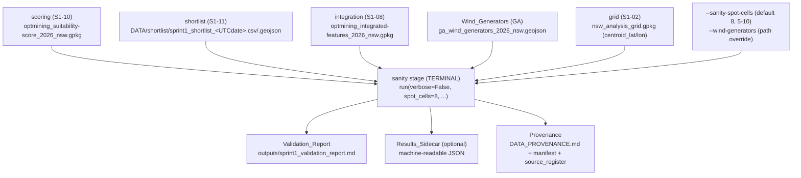
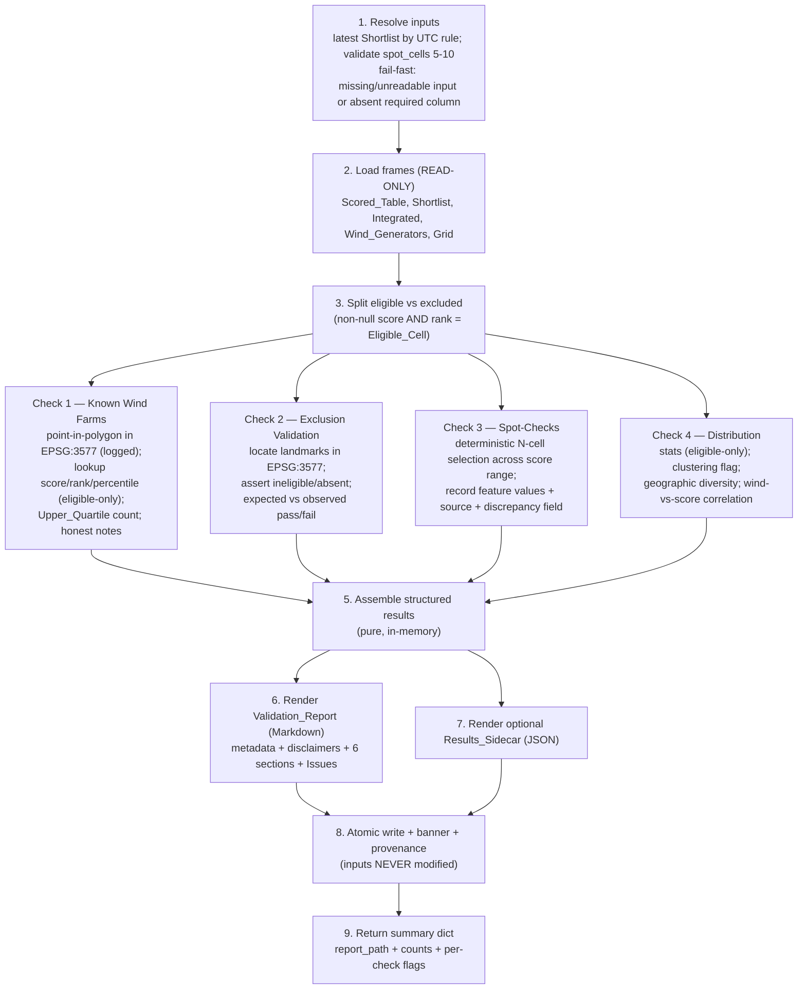

# Design Document

## Overview

This design specifies the **sanity-check** stage (`s1-12-validation-sanity-check`) for the Opt-Mining geospatial pipeline. It adds a new terminal **sanity** subpackage under `pipeline/sanity/` that consumes the Sprint 1 outputs — the ranked Shortlist (S1-11), the per-cell Scored_Table (S1-10), the Integrated_Feature_Table (S1-08), the Geoscience Australia Wind_Generators dataset, and the Analysis_Grid — and produces a human-readable Validation_Report that checks whether the pipeline's outputs are **plausible against known reality**.

For a single run the stage:

- reads the Shortlist, Scored_Table, Integrated_Feature_Table, Wind_Generators, and Analysis_Grid as **read-only** inputs, resolving the latest timestamped Shortlist file by a documented deterministic rule,
- runs **Check 1 — Known Wind Farm Comparison**: locates each GA wind-farm feature to its Containing_Cell by a point-in-polygon join in one explicit, logged CRS (EPSG:3577), looks up that cell's `suitability_score`/`rank`/Percentile (percentile over the Eligible_Cell population only), and reports the count/fraction of known farms in the Upper_Quartile,
- runs **Check 2 — Exclusion Validation**: asserts named urban centres and national parks resolve to excluded/ineligible cells and that no offshore/ocean cell exists in the grid, each as an explicit expected-versus-observed pass/fail,
- runs **Check 3 — Feature-Value Spot-Checks**: deterministically selects `N` (5–10, default 8) cells spanning the score range and records each cell's feature values plus the source to verify against and a human-verification discrepancy field,
- runs **Check 4 — Score-Distribution Plausibility**: reports distribution statistics over Eligible_Cells only, a degenerate-clustering flag, the geographic diversity of the top scores, and the wind-versus-score correlation,
- writes the Markdown Validation_Report to `outputs/sprint1_validation_report.md` (banner-stamped, atomic-written) with an optional machine-readable Results_Sidecar, and
- records anomalies and systematic issues honestly in the report's *Issues for Sprint 2* section.

This stage is deliberately a **reality-check reporting** step — **not** a modelling step and **not** the structural validation step. It is distinct from the cross-domain Structural_Validation in `pipeline/validate.py`, which checks internal data-integrity contracts (row counts, schema, CRS, key coverage). The sanity stage instead asks whether the results *make sense*. Because it is a separate concern, the stage key and its domain are named `sanity` so they never clash with the structural `validate` step. The Opt-Mining constitution constrains the stage directly and non-negotiably: it MUST validate against reality, MUST prompt investigation of the data before any model change, MUST NOT adjust the model to "pass" validation, and MUST state the analysis resolution and its limitations wherever results are presented. The stage is therefore **read-only on all inputs** and **never** re-scores, re-ranks, re-weights, or re-tunes the model; discrepancies are documented honestly and, where systematic, logged as Sprint2_Issues.

The design is a **manual+automated hybrid**: the automated checks (point-in-cell location, Percentile computation, exclusion assertions, distribution statistics, correlation) are scripted and reported with explicit expected-versus-observed pass/fail; the human-judgement items (independent verification of a spot-checked feature value against its source) are surfaced as report fields to be filled in by a reviewer. It satisfies the pipeline's established contracts: the uniform `run(verbose=False, ...) -> dict` stage contract, strict keying to the grid's `cell_id`, explicit and logged CRS handling (EPSG:4326 storage, EPSG:3577 for metric containment), statistics over the Eligible_Cell population only, atomic writes with a do-not-edit banner, provenance capture for a derived product, the "no silent passes" rule, and a reusable, re-runnable design.

### Design Grounding — Research and Existing Conventions

The design reuses existing pipeline infrastructure rather than introducing new patterns:

- **Stage contract & orchestration** — `pipeline/__main__.py` resolves the stage list from `config.STAGES`, dispatches each stage's `run()` via `_get_runner`, and builds kwargs via `_build_kwargs`. Every registered stage exposes `run(verbose=False, ...) -> dict`. This stage registers there and follows the identical pattern used by `integration.merge.run` and `infrastructure.features.run` (Requirement 9).
- **Read-only inputs** — the Scored_Table `DATA/scoring/optmining_suitability-score_2026_nsw.gpkg` (S1-10), the Shortlist `DATA/shortlist/sprint1_shortlist_<UTCdate>.csv`/`.geojson` (S1-11), the Integrated_Feature_Table `DATA/integration/optmining_integrated-features_2026_nsw.gpkg` (S1-08), the Wind_Generators `DATA/infrastructure/generators/ga_wind_generators_2026_nsw.geojson`, and the Analysis_Grid `DATA/grid/nsw_analysis_grid.gpkg`. This stage **reads** them and never writes back (Requirements 1, 8).
- **Grid contract** — `pipeline/grid/config.py` is authoritative for `STORAGE_CRS = "EPSG:4326"`, `COMPUTATION_CRS = "EPSG:3577"`, and `CELL_DEG = 0.05` (~5 km cell, the Analysis_Resolution). The grid carries `centroid_lat`/`centroid_lon` per `cell_id`; the sanity stage reuses `cell_id` byte-for-byte and never re-derives the grid (Requirements 1.2, 7.6).
- **Explicit CRS transform logging** — `infrastructure/features.py` computes distances/containment in `COMPUTATION_CRS = "EPSG:3577"` (`grid.to_crs(computation_crs)`) and records an explicit **"Transform log"** line in its method report enumerating each `source CRS → EPSG:3577` transform. The sanity stage reuses that discipline verbatim: the point-in-polygon join for Check 1 and the landmark location for Check 2 are performed in one explicit CRS (EPSG:3577) and the transform is logged in the report, rather than converting silently (Requirements 2.1, 2.2, 3.5).
- **Atomic writes, banners, timestamps, hashing** — `pipeline/common/geo.py` provides `atomic_write_text` (tmp + `os.replace`), `atomic_write_json`, `banner(module_name)`, `utc_now()` (UTC ISO-8601 to seconds), and `sha256_file`. This stage uses them for the Validation_Report, the Results_Sidecar, and provenance (Requirements 7.7, 7.8, 10). It also uses `query_layer_geojson`'s `outSR` convention as the reference for making an output CRS explicit at a boundary.
- **Provenance pattern** — `infrastructure/features.py` (and `integration.merge.record_provenance`) show the established derived-product provenance triple: a `DATA_PROVENANCE.md` table row, a manifest JSON (SHA-256, byte count, UTC timestamp, generation params), and the `source_register`. This stage mirrors that pattern for the report + sidecar (Requirement 10).
- **CLI-flag threading** — `_build_kwargs` already threads per-stage options (e.g. `--infra-features-crs → computation_crs`). The sanity stage adopts the identical convention with `--sanity-spot-cells → spot_cells` (default 8, range 5–10) and `--wind-generators → wind_generators_path` (Requirements 4.1, 9.7, 12.4).
- **Reusable check logic** — following the pure-function boundary used by the scoring and shortlist stages, all four check computations operate over in-memory frames and return structured results with no file access, so they are independently testable and re-runnable against updated outputs (Requirement 12).

**Research summary — point-in-polygon location in a metric CRS.** Locating a longitude/latitude point to its containing grid cell is a spatial join (`geopandas.sjoin(..., predicate="within")`). Doing it in the geographic CRS (EPSG:4326) is unsafe for containment near cell boundaries because degrees are not isotropic; the pipeline's convention is to perform metric spatial operations in EPSG:3577 (Australian Albers, equal-area) and to make the `EPSG:4326 → EPSG:3577` transform explicit and logged. Because every cell is a `0.05°` square and the grid tiles NSW without gaps, a well-formed interior point lies in exactly one cell; a point outside the grid extent (e.g. offshore) lies in **none**, which Check 1 must report honestly rather than drop. Percentile of a score within a population is `100 × (count of eligible scores ≤ v) / n_eligible`, computed over the Eligible_Cell population **only** so that null-scored excluded cells never dilute the rank. The Spearman/Pearson correlation between `wind_speed` and `suitability_score` over eligible cells is expected to be positive (wind is a positively-weighted input criterion); a non-positive result is *reported honestly*, never enforced and never used to adjust the model. This grounding informs the check components and the correctness properties below.

## Architecture

### Placement in the pipeline

The stage is a new subpackage `pipeline/sanity/` whose `run.py` module exposes `run(verbose=False, ...) -> dict`. It is registered in `pipeline/config.py` `STAGES` **after** `shortlist` (the producer of one of its inputs) as the **terminal** stage, and a new `"sanity"` entry is added to `DOMAINS`.



### Updated stage execution order

```
... → exclusions → integration → scoring → shortlist → sanity
```

`sanity` is placed after `shortlist` because it consumes the shortlist (as well as the Scored_Table, integrated table, wind generators, and grid), and it is the **terminal** stage in the Sprint 1 sequence — there is no consumer downstream, so it runs last. `config.STAGES` is the single source of truth for order; the orchestrator's resolved order MUST place `sanity` after `shortlist` for every invocation that includes both (Requirements 9.4, 9.9).

> **Naming note.** The stage key is `sanity` (a new domain), deliberately distinct from the structural `validate` step so the two validation concerns never clash (Requirement 9.5). It is added to both `config.STAGES` (as the terminal entry, after `shortlist`) and `config.DOMAINS`, so `--only sanity` and `--skip sanity` resolve. The README stage-order table and `__main__.py` dispatch are kept in sync with `config.STAGES` (Requirements 9, 14). This stage does **not** replace or duplicate the cross-domain checks in `pipeline/validate.py`, which remain the structural tier (Requirement 11.6).

### Internal data flow of the four checks



The dashed boundary between the pure check computations (steps 3–5, `checks.py`) and the surrounding I/O (steps 1–2, 6–9) is deliberate and enforced: each check receives in-memory frames and returns a structured result object with no file access, so the checks are independently testable, deterministic given fixed inputs, and re-runnable against updated pipeline outputs without code changes (Requirement 12).

### CRS discipline

Storage is **EPSG:4326** throughout. Every spatial-containment operation — locating a wind-farm point to its cell (Check 1) and locating a named landmark to its cell (Check 2) — is performed in **one explicit CRS, EPSG:3577**, and the `EPSG:4326 → EPSG:3577` transform is stated in the report's transform log, mirroring `infrastructure/features.py` (Requirements 2.1, 2.2, 3.5). No CRS conversion is performed silently. A source that carries no resolvable CRS is a fatal error: the stage halts before any write rather than assuming a projection.

## Components and Interfaces

### 1. Stage entry point — `pipeline/sanity/run.py` (Requirement 9)

```python
def run(
    verbose: bool = False,
    spot_cells: int = 8,                          # Spot_Check_Cells count, 5-10 (4.1, 4.5)
    wind_generators_path: Path | None = None,     # default DATA/infrastructure/generators/ga_wind_generators_2026_nsw.geojson
    shortlist_dir: Path | None = None,            # default DATA/shortlist/ (latest timestamped file, 1.6)
    scored_path: Path | None = None,              # default DATA/scoring/optmining_suitability-score_2026_nsw.gpkg
    integrated_path: Path | None = None,          # default DATA/integration/optmining_integrated-features_2026_nsw.gpkg
    grid_path: Path | None = None,                # default DATA/grid/nsw_analysis_grid.gpkg
    containment_crs: str = "EPSG:3577",           # single explicit, logged containment CRS (2.2)
    write_sidecar: bool = True,                   # emit the optional Results_Sidecar (7.8)
) -> dict:
    """
    Run the four plausibility sanity checks against the read-only pipeline
    outputs and write the Validation_Report (+ optional Results_Sidecar).

    Returns a summary dict with at least:
        {
          "report_path": str,               # outputs/sprint1_validation_report.md, exists on disk (9.2)
          "sidecar_path": str | None,       # Results_Sidecar path if written, exists on disk (9.2)
          "resolved_shortlist_path": str,   # the timestamped Shortlist actually used (1.6)
          "n_cells": int,                   # total grid cells (7.3)
          "n_eligible": int,                # Eligible_Cell count (7.3)
          "n_known_farms": int,             # Check 1 (11.2)
          "n_farms_upper_quartile": int,    # Check 1 (2.5, 11.2)
          "n_exclusion_checks_passed": int, # Check 2 (11.3)
          "n_exclusion_checks_failed": int, # Check 2 (11.3)
          "n_spot_cells": int,              # Check 3 (4.1)
          "check1_pass": bool,              # per-check pass/fail flags (11.2-11.4)
          "check2_pass": bool,
          "check3_recorded": bool,
          "check4_pass": bool,
          "run_timestamp": str,             # single UTC Run_Timestamp
          "runtime_seconds": float,
        }

    Raises (does NOT return a dict) on: missing/unreadable required input,
    absent required column, spot_cells outside 5-10, an unresolvable source
    CRS, or a write failure — so the orchestrator halts with a non-zero exit
    status (1.4, 1.5, 4.5, 7.9, 9.3). NEVER writes to any input (8.1).
    """
```

The signature matches the registered-stage contract (first parameter `verbose`, defaults to `False`, returns a dict — Requirement 9.1). Satisfies Requirements 9.1, 9.2, 9.3.

### 2. Input resolver & loader — `pipeline/sanity/load.py` (Requirements 1, 8)

```python
REQUIRED_SCORE_COLUMNS = ("cell_id", "suitability_score", "rank")
REQUIRED_INTEGRATED_COLUMNS = ("cell_id", "wind_speed", "slope_deg",
                               "dist_transmission_km", "protected", "eligible")
REQUIRED_GRID_COLUMNS = ("cell_id", "centroid_lat", "centroid_lon", "geometry")
REQUIRED_WIND_GENERATOR_ATTR = "name"

def resolve_shortlist(shortlist_dir: Path) -> Path:
    """
    Resolve the Shortlist by a documented deterministic rule: the file with the
    most recent UTC Run_Timestamp in its name under DATA/shortlist/ (1.6).
    Halts BEFORE any output if no shortlist file is present (1.4).
    """

def load_inputs(paths: SanityInputs) -> LoadedFrames:
    """
    Read all inputs READ-ONLY (8.1): Scored_Table, resolved Shortlist,
    Integrated_Feature_Table, Wind_Generators, Analysis_Grid. Halts BEFORE any
    output on: any missing/unreadable input (1.4); any required column absent
    (1.5), naming the column and the input it was expected in; a source with no
    resolvable CRS. Reuses cell_id byte-for-byte and never re-derives, renumbers,
    reformats, or reorders (1.2). Never re-scores or re-ranks (1.3).
    """
```

The loader is the only file-reading path; it hands fully in-memory frames to the pure checks and opens every input in read-only mode so no input is ever mutated. Satisfies Requirements 1.1–1.6, 8.1.

### 3. CRS containment helper — `pipeline/sanity/geo.py` (Requirements 2.1, 2.2, 3.5)

```python
@dataclass(frozen=True)
class CrsTransform:
    source: str          # e.g. "EPSG:4326"
    target: str          # e.g. "EPSG:3577"
    purpose: str         # "wind-farm containment" | "landmark containment"

def locate_points_to_cells(
    points: gpd.GeoDataFrame,      # EPSG:4326 storage
    grid: gpd.GeoDataFrame,        # EPSG:4326 storage
    containment_crs: str,          # EPSG:3577
    transform_log: list[CrsTransform],
) -> pd.DataFrame:
    """
    Reproject BOTH points and grid to the single explicit containment_crs
    (EPSG:3577), record the EPSG:4326 -> EPSG:3577 transform in transform_log
    (2.2, 3.5), and perform a point-in-polygon spatial join (predicate="within").
    Returns one row per input point with its Containing_Cell cell_id, or a null
    cell_id when the point lies in NO grid cell (offshore / out-of-extent),
    reported honestly rather than dropped (2.7). Never converts CRS silently.
    """
```

The `transform_log` is rendered verbatim into the report's transform-log line, exactly as `infrastructure/features.py` does. Satisfies Requirements 2.1, 2.2, 2.7 (location), 3.5.

### 4. Check 1 — Known Wind Farm Comparison — `pipeline/sanity/checks.py` (Requirement 2)

```python
UPPER_QUARTILE_PERCENTILE = 75.0    # documented Upper_Quartile threshold (2.5)
POOR_SCORE_PERCENTILE = 25.0        # documented "scores poorly" threshold (2.6)

def check_known_wind_farms(
    wind_generators: gpd.GeoDataFrame,
    grid: gpd.GeoDataFrame,
    scored: pd.DataFrame,
    containment_crs: str,
    transform_log: list[CrsTransform],
) -> WindFarmCheckResult:
    """
    PURE. For each Known_Wind_Farm: locate it to its Containing_Cell via
    locate_points_to_cells (EPSG:3577, logged) (2.1, 2.2); look up that cell's
    suitability_score, rank, and Percentile computed over the Eligible_Cell
    population ONLY (2.3, 2.4). Build a results-table row
    (Wind Farm | Cell ID | Score | Rank | Percentile | Notes). Report the count
    and proportion of farms in the Upper_Quartile (percentile >= 75) and state
    the expectation that most operational farms fall there (2.5).

    A farm whose cell scores below POOR_SCORE_PERCENTILE, or whose cell is an
    Excluded_Cell (null score), or whose point falls in NO grid cell, is
    recorded HONESTLY in the Notes field with an investigation note that
    distinguishes a likely data issue from a legitimate model result; the model
    is NEVER adjusted and the farm is NEVER silently dropped (2.6, 2.7, 6.5, 8.3).
    """
```

`percentile_over_eligible(score, eligible_scores)` computes `100 × (count of eligible scores ≤ score) / n_eligible`, using the eligible population only (2.4). Satisfies Requirements 2.1–2.7.

### 5. Check 2 — Exclusion Validation — `pipeline/sanity/checks.py` (Requirement 3)

```python
# Documented landmark coordinates (EPSG:4326), located to cells in EPSG:3577.
LANDMARKS = (
    Landmark("Sydney CBD",      -33.8688, 151.2093, kind="urban"),
    Landmark("Newcastle",       -32.9283, 151.7817, kind="urban"),
    Landmark("Wollongong",      -34.4278, 150.8931, kind="urban"),
    Landmark("Blue Mountains NP",-33.7000, 150.3000, kind="park"),
    Landmark("Kosciuszko NP",   -36.4560, 148.2630, kind="park"),
)

def check_exclusions(
    landmarks, grid, scored, integrated, containment_crs, transform_log,
) -> ExclusionCheckResult:
    """
    PURE. For each landmark: locate it to its cell in EPSG:3577 (logged) via the
    documented coordinate rule (3.5); assert the cell is an Excluded_Cell
    (eligible == false / null suitability_score) or absent from the grid (3.1,
    3.2). Additionally assert NO offshore/ocean cell exists in the grid: every
    grid cell resolves to a land/eligible-population membership, so an
    ocean-only cell would be an anomaly (3.3). Each assertion records the
    expected outcome, the observed outcome, and an explicit pass/fail; NEVER a
    pass without an observed value (3.4). A failing assertion is reported
    HONESTLY as an Anomaly with an investigation note and is NOT suppressed to
    make the check pass (3.6, 8.3).
    """
```

Satisfies Requirements 3.1–3.6.

### 6. Check 3 — Feature-Value Spot-Checks — `pipeline/sanity/checks.py` (Requirement 4)

```python
SPOT_CHECK_MIN, SPOT_CHECK_MAX, SPOT_CHECK_DEFAULT = 5, 10, 8

VERIFY_SOURCES = {
    "wind_speed":            "open Global Wind Atlas (GWA) at the cell centroid",
    "slope_deg":             "a topographic reference (SRTM-derived slope)",
    "dist_transmission_km":  "a GIS distance measurement to the nearest transmission line",
    "protected":             "CAPAD protected-area lookup",
}

def select_spot_cells(eligible: pd.DataFrame, n: int) -> pd.DataFrame:
    """
    PURE, DETERMINISTIC. Require SPOT_CHECK_MIN <= n <= SPOT_CHECK_MAX (else the
    caller halts, 4.5). Order eligible cells ascending by suitability_score with
    a cell_id tie-break, then pick n evenly-spaced quantile positions spanning
    the range so the selection ALWAYS includes the top cell, the bottom cell,
    and (n-2) interior quantiles (4.2). The rule is a fixed function of
    (sorted eligible scores, n), so repeated runs pick the SAME cells (12.3).
    """

def check_spot_values(spot_cells, integrated) -> SpotCheckResult:
    """
    PURE. For each selected cell record cell_id, centroid_lat/lon (EPSG:4326),
    wind_speed, slope_deg (or elevation), dist_transmission_km, and the
    protected flag, plus the VERIFY_SOURCES entry for each value and an empty
    "discrepancy" field for the human reviewer (4.3, 4.4). A cell missing a
    required feature value records the value as MISSING with a note rather than
    fabricating one (4.6).
    """
```

Satisfies Requirements 4.1–4.6.

### 7. Check 4 — Score-Distribution Plausibility — `pipeline/sanity/checks.py` (Requirement 5)

```python
CLUSTER_EPSILON = 0.02          # documented "within epsilon of 0 or 1" band (5.2)
CLUSTER_FRACTION_THRESHOLD = 0.5  # documented degenerate-clustering threshold (5.2)

def check_distribution(eligible: pd.DataFrame) -> DistributionCheckResult:
    """
    PURE. Over the Eligible_Cell population ONLY (5.1):
      - stats: min, max, mean, std, and quartiles (Q1/median/Q3) of
        suitability_score;
      - clustering flag: fraction of eligible scores within CLUSTER_EPSILON of
        0 or 1; degenerate if that fraction exceeds CLUSTER_FRACTION_THRESHOLD;
        reported as an explicit pass/fail (5.2);
      - geographic diversity of the top-scoring cells: latitude range and
        longitude range (and REZs represented, WHERE available) of the top
        cells, so a single-region concentration is visible (5.3);
      - wind-vs-score correlation: Spearman (default) or Pearson between
        wind_speed and suitability_score over eligible cells, with a documented
        POSITIVE sign expectation; reported (NOT enforced) with an honest note
        if the sign is unexpected (5.4).
    A degenerate distribution or a non-positive correlation is reported
    HONESTLY as an Anomaly with an investigation note; the model is NEVER
    adjusted to alter the distribution (5.5, 8.2, 8.3).
    """
```

Satisfies Requirements 5.1–5.5.

### 8. Anomaly & Sprint-2 issues collector — `pipeline/sanity/issues.py` (Requirement 6)

```python
@dataclass(frozen=True)
class Anomaly:
    check: str            # which check surfaced it
    description: str
    kind: str             # "data_issue" | "model_result" (6.4, 6.5)
    investigation_note: str

def collect_issues(*check_results) -> list[Anomaly]:
    """
    Gather every Anomaly recorded by the four checks into the report's
    "Issues for Sprint 2" section. Each Anomaly records its description, the
    check that surfaced it, and whether it is a suspected data issue or a
    legitimate model result (6.1, 6.3, 6.4, 6.5). Anomalies are NEVER
    suppressed and NEVER used to auto-adjust the model (6.2, 8.2).
    """
```

Satisfies Requirements 6.1–6.5.

### 9. Report renderer & writer — `pipeline/sanity/report.py` (Requirement 7)

```python
REPORT_PATH = Path("outputs/sprint1_validation_report.md")

def render_report(results: SanityResults, meta: RunMetadata) -> str:
    """
    Render the Markdown Validation_Report, banner-stamped via
    common.geo.banner("sanity"). Sections in order (7.2):
      header/run-metadata (run date, Pipeline_Version, total cells, eligible
        cells) + disclaimers (Preliminary_Disclaimer + Analysis_Resolution
        ~5 km / 0.05 degree + limitations; a plausibility sanity check, NOT a
        formal accuracy assessment and NOT a site approval) (7.3, 7.5, 7.6);
      1. Known Wind Farm Comparison;
      2. Exclusion Validation;
      3. Feature Value Spot-Checks;
      4. Score Distribution;
      5. Issues for Sprint 2;
      6. Conclusion (overall trustworthy-for-preliminary-screening assessment) (7.4).
    The Analysis_Resolution and its limitations appear wherever results are
    presented (7.6).
    """

def write_report(text: str, path: Path = REPORT_PATH) -> None:
    """Atomic write via common.geo.atomic_write_text (tmp + os.replace); on
    failure leave any prior report unmodified and raise (7.7, 7.9)."""

def write_sidecar(results: SanityResults, path: Path) -> None:
    """Atomic write of the machine-readable Results_Sidecar via
    common.geo.atomic_write_json, labelled a derived product; on failure leave
    any prior sidecar unmodified and raise (7.8, 7.9, 10.2)."""
```

Satisfies Requirements 7.1–7.9.

### 10. Provenance — `pipeline/sanity/report.py::record_provenance` (Requirement 10)

Mirrors `infrastructure/features.py` provenance: a `DATA_PROVENANCE.md` row, a `sanity_manifest.json` (SHA-256, byte count, UTC Run_Timestamp, generation params — listing the Shortlist, Scored_Table, Integrated_Feature_Table, Wind_Generators, and Analysis_Grid inputs), and a `source_register` entry — labelling the Validation_Report and the Results_Sidecar **derived products** so they are not mistaken for custodial source data (10.1, 10.2, 10.3). Where the Results_Sidecar is emitted, it follows the `{source}_{dataset}_{year/vintage}_{region}.{ext}` convention with region slug `nsw` (e.g. `optmining_validation-results_2026_nsw.json`); the report retains its fixed `outputs/sprint1_validation_report.md` path with the naming rule documented (10.4). Satisfies Requirements 10.1–10.4.

### 11. No-silent-passes reporter — `pipeline/sanity/checks.py` (Requirement 11)

Every automated check returns a structured `CheckOutcome(expected, observed, passed)` and the renderer prints all three; no check records a `pass` without a recorded observed value (11.1). Check 1 reports the Upper_Quartile count against the expectation as an explicit pass/fail with the observed count (11.2); each Check 2 assertion reports observed eligibility/grid-membership as pass/fail (11.3); Check 4 reports the clustering and wind-correlation checks as pass/fail with observed statistics (11.4). A failing check is surfaced, never overwritten or hidden (11.5). Cross-domain structural checks remain in `pipeline/validate.py` and are not duplicated here (11.6). Satisfies Requirements 11.1–11.6.

### 12. Orchestrator integration — `pipeline/config.py`, `pipeline/__main__.py` (Requirement 9)

- `pipeline/config.py`: append `"sanity"` to `STAGES` as the terminal entry, after `"shortlist"`; add `"sanity"` to `DOMAINS` (9.4, 9.5).
- `pipeline/__main__.py`: add an `_get_runner` branch `from .sanity.run import run`; extend `_build_kwargs` to pass `verbose`, `spot_cells`, and `wind_generators_path`; add `--sanity-spot-cells` (default 8, validated 5–10) and `--wind-generators` CLI flags (9.6, 9.7).
- `pipeline/sanity/__init__.py`: docstring describes the sanity-check stage, its **distinction from the structural `validate` step**, and its **terminal** position in the sequence (9.8). Satisfies Requirements 9.4–9.9.

## Data Models

### Known Wind Farm Comparison — results table (Check 1, Requirement 2)

| Column | Type | Domain / Units | Notes |
|--------|------|----------------|-------|
| `Wind Farm` | string | GA `name` attribute | From Wind_Generators (2.3) |
| `Cell ID` | grid-native | matches grid `cell_id`, or `null` | `null` when point in no cell (2.7) |
| `Score` | float | `[0, 1]` or `null` | Looked up from Scored_Table; `null` if excluded (2.3, 2.6) |
| `Rank` | integer | `1..n_eligible` or `null` | From Scored_Table (2.3) |
| `Percentile` | float | `0..100` | Over Eligible_Cell population only (2.4) |
| `Notes` | string | free text | Honest investigation note; data-issue vs model-result (2.6, 2.7) |

Summary fields: `n_known_farms`, `n_farms_upper_quartile` (percentile ≥ 75), `fraction_upper_quartile`, and the stated expectation that most operational farms fall in the Upper_Quartile (2.5).

### Exclusion Validation — assertion records (Check 2, Requirement 3)

| Field | Type | Notes |
|-------|------|-------|
| `landmark` | string | e.g. "Sydney CBD", "Kosciuszko NP" |
| `kind` | string | `urban` \| `park` \| `offshore` |
| `lat`, `lon` | float | documented EPSG:4326 coordinate (3.5) |
| `cell_id` | grid-native / null | located in EPSG:3577 (3.5); `null` = absent from grid |
| `expected` | string | e.g. "ineligible / excluded / absent" (3.4) |
| `observed` | string | observed eligibility / grid-membership (3.4, 11.3) |
| `passed` | bool | explicit pass/fail, never a pass without observed (3.4) |

Plus the offshore/ocean assertion over the whole grid (no ocean-only cell exists) (3.3).

### Feature-Value Spot-Check records (Check 3, Requirement 4)

| Field | Type | Notes |
|-------|------|-------|
| `cell_id` | grid-native | selected cell (4.3) |
| `centroid_lat`, `centroid_lon` | float | EPSG:4326 (4.3) |
| `score_band` | string | `top` \| `middle` \| `bottom` (deterministic span, 4.2) |
| `wind_speed` | float / `MISSING` | verify against GWA (4.3, 4.4, 4.6) |
| `slope_deg` (or `elevation`) | float / `MISSING` | verify against topographic reference (4.3, 4.4) |
| `dist_transmission_km` | float / `MISSING` | verify against GIS measurement (4.3, 4.4) |
| `protected` | bool / `MISSING` | verify against CAPAD (4.3, 4.4) |
| `verify_source` | string | source per value (4.4) |
| `discrepancy` | string (empty) | human-verification field, left blank (4.3) |

### Score-Distribution statistics (Check 4, Requirement 5)

```python
@dataclass(frozen=True)
class DistributionCheckResult:
    stats: dict            # {"min","max","mean","std","q1","median","q3"} over ELIGIBLE only (5.1)
    cluster_fraction: float  # fraction within CLUSTER_EPSILON of 0 or 1 (5.2)
    cluster_degenerate: bool # cluster_fraction > threshold (5.2)
    cluster_passed: bool     # explicit pass/fail (5.2, 11.4)
    top_lat_range: tuple     # (min, max) latitude of top cells (5.3)
    top_lon_range: tuple     # (min, max) longitude of top cells (5.3)
    rez_represented: list    # REZs among top cells, WHERE available (5.3)
    wind_score_corr: float   # Spearman/Pearson over eligible cells (5.4)
    corr_method: str         # "spearman" | "pearson"
    corr_sign_expected_positive: bool  # documented expectation (5.4)
    corr_passed: bool        # positive as expected? reported, not enforced (5.4)
```

### Run summary dict (Requirement 9)

```python
{
    "report_path": str,               # outputs/sprint1_validation_report.md, exists on disk (9.2)
    "sidecar_path": str | None,       # exists on disk if written (9.2, 7.8)
    "resolved_shortlist_path": str,   # latest timestamped Shortlist used (1.6)
    "n_cells": int,                   # total grid cells (7.3)
    "n_eligible": int,                # Eligible_Cell count (7.3)
    "n_known_farms": int,             # (11.2)
    "n_farms_upper_quartile": int,    # (2.5, 11.2)
    "n_exclusion_checks_passed": int, # (11.3)
    "n_exclusion_checks_failed": int, # (11.3)
    "n_spot_cells": int,              # (4.1)
    "check1_pass": bool, "check2_pass": bool,
    "check3_recorded": bool, "check4_pass": bool,   # per-check flags (11.2-11.4)
    "run_timestamp": str,             # single UTC Run_Timestamp
    "runtime_seconds": float,
}
```

### Report / sidecar structure (Requirement 7)

- **Validation_Report** — Markdown at `outputs/sprint1_validation_report.md`, banner-stamped, atomic-written. Header/run-metadata + disclaimers, then sections `1. Known Wind Farm Comparison`, `2. Exclusion Validation`, `3. Feature Value Spot-Checks`, `4. Score Distribution`, `5. Issues for Sprint 2`, `6. Conclusion` (7.1, 7.2). Metadata: run date, Pipeline_Version, total cell count, eligible cell count (7.3). Disclaimers: preliminary-screening plausibility sanity check at ~5 km / 0.05° resolution, not a formal accuracy assessment, not a site approval (7.5, 7.6).
- **Results_Sidecar** — optional JSON at `DATA/.../optmining_validation-results_2026_nsw.json`, atomic-written, labelled a derived product, carrying the structured automated results (including the Known_Wind_Farm_Comparison table) (7.8, 10.2, 10.4).

## Correctness Properties

*A property is a characteristic or behavior that should hold true across all valid executions of a system — essentially, a formal statement about what the system should do. Properties serve as the bridge between human-readable specifications and machine-verifiable correctness guarantees.*

The properties below were derived from the acceptance-criteria prework and consolidated to remove redundancy: the read-only/model-never-adjusted criteria (1.3, 8.1, 8.2, 8.3, 6.2) collapse into one invariant; the honest-reporting criteria across checks (2.6, 2.7, 3.6, 5.5, 6.1, 11.5) fold into the honest-reporting and per-check pass/fail properties; the eligible-only statistics criteria (2.4, 5.1) into one eligible-only property; the determinism criteria (12.3, 13.6) into one idempotence property; and the no-silent-passes criteria (3.4, 11.1, 11.2, 11.3, 11.4) into one explicit-pass/fail property. Point-in-cell location, spot-cell selection, and the specific check computations each retain a dedicated property because they exercise distinct logic.

### Property 1: Point-in-cell location is correct in the metric CRS

*For any* set of points and *any* well-formed grid, locating each point to its Containing_Cell in the single explicit containment CRS (EPSG:3577) assigns each interior point to exactly the one cell whose polygon contains it, and assigns a `null` cell to any point lying outside the grid extent — never silently dropping a point.

**Validates: Requirements 2.1, 2.2, 2.7**

### Property 2: Percentile is computed over the eligible population only

*For any* Scored_Table containing both eligible and excluded cells and *any* score value, its Percentile equals `100 × (count of Eligible_Cell scores ≤ value) / n_eligible`, computed over the Eligible_Cell population only, and is unchanged by any modification to Excluded_Cell values.

**Validates: Requirements 2.3, 2.4**

### Property 3: Upper-quartile count is correct

*For any* set of Known_Wind_Farms located to scored cells, the reported count of farms in the Upper_Quartile equals the number whose Containing_Cell Percentile is at or above 75, and the reported fraction equals that count divided by the number of known farms.

**Validates: Requirements 2.5**

### Property 4: Exclusion checks report expected-versus-observed with honest out-of-grid/ineligible handling

*For any* landmark located to the grid, the Exclusion_Validation records the expected outcome, the observed eligibility or grid-membership, and an explicit pass/fail — passing only when the cell is observed to be an Excluded_Cell (ineligible / null score) or absent from the grid, and recording a fail honestly (never a pass without an observed value) when an urban or protected cell is observed eligible or an offshore cell is found in the grid.

**Validates: Requirements 3.1, 3.2, 3.3, 3.4**

### Property 5: Spot-cell selection is deterministic and spans the score range

*For any* Eligible_Cell population and *any* count `n` in `[5, 10]`, the spot-cell selection returns exactly `n` distinct eligible cells that include the top-scoring cell, the bottom-scoring cell, and interior cells spanning the score range, and returns the identical set of cells on repeated selection over identical inputs.

**Validates: Requirements 4.1, 4.2**

### Property 6: Invalid spot-cell count is rejected before any write

*For any* requested Spot_Check_Cells count outside the inclusive range `[5, 10]`, the stage halts before writing any Validation_Report and returns an error identifying the invalid count, leaving no partial output on disk.

**Validates: Requirements 4.5**

### Property 7: Distribution statistics are computed over eligible cells only

*For any* Scored_Table, the reported minimum, maximum, mean, standard deviation, and quartiles of `suitability_score` equal those statistics computed over the Eligible_Cell population only, and are unchanged by any modification to Excluded_Cell values.

**Validates: Requirements 5.1**

### Property 8: Degenerate-clustering flag is correct

*For any* Eligible_Cell score distribution, the clustering check flags the distribution as degenerate if and only if the fraction of eligible scores within the documented epsilon of 0 or 1 exceeds the documented threshold, and reports that fraction as the observed value alongside the pass/fail.

**Validates: Requirements 5.2**

### Property 9: Wind-versus-score correlation is reported honestly, not enforced

*For any* Eligible_Cell population, the stage reports the computed `wind_speed`-versus-`suitability_score` correlation and its sign against the documented positive expectation, and when the correlation is not sensibly positive it records an honest Anomaly note rather than altering the distribution or failing the run.

**Validates: Requirements 5.4, 5.5**

### Property 10: Inputs are read-only and the model is never adjusted

*For any* run and *any* check outcome, the byte content of every input (Shortlist, Scored_Table, Integrated_Feature_Table, Wind_Generators, Analysis_Grid) is unchanged after the run, no `suitability_score`/`rank` is recomputed, and no criteria weight, normalisation bound, exclusion rule, or scoring parameter is altered as a consequence of any result.

**Validates: Requirements 1.3, 8.1, 8.2, 8.3**

### Property 11: Every automated check reports an explicit pass/fail with an observed value

*For any* automated check, the recorded outcome contains an expected value, an observed value, and an explicit pass/fail, and no outcome records a pass without a recorded observed value; a failing outcome is surfaced in the report and never overwritten or hidden.

**Validates: Requirements 3.4, 11.1, 11.2, 11.3, 11.4, 11.5**

### Property 12: Surprising results are recorded honestly as Sprint-2 issues

*For any* check that produces a surprising or failing result, the result is recorded in the report with an investigation note classifying it as a suspected data issue or a legitimate model result, is not suppressed, and where systematic is logged as a Sprint2_Issue rather than fixed ad hoc.

**Validates: Requirements 6.1, 6.3, 6.4, 6.5**

### Property 13: The report contains all required sections and disclaimers

*For any* successful run, the Validation_Report contains the six required sections (Known Wind Farm Comparison, Exclusion Validation, Feature Value Spot-Checks, Score Distribution, Issues for Sprint 2, Conclusion), the run metadata (date, Pipeline_Version, total cells, eligible cells), the Preliminary_Disclaimer, and the Analysis_Resolution statement.

**Validates: Requirements 7.2, 7.3, 7.5, 7.6**

### Property 14: Regeneration is deterministic (idempotent)

*For any* fixed set of inputs, running the automated checks twice produces identical structured results — identical located cells, percentiles, exclusion pass/fail, selected spot cells, and distribution statistics — confirming the checks are deterministic and reproducible.

**Validates: Requirements 12.3**

### Property 15: Successful run returns an existing report path

*For any* valid inputs, when `run()` completes successfully it returns a summary dict whose `report_path` is a non-empty filesystem path that exists on disk after the call returns, and whose `sidecar_path`, when a sidecar is written, likewise exists on disk.

**Validates: Requirements 9.2**

### Property 16: Resolved execution order places sanity after shortlist as the terminal stage

*For any* orchestrator invocation whose resolved stage list includes both `shortlist` and `sanity`, the index of `shortlist` is strictly less than the index of `sanity`, and `sanity` is the last entry in the resolved order.

**Validates: Requirements 9.4, 9.9**

## Error Handling

The stage fails loud and early, never silently. All halt conditions occur **before** any Validation_Report or Results_Sidecar is written, so a failed run never leaves a partial or corrupt output, and no input is ever modified.

| Condition | Handling | Requirement |
|-----------|----------|-------------|
| Any required input missing / unopenable | Raise `FileNotFoundError`/`RuntimeError` naming the path; no output written | 1.4 |
| No Shortlist file under `DATA/shortlist/` | Raise error stating no shortlist could be resolved; no output written | 1.4, 1.6 |
| A required column absent in an input | Raise error naming the missing column and the input it was expected in; no output written | 1.5 |
| A source carries no resolvable CRS | Raise error naming the source; never assume a projection; no output written | 2.2, 3.5 |
| Requested `spot_cells` outside `[5, 10]` | Raise error naming the invalid count; no output written | 4.5 |
| Known wind-farm point in no grid cell | Not fatal: record `null` cell with an honest note; never drop the farm | 2.7 |
| Wind-farm cell scores poorly / is excluded | Not fatal: record honestly with an investigation note; model never adjusted | 2.6, 8.3 |
| Exclusion assertion fails | Not fatal: record honest fail as an Anomaly; never suppress to pass | 3.6 |
| Spot-check cell missing a feature value | Not fatal: record value as `MISSING` with a note; never fabricate | 4.6 |
| Degenerate distribution / non-positive wind correlation | Not fatal: report honestly as an Anomaly; distribution/model never altered | 5.5 |
| Report or sidecar write fails | Leave any pre-existing output unmodified (atomic tmp + `os.replace`); raise an error indication | 7.9 |
| Cannot produce the Validation_Report | Raise an error indicating the cause; do NOT return a summary dict, so the orchestrator halts with a non-zero exit | 9.3 |

The distinction between **fatal** conditions (missing input, absent required column, unresolvable CRS, invalid `spot_cells` → halt before any write) and **handled** conditions (out-of-grid farm, poorly-scoring farm, failing assertion, missing feature value, degenerate/negative distribution → record honestly and continue) is deliberate and central to this stage: malformed inputs must abort loudly, but a *surprising but legitimate* result must be reported honestly rather than crash the run, suppressed, or used to auto-adjust the model.

## Testing Strategy

The sanity stage's core is a set of pure, deterministic check computations — point-in-cell location, percentile/quartile statistics, exclusion assertions, deterministic spot-cell selection, distribution statistics, and correlation — all functions of the in-memory input frames, so **property-based testing applies** to that logic. Infrastructure-boundary concerns (orchestrator wiring, provenance content, documentation consistency, Markdown/JSON rendering, file I/O) are covered by example, integration, and smoke tests instead. The stage never adjusts the model, so the read-only invariant is itself tested as a property.

### Dual approach

- **Property tests** verify the universal properties in the Correctness Properties section across many generated inputs (random grids and points, random Scored_Tables of eligible/excluded cells, random spot-cell counts including out-of-range, random score distributions including degenerate ones).
- **Unit (example) tests** verify specific hand-computed locations, percentiles, exclusion outcomes, distribution statistics, and spot-cell selections, plus edge and error conditions (Requirement 13).
- **Integration tests** verify the full-NSW run over the real 47,311-cell outputs and orchestrator ordering.
- **Smoke tests** verify config/wiring (`STAGES` terminal membership, `DOMAINS`, `--sanity-spot-cells`/`--wind-generators` flags, `_get_runner`/`_build_kwargs`, `__init__` docstring).

### Property-based testing

- Library: **Hypothesis** (the standard PBT library for Python; the repo already vendors a `.hypothesis` cache). PBT is not implemented from scratch.
- Each property is implemented as a **single** property-based test running a **minimum of 100 iterations**.
- Each test is tagged with a comment referencing its design property, in the format:
  `# Feature: s1-12-validation-sanity-check, Property {number}: {property_text}`
- Generators: synthetic in-memory grids of contiguous `0.05°` cells with `centroid_lat`/`centroid_lon`; random points placed inside a known cell or deliberately outside the extent; synthetic Scored_Tables with unique `cell_id`s, a random mix of Eligible_Cells (non-null score in `[0, 1]` + `rank`) and Excluded_Cells (null score + null rank); random Spot_Check_Cells counts spanning below, inside, and above `[5, 10]`; and score distributions seeded to be uniform, degenerate at 0/1, and correlated/anti-correlated with a synthetic `wind_speed`. The pure check functions are exercised directly with in-memory frames so no filesystem access is needed.

| Property | Test focus |
|----------|-----------|
| 1 Point-in-cell location | Interior point → exactly its cell (EPSG:3577); out-of-extent point → null; none dropped |
| 2 Percentile eligible-only | Percentile == eligible-only recomputation; unchanged when excluded perturbed |
| 3 Upper-quartile count | Count == number with percentile ≥ 75; fraction == count / n_known_farms |
| 4 Exclusion expected-vs-observed | Pass iff observed ineligible/absent; fail recorded honestly; no pass without observed |
| 5 Spot-cell selection | Exactly `n` distinct cells incl. top+bottom, spanning range; identical on repeat |
| 6 Invalid count rejected | `spot_cells` outside `[5,10]` raises and writes nothing |
| 7 Distribution eligible-only | Stats == eligible-only recomputation; unchanged when excluded perturbed |
| 8 Clustering flag | Degenerate iff fraction within epsilon of 0/1 exceeds threshold; fraction reported |
| 9 Wind-score correlation honest | Correlation + sign reported; non-positive → honest note, run not failed/altered |
| 10 Read-only / model unchanged | Input bytes unchanged; no score/rank recomputed; no parameter altered |
| 11 Explicit pass/fail | Each outcome has expected+observed+pass/fail; no pass without observed |
| 12 Honest Sprint-2 issues | Surprising results recorded with data-issue/model-result note; not suppressed |
| 13 Report sections + disclaimers | All six sections, metadata, disclaimer, and resolution present |
| 14 Determinism/idempotence | Two runs on fixed inputs produce identical structured results |
| 15 Returned path exists | After `run()`, `report_path` (and any `sidecar_path`) exist on disk |
| 16 Shortlist-before-sanity terminal | For any resolved stage list with both, shortlist index < sanity index; sanity last |

### Unit tests (Requirement 13)

Explicit hand-computed synthetic examples, complementing the properties and mapped directly to the Requirement-13 acceptance criteria:

- 13.1 Point-in-cell location on a small synthetic grid and synthetic wind-farm points: each point is located to the correct Containing_Cell in the documented CRS (EPSG:3577).
- 13.2 Percentile computation over a small synthetic Eligible_Cell population: computed percentiles equal hand-computed values within a documented tolerance, and Excluded_Cell values are omitted.
- 13.3 Exclusion assertions: a synthetic urban/protected/offshore location is correctly detected as excluded, and a failing assertion is reported as a fail with the observed value.
- 13.4 Distribution statistics: min, max, mean, std, quartiles, degenerate-clustering flag, and wind-resource correlation equal hand-computed values within a documented tolerance.
- 13.5 Spot_Check_Cells selection: the selected count lies within `[5, 10]` and the selected cells span the top, middle, and bottom of the synthetic score range.
- 13.6 Determinism: the automated check computations return identical results for two runs over identical inputs.

Additional example/error-condition unit tests cover: latest-Shortlist resolution rule (1.6), input error conditions (1.4, 1.5), unresolvable-CRS halt (2.2, 3.5), invalid-`spot_cells` halt (4.5), out-of-grid wind-farm honest note (2.7), missing-feature-value `MISSING` note (4.6), the transform-log line content (2.2, 3.5), atomic write + banner (7.7), write-failure leaves prior output intact (7.9), the six report sections + disclaimers (7.2, 7.5, 7.6), `run()` signature and error-on-failure (9.1, 9.3), and provenance content labelled a derived product (10.1–10.4).

### Integration and smoke tests

- **Full-NSW integration** (Requirements 1, 2, 5, 9): run over the real 47,311-cell Scored_Table, the latest Shortlist, the integrated table, the GA wind generators, and the grid; assert the report is written to `outputs/sprint1_validation_report.md` with all six sections, the Known_Wind_Farm_Comparison table has one row per generator, the Upper_Quartile count and distribution statistics are recorded with explicit pass/fail, no input file is modified (compare pre/post SHA-256), and a second run reproduces the automated results (deterministic derived product).
- **Orchestrator smoke** (9.4–9.8): assert `sanity` is the terminal entry in `config.STAGES` (after `shortlist`), `sanity` is in `config.DOMAINS`, `--sanity-spot-cells` and `--wind-generators` exist and are forwarded by `_build_kwargs` as `spot_cells`/`wind_generators_path`, `_get_runner("sanity")` returns the stage `run`, and the subpackage `__init__` docstring describes the stage, its distinction from `validate`, and its terminal position.
- **Documentation consistency** (14.2, 14.3, 14.5): assert the README stage-order table/name for `sanity` matches the resolved runtime configuration (including the CLI flags) and that the README/spec state the stage is a preliminary-screening plausibility sanity check distinct from `pipeline/validate.py`.

### Cross-component impact (must be delivered with this stage)

Per the holistic-project-awareness rule, this feature is not complete until these related components are updated consistently. The sanity stage is a **new read-only consumer** of the S1-08/S1-10/S1-11 outputs, the GA wind generators, and the grid, and a **new producer** of the Validation_Report + Results_Sidecar, so the ripple crosses config, orchestration, provenance, and documentation:

- `pipeline/config.py` — append `"sanity"` to `STAGES` as the terminal entry (after `shortlist`) and add `"sanity"` to `DOMAINS`. These are the authoritative single source for stage order and domain resolution; the README and `__main__.py` are kept in sync with them. (Note: `scoring` and `shortlist` are introduced by the sibling S1-10/S1-11 specs; `sanity` must be registered after `shortlist`.)
- `pipeline/__main__.py` — `_get_runner` dispatch branch (`from .sanity.run import run`), `_build_kwargs` handling for `spot_cells` and `wind_generators_path`, and the new `--sanity-spot-cells` (default 8, validated 5–10) and `--wind-generators` CLI flags.
- `pipeline/sanity/` (new subpackage) — `__init__.py` docstring, `run.py`, `load.py`, `geo.py`, `checks.py`, `issues.py`, `report.py`.
- **Producer/consumer contract with S1-08/S1-10/S1-11 and the grid** — this stage reads the Scored_Table columns (`cell_id`, `suitability_score`, `rank`), the integrated-table feature columns (`wind_speed`, `slope_deg`, `dist_transmission_km`, protected flag, `eligible`), the grid columns (`cell_id`, `centroid_lat`, `centroid_lon`, geometry), the Shortlist columns, and the GA generator `name` attribute. If any of those upstream column/attribute names change, the loader's required-column checks and the check computations MUST be updated in lockstep. This stage never re-scores, re-ranks, or re-derives the grid.
- `pipeline/validate.py` — **unchanged in responsibility**: the cross-domain structural checks stay here (Requirement 11.6); the sanity stage explicitly does NOT duplicate or replace them. If a genuinely structural cross-domain check is identified during implementation, it belongs in `pipeline/validate.py`, not in the sanity stage.
- Provenance — `DATA_PROVENANCE.md` row, `sanity_manifest.json` (all five inputs + UTC Run_Timestamp), and `source_register` entry for the derived Validation_Report and Results_Sidecar, labelled derived products, using `common.geo` atomic writes and the `banner()` stamp.
- `DATA/data-specification/sprint1_data_specification.md` §4 (dataset detail) and §7 (dataset→stage→criterion mapping) — add the Validation_Report and any Results_Sidecar, and the sanity stage that produces them, via the §8 change-control process; state that the report is a preliminary-screening plausibility sanity check at the stated Analysis_Resolution and is not a site approval, and that the sanity stage is distinct from structural `validate` (14.1, 14.4, 14.5).
- `pipeline/README.md` — stage-order table and CLI documentation listing `sanity` at the resolved terminal runtime position (after `shortlist`), including the `--sanity-spot-cells` and `--wind-generators` flags, the preliminary-screening/resolution statement, and the note that this stage is distinct from `pipeline/validate.py` (14.2, 14.3, 14.4, 14.5).
- **Frozen decisions (Q1–Q7)** — if any frozen parameter is affected, follow the spec §8 change-control process and update both the spec §2 and the README identically (14.6). This stage does not change any frozen decision; the spot-cell count and wind-generators path are runtime CLI/config values.
