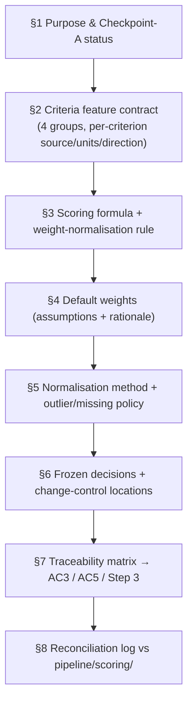
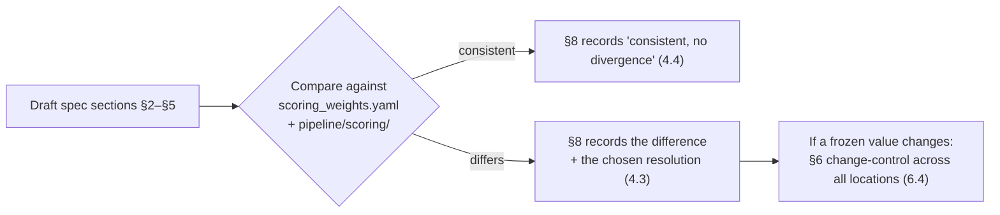

# Design Document

## Overview

This design specifies how the **decision-engine specification** (`s2-01-decision-engine-specification`) is authored, structured, reconciled against the existing Sprint 1 implementation, and governed. The deliverable is a single document, `Sprint-2-Tasks/decision_engine_specification.md`, that freezes the decision engine's feature contract, normalisation method, scoring formula and default weights for the combined Sprint 2/3.

This is a documentation feature. It produces no pipeline code. Its "components" are the sections of the specification document and the cross-references that keep the frozen parameters consistent across the repository. The design's job is to ensure the document is authoritative, traceable to the client acceptance criteria (AC3, AC5), reconciled with `pipeline/scoring/`, and placed under section-8 change control.

## Design Grounding — Research and Existing Conventions

The specification is not written from scratch — it formalises a design already realised in code, so it must reconcile against these authoritative sources:

- **Existing weights file** — `pipeline/scoring/scoring_weights.yaml` already declares six criteria with weights, directions and rationales: `wind_speed` (0.35, higher_is_better), `dist_transmission_km` (0.20, lower_is_better), `demand_proxy` (0.15, higher_is_better), `dist_substation_km` (0.10, lower_is_better), `slope_deg` (0.10, lower_is_better), `inside_rez` (0.10, higher_is_better). This file is the authoritative statement of the model's current priorities and the specification MUST reconcile against it (Requirement 4.3).
- **Existing scoring formula** — the pipeline README and `pipeline/scoring/` document the weighted-MCDA formula, the directional min-max normalisation with bounds computed from the eligible population, the eligible-only rule, the contributions-sum-to-score explainability contract, and the not-circular guarantee. The specification restates these rather than inventing them (Requirements 3, 5).
- **Integrated-table schema** — `pipeline/integration/config.py` (`OUTPUT_COLUMNS` / `SCORED_FEATURE_COLUMNS`) is authoritative for the real feature-column names the criteria must match (Requirement 2.7).
- **Data specification** — `DATA/data-specification/sprint1_data_specification.md` section 4 details each dataset (source, units, CRS, vintage) and section 8 defines the change-control process the frozen decisions fall under (Requirements 6, 7).
- **Constitution & client guidance** — the constitution ("weights are user inputs", "a recommendation the user cannot interrogate is an assertion") and the combined-sprint guidance Step 3 (no vague "infrastructure score"; defaults are assumptions) set the phrasing and content bar.

**Consistency hazard.** The default weight values appear in at least three places: this specification, `pipeline/scoring/scoring_weights.yaml`, and the data specification section 4.5. This is the known duplication hazard the project's holistic-awareness rule calls out. The design's answer is Requirement 6's enumeration-and-change-control mechanism: the specification lists every location and requires any frozen-decision change to be applied in all of them.

## Architecture

### Document structure

### Reconciliation flow

## Components and Interfaces

The "components" are the document sections. Each maps to requirements.

### §1 Purpose & Checkpoint-A status (Requirement 1)
States the document is the single authoritative decision design, the Checkpoint-A artefact, records Jira/PR references, and commits to Screening_Language. Adds the README and data-specification cross-references (Requirement 1.2).

### §2 Criteria feature contract (Requirement 2)
A table per Criteria_Group. Columns: Criterion (real integrated-table column), units, source, Direction, notes. Wind names a GWA variable with height justification; demand is labelled a Demand_Proxy; infrastructure lists distance-to-transmission, distance-to-substation, REZ membership; geographic lists slope. Every Criterion name is verified against `pipeline/integration/config.py` columns.

### §3 Scoring formula (Requirement 3)
Writes `S_i = Σ_k w_k · n_k(i)` with the weight-normalisation rule (division by the applied weight sum), the eligible-only/null-for-excluded rule, and the not-circular statement.

### §4 Default weights (Requirement 4)
Reproduces the six default criteria with weight, direction and rationale, labelled as assumptions, plus the §8 reconciliation result.

### §5 Normalisation method (Requirement 5)
States directional linear min-max; bounds from the eligible population fixed per run (not per UI filter); the outlier policy; the missing-value policy (never bias-imputed); the constant-criterion rule; and the boolean mapping.

### §6 Frozen decisions & change control (Requirement 6)
Lists which parameters are frozen, states the section-8 process governs changes, and enumerates every recording location (this spec, `scoring_weights.yaml`, data-specification §4.5).

### §7 Traceability matrix (Requirement 7)
Maps criteria → AC3, weights/normalisation rule → AC5, the four groups → guidance Step 3.

### §8 Reconciliation log (Requirement 4.3, 4.4)
Line-by-line comparison against the existing implementation, recording either "consistent" or the difference and its resolution.

## Data Models

The document defines two tabular models used inside it:

- **Criterion row:** `{ criterion, group, column, units, source, direction, default_weight, rationale, frozen }`.
- **Reconciliation row:** `{ parameter, spec_value, implementation_value, status (consistent|resolved), resolution }`.

No runtime data structures are introduced.

## Error Handling

There is no runtime execution. "Error handling" here is authoring-integrity: the tasks include a verification step that every Criterion column name resolves to a real integrated-table column (guards Requirement 2.7), and that the reconciliation log covers every criterion in `scoring_weights.yaml` (guards Requirements 4.3/4.4). A criterion named in the spec but absent from the integrated schema, or a weight present in the YAML but missing from the spec, is treated as a defect to fix before Checkpoint A sign-off.

## Testing Strategy

Being a document, this feature is verified by review and by two lightweight automatable checks:

1. **Column-name check** — every Criterion column named in §2 appears in `pipeline/integration/config.py` `OUTPUT_COLUMNS`/`SCORED_FEATURE_COLUMNS`.
2. **Reconciliation completeness check** — every criterion in `pipeline/scoring/scoring_weights.yaml` appears in the §8 reconciliation log.

These are documentation-consistency checks in the spirit of the pipeline's README/stage-order consistency tests, and they gate Checkpoint A.

## Correctness Properties

- **P1 — Every criterion resolves to a real column.** For every Criterion in §2, its `column` is a member of the integrated feature table schema.
- **P2 — Reconciliation is complete.** Every criterion in `scoring_weights.yaml` has a row in the §8 reconciliation log with a status of `consistent` or `resolved`.
- **P3 — Every default weight carries a rationale.** For every Criterion in §4, the rationale string is non-empty.
- **P4 — Frozen decisions are fully enumerated.** Every parameter marked frozen in §6 lists at least the three recording locations (this spec, the weights YAML, the data specification).
- **P5 — Screening language only.** The document contains no absolute superlative claim ("best site") in describing model output.
