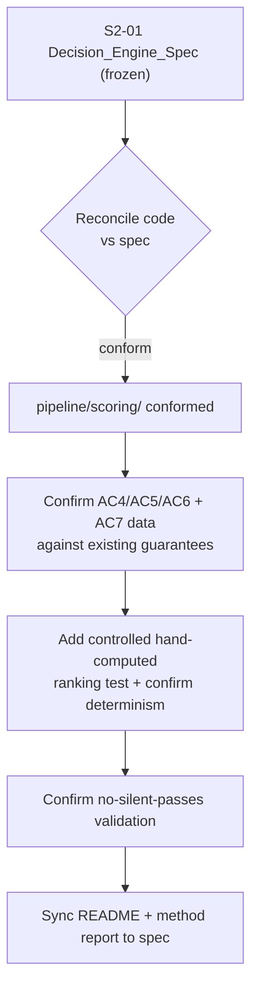

# Design Document

## Overview

This design specifies how the Sprint 2 task S2-05 **hardens and formalises the existing scoring stage** (`pipeline/scoring/`) to the combined Sprint 2/3 acceptance bar. The core algorithm — a transparent weighted-MCDA over directionally min-max-normalised criteria, with per-criterion contributions, deterministic ranking, and an eligible-only rule — already exists and runs over the full 47,311-cell NSW grid. This feature does **not** rewrite it. It conforms the code to the frozen S2-01 Decision_Engine_Spec, confirms each combined-sprint acceptance criterion (AC4, AC5, AC6, and the AC7 score data), and raises test coverage to include a controlled hand-computed ranking case.

The scoring computation is pure (`pipeline/scoring/score.py`: DataFrame + weights in, scored DataFrame out, no I/O), so it is independently replaceable without touching data loading — the constitution's separability requirement. Weights are user inputs loaded from `pipeline/scoring/scoring_weights.yaml` (or `--scoring-weights`); no weight literal appears in the source. Excluded cells receive a null score, null rank and null contributions and take no part in the normalisation bounds or the ranking.

## Design Grounding — Research and Existing Conventions

This feature reuses the existing scoring subpackage rather than introducing new patterns:

- **Existing module layout** — `pipeline/scoring/` already contains `weights.py` (loader/validator), `load.py` (reads the S1-08 integrated table), `normalise.py` (directional min-max from the eligible population), `score.py` (the pure scoring function), `rank.py` (descending by score, ties by ascending `cell_id`), `write.py` (atomic GeoPackage/CSV), `report.py` (method report + provenance), `validate.py` (no-silent-passes checks) and `run.py` (the `run()` entry point). The hardening work maps onto these existing files.
- **Formula & guarantees** — the pipeline README documents the exact formula (`norm`, `contrib_i = weight_i * norm_i / W_cell`, `score = Σ contrib_i` in `[0,1]`), the eligible-only rule, the contributions-sum-to-score guarantee, the ascending-`cell_id` tie-break, and the not-circular statement. These are the invariants this feature confirms, not invents.
- **Weights file** — `pipeline/scoring/scoring_weights.yaml` ships the six default criteria and is the sole place weights live. The `--scoring-weights` flag and `_build_kwargs` threading already exist.
- **Stage contract & orchestration** — `pipeline/__main__.py` dispatches `scoring` via `_get_runner`; `config.STAGES` places it after `integration`, before `validate`. This feature keeps that wiring.
- **S2-04 dependency** — the normalisation component this feature calls is the same `pipeline/scoring/normalise.py` surfaced as a standalone tested component by S2-04. There must be exactly one normaliser (Requirement 1.4).
- **S2-01 authority** — the frozen Decision_Engine_Spec is authoritative for the formula, criteria, directions and default weights (Requirement 1). Any code/spec difference is reconciled to the spec and recorded.

**Research summary — weighted-sum MCDA.** Weighted-sum over min-max-normalised criteria is the standard transparent screening method: linear rescale to `[0,1]` per criterion (directional), non-negative weighted average stays in `[0,1]`, contributions are additive and reconstruct the score. The only numerical hazard is a constant criterion (min == max), handled by a documented constant fill. This is already implemented; the design's job is to prove it against the acceptance criteria and the controlled test case.

## Architecture

### Placement in the pipeline (unchanged)

```
... → exclusions → integration → scoring → shortlist → validate → sanity
```

`scoring` remains after `integration` (its sole feature input) and before `validate`. No new stage or ordering change is introduced by this feature.

### Hardening flow



### Internal data flow (existing, confirmed)

```mermaid
flowchart LR
    A["load Weights_Config<br/>validate directions/weights/sum"] --> B["load integrated table<br/>validate columns"]
    B --> C["split eligible vs excluded"]
    C --> D["normalise (S2-04): bounds from eligible pop"]
    D --> E["score.py (PURE): weighted sum → score + contribs"]
    E --> F["rank.py: descending, tie-break ascending cell_id"]
    F --> G["null-out excluded: score/rank/contribs = null"]
    G --> H["write Scored_Table (atomic, EPSG:4326)"]
    H --> I["method report + provenance"]
    I --> J["validate (no silent passes)"]
```



## Components and Interfaces

### 1. `pipeline/scoring/weights.py` (Requirements 2)
Loads and validates the Weights_Config; halts before any write on unparsable file, invalid direction, negative/non-numeric weight, or zero weight sum. Confirm the enforce/auto-normalise rule is documented (2.4).

### 2. `pipeline/scoring/normalise.py` (Requirements 1.4, 4.3)
The single normaliser, shared with S2-04. Directional min-max from the eligible population; constant-criterion fill; boolean definitional mapping. This feature confirms there is no second normaliser anywhere.

### 3. `pipeline/scoring/score.py` — the pure Scoring_Function (Requirements 3, 6)
`score_and_rank(feature_frame, weights) -> DataFrame`. Weighted sum divided by applied weight sum; bounded to `[0,1]`; writes `contrib_{feature}` per criterion; contributions sum to the score. No file I/O.

### 4. `pipeline/scoring/rank.py` (Requirements 5)
Descending by `suitability_score`, ties by ascending `cell_id`; rank 1 is best; null rank for excluded cells.

### 5. `pipeline/scoring/run.py` (Requirements 8)
`run(verbose=False, weights_path=None, ...) -> dict` returning existing Scored_Table and method-report paths. Raises (no dict) on any fatal condition so the orchestrator halts non-zero.

### 6. `pipeline/scoring/validate.py` (Requirements 9)
No-silent-passes checks: one row per `cell_id`; scores in `[0,1]`; eligible↔non-null / excluded↔null; contributions reconcile; rank contiguity. Each reports expected vs observed vs pass/fail.

### 7. `pipeline/scoring/report.py` (Requirements 10)
Method report stating the formula, criteria/weights/directions/rationales, per-run normalisation bounds, and eligible/excluded/confidence counts — kept consistent with the Decision_Engine_Spec.

## Data Models

**Scored_Table row (unchanged, confirmed):**
`{ cell_id, suitability_score ∈ [0,1] ∪ {null}, rank ∈ ℤ⁺ ∪ {null}, confidence ∈ {high, low}, contrib_{feature}... }`, one row per `cell_id`, geometry (if carried) in EPSG:4326.

**WeightsConfig (unchanged):** an ordered set of `{ feature, weight ≥ 0, direction ∈ {higher_is_better, lower_is_better}, rationale }`.

## Error Handling

All fatal conditions halt before any write and raise (never return a partial dict): missing/unreadable integrated table; absent `cell_id`, criterion, `eligible` or confidence column; missing/invalid Weights_Config; write failure (leaving any prior output intact). This mirrors the existing halt-early discipline and Requirement 2.5 / 8.3.

## Testing Strategy

- **Unit** — normalisation directions and edge cases; the weighted formula on a synthetic set; weight re-normalisation; tie-break; eligible-only rule; constant-criterion handling.
- **Controlled_Test_Case** — a tiny fixture (a handful of cells) with a hand-computed expected ranking, arithmetic verified in a comment, asserting the end-to-end score and rank (Requirement 7.3; guidance Step 11).
- **Determinism** — two runs over identical inputs yield identical scores, ranks and contributions.
- **Validation** — seeded bad tables fail the relevant no-silent-passes check.
- Tests run under the project pytest config and CI.

## Correctness Properties

- **P1 — Scores bounded.** Every non-null `suitability_score` ∈ `[0, 1]`.
- **P2 — Contributions reconstruct the score.** For every scored cell, `Σ contrib_{feature}` equals `suitability_score` within tolerance.
- **P3 — Eligible-only.** Every Eligible_Cell has a non-null score/rank/contributions; every Excluded_Cell has null score/rank/contributions and is absent from the ranking and the bounds.
- **P4 — Deterministic ranking.** Two runs over identical inputs and weights produce identical scores and ranks; ties resolve by ascending `cell_id`.
- **P5 — Weights are data.** No weight literal appears in `pipeline/scoring/` source; changing the YAML changes the model.
- **P6 — Not circular.** The wind feature appears only as an input criterion, never as a target.
- **P7 — Conforms to the spec.** The implemented formula, criteria, directions and default weights match the S2-01 Decision_Engine_Spec.
