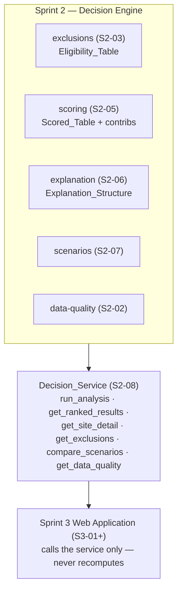
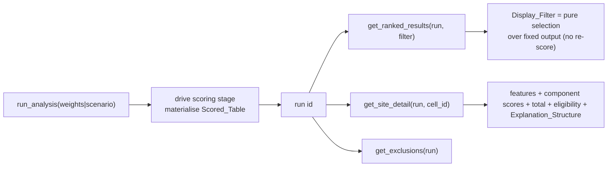

# Design Document

## Overview

This design specifies the **Decision_Service** (`s2-08-decision-service-api`): a thin service layer that exposes the decision engine (exclusions, normalisation, scoring/ranking, explanation, scenarios) to the Sprint 3 web application through a documented set of operations. The service performs no decision logic of its own — it orchestrates the existing pipeline stages and serves their materialised outputs, applying only display-level filters over fixed engine output. It is the single boundary between backend (Sprint 2) and presentation (Sprint 3), and the mechanism by which combined-sprint AC4 ("scoring/normalisation outside the UI") becomes structurally true: the UI can only call the service.

The service wraps outputs that already exist: the S2-05 Scored_Table (`DATA/scoring/`), the S2-03 Eligibility_Table (`DATA/exclusions/`), the S2-06 Explanation_Structure, the S2-07 scenario comparison, and the S2-02 data-quality status. The MVP stack is decided (S3-01a): a **React/Next.js frontend and a FastAPI backend over HTTP**, so the Decision_Service is a **FastAPI application exposing HTTP endpoints and publishing an OpenAPI schema** (Requirement 6.4). The FastAPI app imports the existing Python engine (`pipeline/`) in-process and serves it over HTTP; the decision logic stays in the pipeline, and the no-recompute rule holds.

## Design Grounding — Research and Existing Conventions

- **Pipeline outputs are the source of truth** — `pipeline/scoring/` writes the Scored_Table, `pipeline/exclusions/` writes the Eligibility_Table, S2-06 writes the Explanation_Structure. The README's Data Outputs section fixes their `DATA/` locations. The service reads these; it never re-derives them.
- **Pure cores already exist** — `pipeline/scoring/score.py::score_and_rank` and `pipeline/shortlist/select.py::select_shortlist` are pure functions over in-memory frames. The service reuses `score_and_rank` for run-analysis (via the S2-05 stage) and reuses the shortlist selection pattern for the top-N Display_Filter, rather than writing new selection logic.
- **Stage contract** — every stage exposes `run(verbose=False, ...) -> dict`. The run-analysis operation drives the scoring stage through this contract, so a Run is "execute the engine with these weights and materialise the outputs".
- **Weights as user inputs** — `pipeline/scoring/scoring_weights.yaml` and the S2-07 scenario presets are the weight sources. The service passes weights/scenarios into the engine; it holds no weight literals.
- **CRS discipline** — served coordinates are the grid centroids in EPSG:4326 (storage CRS); the service performs no reprojection, consistent with the shortlist stage.
- **Fixed normalisation bounds** — S2-04 fixes normalisation bounds per run from the eligible population. The service's Display_Filters are strictly selection over a completed Run, so they cannot alter bounds (Requirement 3.1).

**Research summary — service seam for an explainable MVP.** The guidance requires a reusable decision module callable independently of the UI. A thin read-and-serve service over materialised engine outputs, with display filters as pure selections, is the minimal design that (a) guarantees the map and the table show one engine output and (b) lets the scoring module be reused by OPT-MINING later without the UI. This favours a small, well-typed operation set over a broad API surface.

## Architecture

### The seam



### Operation flow — run then serve



## Components and Interfaces

### 1. FastAPI service — `pipeline/service/` (new, thin) exposed as an HTTP API (`app.py`)

A thin core module holds the operation functions below; a FastAPI `app.py` maps each to an HTTP endpoint (e.g. `POST /runs`, `GET /runs/{run_id}/results`, `GET /runs/{run_id}/sites/{cell_id}`, `GET /runs/{run_id}/exclusions`, `POST /scenario-comparison`, `GET /data-quality`) and lets FastAPI generate the OpenAPI schema (Requirement 6.1). The core functions stay pure-of-transport so they remain unit-testable without the HTTP layer.

```python
def run_analysis(weights: dict | None = None, scenario: str | None = None) -> RunHandle:
    """Drive the S2-05 scoring stage with the given weights/scenario and
    return a handle identifying the materialised Run. Reuses the engine;
    holds no scoring logic. Raises on invalid weights/scenario (4.4)."""

def get_ranked_results(run: RunHandle, top_n: int | None = None,
                       min_score: float | None = None) -> list[RankedRow]:
    """Selection over the fixed Scored_Table for the Run. Preserves S2-05
    ranks; never re-scores (3.1, 3.2). Empty-but-valid on an all-excluding
    threshold (3.4)."""

def get_site_detail(run: RunHandle, cell_id: str) -> SiteDetail:
    """Features, component scores, total score, eligibility, and the S2-06
    Explanation_Structure for one cell. Same score/rank as get_ranked_results
    (2.3). Raises on unknown cell_id (7.2)."""

def get_exclusions(run: RunHandle) -> list[ExcludedRow]:
    """Excluded cells + machine- and human-readable reasons from the
    Eligibility_Table (1.4)."""

def compare_scenarios(scenario_a: str, scenario_b: str) -> ScenarioComparison:
    """Per-cell rank comparison; reuses the scoring engine per scenario (4.3)."""

def get_data_quality() -> DataQualityStatus:
    """The S2-02 validation status for a UI banner (5.1)."""
```

Each operation reads materialised engine outputs and returns typed results; none contains scoring, normalisation, ranking or exclusion logic (Requirement 2).

### 2. Display filters — reuse the shortlist selection pattern
Top-N reuses the `pipeline/shortlist/select.py` selection-by-rank pattern; minimum-score is a threshold filter over the fixed Scored_Table. Both are pure selections (Requirement 3).

### 3. Contract — FastAPI OpenAPI schema + `pipeline/service/CONTRACT.md`
FastAPI auto-generates the OpenAPI schema (served at `/openapi.json`, browsable at `/docs`) describing every endpoint's request/response; `CONTRACT.md` narrates the operation semantics and records the freeze at the sprint boundary (Requirement 6). The Next.js/React frontend generates its typed client from this OpenAPI schema (S3-01b), so frontend/backend types cannot drift.

## Data Models

```
RunHandle       = { run_id: str, weights_id: str, scenario: str | null }
RankedRow       = { cell_id, suitability_score, rank, key_components: {feature: value} }
SiteDetail      = { cell_id, features: {...}, contributions: {feature: value},
                    suitability_score, rank, eligible: bool, explanation: Explanation_Structure }
ExcludedRow     = { cell_id, reason_codes: [str], reason_text: str }
ScenarioComparison = { rows: [{ cell_id, rank_a, rank_b, rank_delta }], labels: {a, b} }
DataQualityStatus  = { passed: bool, checks: [{ name, expected, observed, pass: bool }] }
```

All coordinates, where returned, are EPSG:4326 grid centroids carried unchanged.

## Error Handling

- Invalid weights/scenario → error, no Run (4.4).
- Missing Run → error naming the Run (7.1).
- Unknown `cell_id` → error naming the `cell_id` (7.2).
- Missing/unreadable engine output → error naming the input, never a fabricated result (7.3).
- Empty-but-valid results (top-N over count, all-excluding threshold) are returned as empty sets, not errors (3.3, 3.4, 7.4).

## Testing Strategy

- **Contract/integration** — exercise every operation against the real engine output on the frozen dataset (8.1).
- **Consistency** — ranked results and site detail return identical score/rank for the same `cell_id` in a Run (8.2).
- **Filter invariance** — a Display_Filter changes the returned set but never scores/ranks (8.3).
- **Scenario reuse** — compare_scenarios reuses the engine and returns a per-cell rank comparison (8.4).
- **Honest failure** — missing Run, missing `cell_id`, missing engine output each raise the right error (8.5).

## Correctness Properties

- **P1 — One engine output.** For a Run, the score and rank of any `cell_id` are identical across `get_ranked_results` and `get_site_detail`.
- **P2 — Filters do not re-score.** For any Display_Filter, the score and rank of every returned cell equal its unfiltered Run values.
- **P3 — No recompute path.** No scoring, normalisation, ranking or exclusion arithmetic exists in `pipeline/service/`; all served values trace to a materialised engine output.
- **P4 — Empty-but-valid.** A top-N over the eligible count returns all eligible cells with no padding; an all-excluding threshold returns an empty set, not an error.
- **P5 — Scenario reuse.** `compare_scenarios` produces each scenario's ranks via the S2-05 engine, not a second scorer.
- **P6 — Honest failure.** Missing Run / `cell_id` / engine output each yield an error naming the fault, never a misleading empty success.
