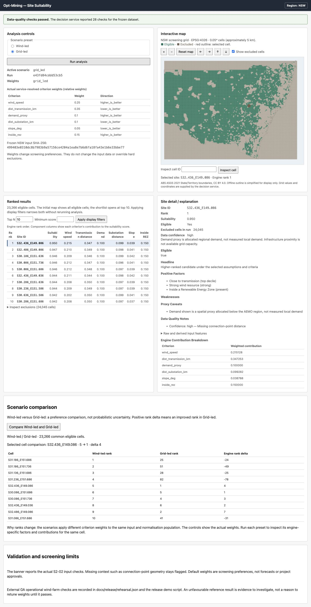

# Final demo script — Guidance §10

The technical walkthrough passed on 5 October 2026 using the real Compose API
and browser. Allow about ten minutes. Present the live app, not only slides.
A high rank is a candidate under stated assumptions, not project approval.

| Step | Action and evidence |
| --- | --- |
| 1. Start | Follow the Compose command in app/README.md. Confirm web/API connectivity and the 28-check banner. Independent Python 3.13/Node 24 images built and booted. |
| 2. NSW inputs and defaults | Show the frozen input hash and service-resolved weights. Explain all 47,311 grid cells remain; 23,266 are eligible and 24,045 excluded. The bounding grid is not a land mask; the new centroid rule precedes scoring. |
| 3. Screen | Run Wind-led. Recorded run: `604d051bb2deb7d8`. The map shows the full population and the shortlist opens at top 10. |
| 4. Exclusion | Look up `S28.186_E141.036` or open Inspect exclusions. Show `outside_nsw_land` and its readable centroid reason. Detail has no score/rank/contributions. High wind cannot override an exclusion. |
| 5. Shortlist/map | Click a shortlist row, then a map cell. Confirm selected ID/detail agree. Demonstrate zoom/pan, excluded overlay and cell lookup. Apply Top N=5: it changes visible cells, not the run or its scores. |
| 6. High-ranked site | Open Wind-led rank 1 `S31.186_E151.686`. Show score, factors, weighted contributions, raw inputs and caveats. Demand is a regional proxy; infrastructure distance is not spare capacity. |
| 7. Change preferences | Compare Wind-led/Grid-led, then run Grid-led. `S32.436_E149.086` moves from Wind-led rank 5 to Grid-led rank 1; service delta is +4. The former Wind-led leader moves 1→25. Use the actual weights and both contribution sets to explain the change. |
| 8. Validation | Show the hand-computed backend test and rehearsal.json. The reference check places 13 of 16 GA operational wind-classified records in the upper quartile (81.25%). Disclose Boco Rock below quartile, two excluded anomalies and source classification ambiguity. This is plausibility, not accuracy. |
| 9. GitHub evidence | Show the scoped baseline/service/UI/security/docs PRs, literal input pins, source records, scenario YAML, engine tests, real E2E and run instructions. Explain main still needs prerequisite merges and Checkpoint D is a human review. |

## Preferences and interpretation

The app's initial preset is Wind-led; baseline scoring_weights.yaml is a
separate default-weight artefact. Both are documented preferences. No formula
or preset weight was changed for this repair.

| Criterion | Unit / direction | Baseline | Wind-led | Grid-led |
| --- | --- | ---: | ---: | ---: |
| wind_speed | m/s, higher | 0.35 | 0.55 | 0.25 |
| dist_transmission_km | km, lower | 0.20 | 0.15 | 0.35 |
| demand_proxy | dimensionless allocation, higher | 0.15 | 0.10 | 0.10 |
| dist_substation_km | km, lower | 0.10 | 0.05 | 0.10 |
| slope_deg | degrees, lower | 0.10 | 0.05 | 0.05 |
| inside_rez | boolean membership, higher | 0.10 | 0.10 | 0.15 |

Wind-led rank 1 has score **0.9265894934503678**. Its contributions are about
0.501685 wind, 0.139448 transmission, 0.100000 demand, 0.046534 substation,
0.038923 slope and 0.100000 REZ. They sum to the score at full precision.
These are weighted components, not raw measurements.

Grid-led run `e43fd84cddd53cb5` ranks `S32.436_E149.086` first at
**0.9504512237174723**. Its grid-distance contribution is 0.347253 versus
wind 0.215128. Grid-led increases grid proximity preferences; it does not
claim a network connection. The service compares all 23,266 eligible cells;
23,259 ranks change. Scenario comparison is not uncertainty probability.

## Reference caveats

Taralga and Rye Park have null score/rank because their coarse cells are
excluded. Keep them visible and inspect the source geometry/rules before any
design change. Boco Rock is at percentile 73.77, below the quartile threshold.
The GA file contains duplicate Gullen Range records and a record named
White Rock Solar Farm classified as Wind/Turbine - Wind. Counts are records,
not unique farms. This ambiguity is retained, not removed to improve results.

## Supporting evidence

- Definitions/formula/change control: Sprint-2-Tasks/decision_engine_specification.md.
- Source/freeze/audit: DATA/integration metadata and docs/release/baseline-change.json.
- Exclusions: pipeline/exclusions; scoring/scenarios: pipeline/scoring.
- Per-run explanation/contract: pipeline/explanation, pipeline/service/CONTRACT.md.
- Arithmetic/property/real-data guards: tests/backend and tests/exclusions.
- Real browser gate: app/web/e2e/final-demo.spec.ts; CI: .github/workflows/ci.yml.
- Startup/architecture: app/README.md; briefing: limitations.md.

This is technical rehearsal evidence. Record real client feedback separately;
automated success is not Checkpoint D sign-off.
